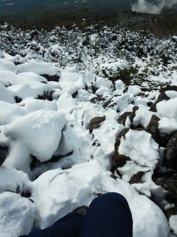
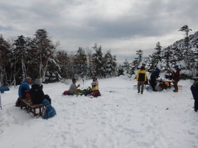

# 2020年10月，八ヶ岳の編笠山に登ってみた，その7

📅 投稿日時: 2021-08-14 01:09:02

昨日はちょっといろいろバタバタしていて．

夜9時ごろに床で寝てしまう

という失態により，Blogが更新できません

でした…

9連休（のはず）なのに，なぜか会社の電話に

次々メッセージが入ってくるんだけど…

…罠かな？

と思う今日この頃．

皆様いかがお過ごしでしょうか(時候の挨拶)

ってなことで．

今回も，編笠山のレポート続きです．

では，どうぞ～！

ーーー

ということで．

編笠山山頂を過ぎたところ．

まだコースも半分も過ぎていない

あたりで，歩くのも辛いほどの

膝の痛みに襲われたわけで．

なるべく早く下山しようと思ったのですが．

登りの時に通ってきた道を引き返した

方が距離的には短いんだけど．

かなりの積雪があって，滑り落ちそうで

結構怖い思いをしたこの急な岩場を．

この膝の状態で降りる気は

1ミクロンも起きないですね．

あそこをもう一度通ろうという気は，

とても起きないですね．←大事な所なので2回繰り返す

この膝で，あの雪だらけの崖を降りたら，

リアルに死ぬ可能性が高いので，

当初予定通り，青年小屋→西岳経由で

戻ろうと考え，ゴロゴロ岩場を痛みに

耐えつつ降り，青年小屋まで下ってきた

わけですが…

青年小屋から駐車場までは，最短距離でも

コースタイム3時間．

編笠からここまでコースタイム17分のところ，

40分もかかっちゃうような今の状態で…

無事，車まで戻れるのだろうか！？？

とりあえず，膝をそんなに曲げなければ

痛みは出ないので，膝を曲げずにかなり

ゆっくり目のペースで，西岳へ向かって

歩きだします…

膝の痛みがある腕，積雪で足場が

見にくいので，時折思わぬ段差で

膝に負担がかかって「いたた…」

ってなりながら歩きますが．

青年小屋を過ぎてしばらく歩いた

ところに，水場がありした…．

雪で埋もれたこの写真ではわかりにくい

のですが，この沢にかかる丸木橋．

この丸木橋の根元に，水が湧きだすところが

あって，有り難くお水をいただきました．

雪でキンキンに冷えて，氷のような

冷たさでしたが…

その後，膝をかばうかなりゆっくりペースで

西岳に向かって歩き続けますが．

西岳に向かっては，青年小屋からさらに

標高100mほど下げ，また100mほど登り

返すので．

標高が下がったところは積雪が減って

来てます…

かなりのゆっくりペースながら．

さっきまでいた編笠山がここまで離れて

見える距離までなんとか歩いてきて…

そして，100mほどの標高差を

登って行きます．

膝が痛くなるのは，下り坂を降りている時．

下りに比べれば，登りは膝が痛くならない

ので楽だなぁ！！

…と，登りは結構順調に進み．

最後はこんなゴロゴロの坂を登り切った

ところで…

やってきました，西岳山頂！

…青年小屋からコースタイム47分のところ．

1時間ほどかかりました…（涙）

でも，結構止まりながらゆっくり歩いた

わりに，登り坂はそれほど膝が痛ま

なかったので，コースタイム+10分ほどで

到着できてラッキー…

山頂からは，さっき登った編笠山や

権現岳が目前にそびえたってるし．

南アルプス方面も見えますね…！

…でも．

今は．

景色を眺めるよりも，

この山頂の広場でゆっくりくつろいで，

膝を休ませることが一番大事かな．

ってなことで．

午後1時と遅めの時間ながら．

西岳山頂で，膝を休ませるのも兼ねて．

ゆっくりお昼休みを取ったのでした…

しかし．

これからはひたすら駐車場まで，下りが

延々続くわけですが．

下りでは痛みが強まるこの膝．

無事，下山までもってくれるのかな…？
