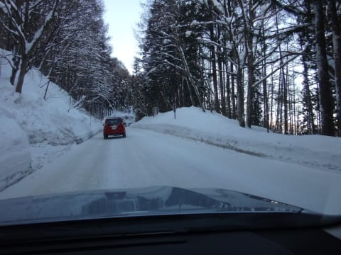

# 2月21日の志賀高原は…終日晴天ぴかぴか！暑いくらいの一日だったよ

📅 投稿日時: 2015-02-21 23:52:56

明日の昼間はむちゃくちゃ気温が上がり，微妙な感じだけど，

風向きその他をいろいろ考慮すると，志賀高原は雨は降らない！

と，強く信じているSkier_Sです．

で．

今日も，志賀高原に来ているわけですけど…

昨日は，かなり雪が降ったらしく．

完全な圧雪路面の志賀高原の上り坂がお出迎えですね～．

で，圧雪路面を登りきってゲレンデに到着すると…

ををっ！！

超晴天ではないかっ！！！

すばらしぃっ！！！

…そして，天気がいいからか．

営業開始前に，これだけ並んでいるのは…

今シーズンの最高記録ではなかろうか…

うーむ．

今日は，混みそうだなぁ…

と，思いつつ，営業開始と共にゴンドラにて山頂へ．

んで，朝一の山頂の気温は…

え？マイナス2度？？

2月にこれって…あったかすぎるなぁ…

でも，山頂のゲレンデは…

うはぁ！

晴天っ！

そして…

シマシマっ！

やわらかめの最高雪質の，気持ちいいシマシマぴかぴか

バーンですっ！

ぐははははは！

晴天，ぴかぴかバーンで．

これは，最高ではないかっ！！

神様，ありがとう～っ！！！

だけど．

朝イチで圧雪がかからないオリンピックコースは，

10cmほどの重めの新雪が乗っていて．

朝イチでも，ちょっと滑りにくかったかな～

日が照っているので，新雪はちょっとダマダマっぽい

感じで，引っかかるよ…

ってことなので．

ひたすら快晴の整地コースを気持ちよくかっ飛ぶこと，

2時間ほど…

10時を過ぎると．

あいやー…

ゴンドラが，「混みそう…」という予想通り，

10分以上の待ちに…（涙）

そして．

ゴンドラが混むということは．

当然，ゲレンデも混むわけで…

あらら…（涙）．

そして．

さらに追い討ち．

日が照っているオリンピックコースなどは，

かなりのダマダマ雪コースに成り果てて…

さらに，人が多いので．

コースがあっという間にでこぼこに…

ご，午前中で，これですか…（悲）．

コース全面，コブ様が順調に成長しつつあります…（涙）

でも．

せめてもの救いは．

午前11時過ぎには，ゴンドラ待ちもほとんどなくなり…

そして，北東側斜面のコースは，日が照っても

雪質が比較的いいままだったことかな～．

（1ゴン側GSコース）

しかし．

午後も，ゲレンデの人が多かったので…

順調にコブ様は，すこやかにご成長あそばされ．

コース全面これは，ちょいと滑りにくいでございます…

そして．

日が当たるコースは，雪がかたくなり．

南側斜面では…

なんだこれは．

コース上の雪が，固まってきてます…

オリンピックコースは，

ボソボソ雪と表面が固まった雪のまだらで，

結構トリッキーなバーンになっちゃっており．

ちょっと体力を消耗するのですが…

とはいえ．

山頂付近や，南向きではない斜面は，

夕方まで結構いい雪質を保ってくれたので．

コースのコブ様はご立派にご成長あそばされましたけど．

リフトストップまで，しっかり楽しめましたよっ！←雪があればどんな条件でも楽しいんでしょ

ってことで．

…

まだ，終わらない．

当然，ナイターへ繰り出すっ！

ふはははは．

ナイターでもう一回，最高のシマシマを楽しむのだっ！！！

昼間雪質が悪くなっちゃったから，ナイターの雪は

どんなもんかと心配したけど．

雪が固まったのは表面だけだったので．

圧雪車で掘り返すと，最高ひえ冷えの雪質に戻り．

いやいやいや，

最高ひえ冷えふかふか雪のシマシマで，かなり超幸せ

ハッピーラッキーな感じのナイターでしたよ～！！

…ってことで．

午後のバーンコンディションはちょいと厳しいものが

あったけれども，朝イチとナイターは最高だったし．

終日天気が良かったので，楽しめた一日でした～．

…明日も，雨が降らずに．

何とかまともに滑れるといいなぁ…

…とりあえず．

私が全身全霊をこめて，全精力を傾けて祈ってますので．

明日は気温が上がっても，雨は降らないはず！

PS.雨が降った場合は，皆さんの信心が足りず，

　雨が降らなかった場合は，私の祈りが通じた…

　ということですので，よろしくお願いします．←なにを？？

## 💬 コメント一覧

### 💬 コメント by (Goku)
**タイトル**: Unknown
**投稿日**: 2015-02-22 07:42:58

うわ！今シーズンイチの賑わいだ

それにしても、いい天気でしたね。

さぞかし朝一のＧＳコースは気持ち良かったことでしょう（羨）

今日は雨が降らないといいですね。

### 💬 コメント by (aqura)
**タイトル**: Unknown
**投稿日**: 2015-02-22 09:33:53

いやー、良い天気でしたねぇーU+2764

一人で土日滑るつもりが、子供二人が、日帰りなら行くと言い出し……、結局日帰り(S様の土曜日はgood、日曜日はうーん、と言う天気予報が後押し？)。

朝イチの良い状態を子供の準備で逃し、少し消化不良

やってしましました、午後コブコブで大転倒U+2757

うーん、シーズン終わったかな

### 💬 コメント by (Skier_S)
**タイトル**: 日曜も晴れましたよ～！
**投稿日**: 2015-02-23 00:12:14

＞Gokuさま

いやーーー．

天気は良かったけど．

混んで，コブコブの一日でした…

でも．

朝イチは最高でしたよっ！！！

＞aquraさま

いやいやいやいや．

いい天気でした～．

朝イチは，この上ない快感バーンでしたよ～！

でも，コブで大転倒ですか？

重くて引っかかる雪でしたから…

「シーズン終わったかな」って，

かなりひどい怪我だったんでしょうか…？

早期恢復を祈ってます．

