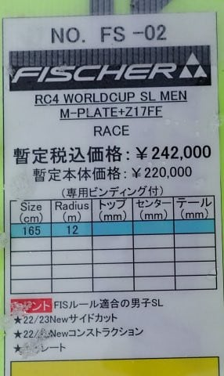

# 2024シーズンモデルのスキー板，試乗レポートその26…FISCHER RC4 Worldcup SL MEN

📅 投稿日時: 2023-07-11 04:23:11

🏷️ カテゴリ: [スキー板試乗](c0bd8048615710cee890e403a36cc9a2b.md)

あぁ…

今日もこんな時間になってしまった…

これからお風呂入って寝るころには，もう

外が明るくなり始めるんだよな～…（涙）

とりあえず．

こんな中，昨日の記事にちょろっと書いた

ように，土曜は午前中だけ山を歩いて

きたわけですが…

スキーシーズンが始まる前の昨年10月

以来の実に久しぶりの山歩き．

私の山歩きは，どちらかというとトレーニングの

性格が強く，

心拍数150をキープしたペースで移動し続ける

という，

かなり邪道な山歩きなわけですが．

スキーシーズンやら仕事の疲れがたまってる

最近…←それなら，無理して山を歩かなくてもよくない？

すごいゆっくりなペースでもすぐ心拍が

150に上がっちゃうようになってないか？

数時間に渡る長い時間，心拍数150を

キープし続けられる根性と体力が残って

いるのか？

そもそも，板を履いて滑るばっかりだったので，

歩き方を忘れてないか…？？

…と，いろいろ心配でしたが．←さすがに歩き方は忘れないでしょ

実際歩いてみると．

まぁ，今回のコースは往復15㎞＆標高差

800m程度でのお気楽コースだったと

いうのもあったけど．

心拍150を合計3時間半キープしても全然

疲れることはなく．

大体昨年までと同じか，それ以上のペースで

歩けました～！

（下りはほとんど走ってるけど…）

…むしろ，目標心拍を155くらいに上げても

いいかも？と思ったくらいだったので．

スキーシーズンの間に，体力が上がってる

みたいですね～！

スキーって，無酸素運動に近い，短時間の

高強度運動の繰り返しだから，

心肺能力を駆使する長時間継続運動の

トレーニングにはならないんじゃないかな…

と思ってたんだけど．

スキーでも朝イチからナイターまで

休まず滑り続ければ，長距離運動のトレーニング

にもなる

ということがわかりました！！←ホントにそうなのか？？

でも．

良い子は前日の睡眠時間2時間半で，

心拍150を4時間キープする運動しちゃ

ダメだぞ♡←むしろ健康を害しているよね…これ…

ってなこととで．

本題へ．

今日も2024シーズンモデルのスキー板の

試乗レポート．

今回はフィッシャー編です．

では，どうぞ～！

〇FISCHER RC4 Worldcup SL MEN　165㎝

SL競技用

FISCHERのFIS公認SL競技用モデルで，

一応，カタログ上ではトップモデルになって

いますが…

このモデルはMプレートが付いてますけど，

この上のモデルとして，サイドがメタルで

強化された「MBプレート」が着いた選手用

モデルがあります．

で．

滑ってみたところ…

いや．

これはいい！

履いた感じは重みがありますが，そのぶん

足元のしっかり感を感じ，難しい斜面でも

がっつりグリップでしっかりした足場を

感じられます…

なので，荒れた難しい斜面でも，板を

信頼して安心して板に乗っていけます．

板の強さがある分，たわませにくいけど，

たわませなければ縦に落としていけるし，

踏んでいけば粘りを感じながらたわんでいき，

小回り板っぽい半径で鬼グリップで

強い横Gを受けながら切れていってくれます．

使いこなすにはそこそこの脚力がいると

思いますが…

SL用ではあるけど，整地だけじゃなくて

そこそこ荒れた斜面でも，

トップからテールまでのエッジをフルに使って

気持ちよく切っていける板．

板の返りも気持ちよく，ターンが仕上がる

ぎりぎり最後までしっかり丸い弧を描き，

最後はすっと反対側に抜けていくような，

気もちいい切り替えができます．

SL競技用としては，HEADのSL RDより強め，

NORDICAのDobermann SLより優しめ…

という感じかな．

…とりあえず，この板はSL競技用だけど．

結構脚力がある人，かなりスピードを出す

アグレッシブな人が，ゲレンデ用小回り

ベースとして使えるんじゃないかな？

ゲレンデでも，そこそこ大回りから小回り

まで行けて．

そしてハイスピードではかなり気持ちいい

小回りができそうで，結構物欲を刺激

しましたが…

ただ，定価24万円越えか…

こんな高い板，買えませんね（涙）

## 💬 コメント一覧

### 💬 コメント by (油漏＠あちこち+筋肉痛)
**タイトル**: Unknown
**投稿日**: 2023-07-11 06:34:47

お疲れ様です。スキーは高地でのインターバルトレーニングっぽくなるので、心肺機能が鍛えられるのかもしれません。（個人の感想です。でも無理をなさっていないか心配になります）

８日は志賀高原のトレールランがあり、参加しました。一ノ瀬は迂回コースなのに下りのきつい事、、本当にスキーの下りは楽です。焼額山の登り、、、リフトは絶大な存在であると実感しました。

私は歳なので心拍数を150以下に抑えないと呼吸が苦しすぎて、死にそうになります。ログを見ると登りでは140位でした。下りでは筋肉が攣りそうになっているのに女の子に抜かれまくりで、我ながら笑ってしまいました。タイムは自己満足、順位は下位グループでした。

こういう運動、体に悪いと私も思います。

### 💬 コメント by (Skier_S)
**タイトル**: ＞油漏れ＠あちこちさま
**投稿日**: 2023-07-12 00:12:47

えええ！！？？

志賀100トレイル参加されたんですか！！

まさか100㎞じゃなく，40㎞コースですよね…

それにしても，40㎞のトレイルランができるなんてすごすぎる…！！

私は40㎞なんて一日で移動したことないので，とても10時間で移動できなさそうです．

でも，40㎞トレイルラン…確かに体に悪そうですね（笑）．

志賀トレイル参加，ホントにすごいです…！！

