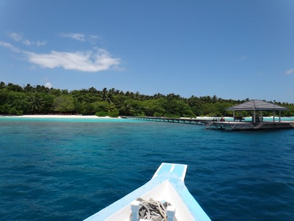
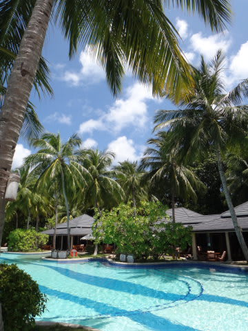
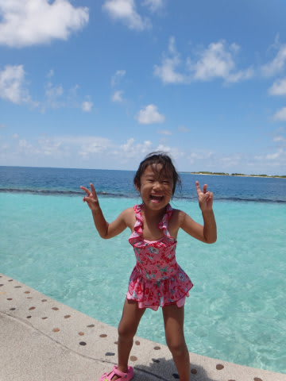
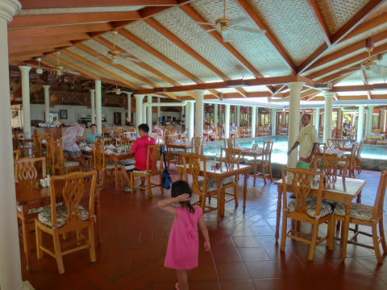
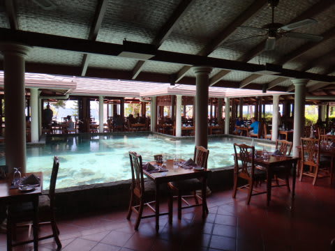
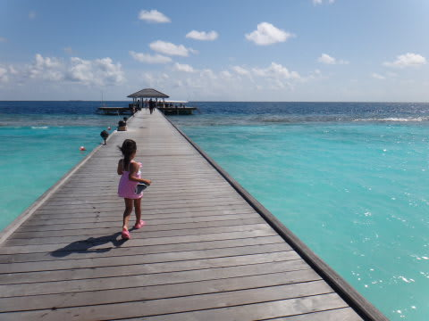
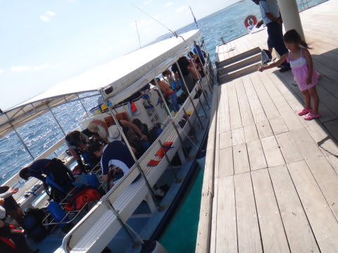
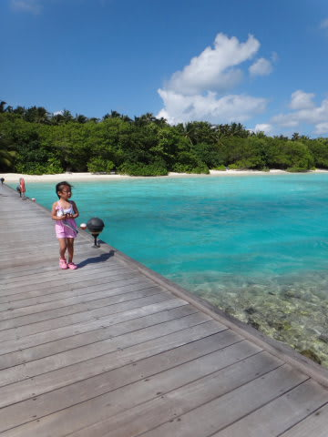

# 2012年　子連れモルジブ　ダイビング旅行記　その9

📅 投稿日時: 2012-10-18 00:41:38

で．

午前2本のダイビングを終えたあとは．

ボートで20分くらいかけて，リゾートへ戻ってきます．

あれ？リゾートへ戻ってきても，娘は桟橋にお出迎えに来てないなぁ．

部屋に戻っても，部屋には誰もいない…．

…まさか．

朝8時半に出かけるときに，私を見送ることなく

「プール！プール！」

って言って，朝一番からプールに出かけた娘．

昼すぎの12時半まで，部屋に帰らず．

…ずっとプールで遊んでいるのか？？

と，プールに行ったら…

娘は予想通り，プールでエキサイトしてました．

あーのーなー．

朝から4時間．

ぶっ続けでプールで遊んでたのか，お前は…

とりあえず．

帰りたがらない娘をプールから引き離すという儀式をとりおこない．

(なんだか，[1歳のころ](d20120720.md)から変わってない気がする…）

それから，お昼ごはんタイムっ！

ダイビングから戻ってくるのが12時半．

それからウェットスーツを脱いで，部屋に戻ってシャワーを浴びて着替えて，

レストランへ歩いて…ってやってると．すぐ1時半くらいになっちゃいます．

＃やっぱり，ダイビングクルーズは楽だったなぁ…

いつもと同じレストランで，真ん中の池に泳ぐ魚を見つつの昼食です．

ビュッフェスタイルで，メニューもそこそこあって良いんですが．

なんか，娘は相変わらずデザートやフルーツばっかり食べてたなぁ…

で．食事が終わると2時すぎで．

午後のダイビングは2時半からなので．

またあわてて部屋へ戻って準備をせねば…

…でも．今度は私が娘と残る番．

2時半に桟橋へ行って…

娘と一緒に，潜りに行くみんなへ

「いってらっしゃーい！」

…

…

わたしも潜りに行きたい…（ぼそ）．

まぁ，とりあえず．

残された私は．

娘と一緒に遊びますか．

私「娘～，何して遊びたい…？」

娘「プール！プール！」

…お前はホントに．

飽きんやっちゃなぁ…
