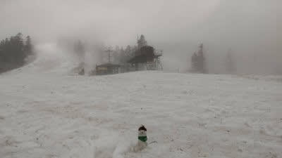
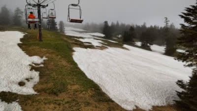
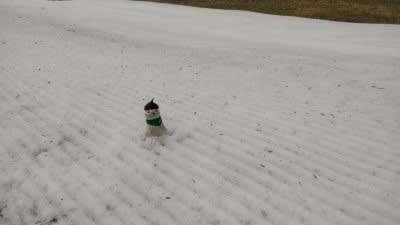
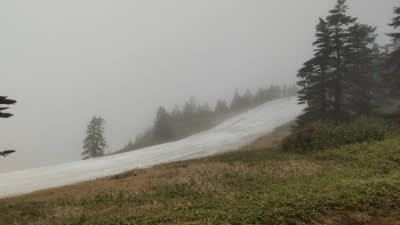
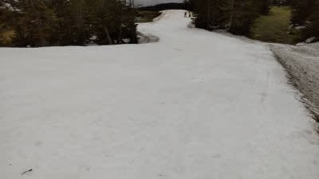

# 2021/5/18(火)も，志賀高原渋峠スキー場から特派員レポート！…気温は高いけど，硫安が効いてそこそこ滑ってみたい…

📅 投稿日時: 2021-05-19 04:10:30

🏷️ カテゴリ: [日記](cc4b5682fb7b8b144980957a978653fb0.md)

ということで．

本日もなぜかこんな時間まで仕事していた

Skier_Sです．

そして，明日…というか，もう今日か．

朝7時からオンライン会議なんだけど…

あと3時間寝れないんですけど(涙)

…ってなことで．

今日もおこみん特派員が写真を送って

きてくださったので．

（しつこいようだけど，このおこみん人形が特派員なわけではない）

時間がなくて死ぬほど眠い中，

本日（というか，もう昨日の18日火曜日）の

志賀高原，渋峠スキー場のレポートです！

こんな状況でも記事を書く自分，偉い！！

ホントに偉いぞ！！←眠いのに記事を書いて偉い！とみんなから褒めてほしいのね…

で．

朝から気温は+11度と高めで．

ガス気味の曇り空で始まったらしい

本日ですが…

あさイチは，一応シマシマ！

硫安が効いてところどころ固く

なっていたようで…

昨日よりは滑り良かったみたいです！

そして，朝9時ごろからは時折晴れ間も

顔をのぞかせ．

昨日よりはフラットで，楽しめるバーン

コンディションだったようです…

ガラガラに見えますが，昼前には

40~50人くらい滑ってたとのことで．

…この時期の平日に，そんなに滑る人が

いるんだ，ってのがちょっと驚き…

コース上はユンボでの雪出しをやってたり，

スタッフはゲレンデ状況の維持に

かなり本気を出してくれているみたいです！

これからの雨は心配だけど．

まぁ，今週末までは大丈夫そうな感じかな…

ってなことで．

今日はもう寝ないと死ぬので．

おやすみなさい～！！
