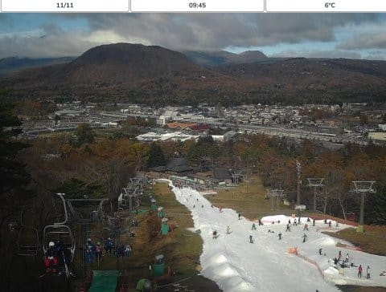
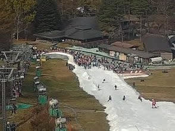
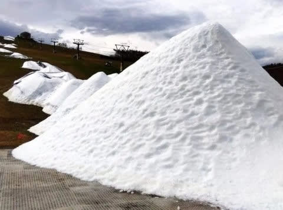
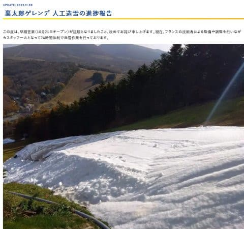
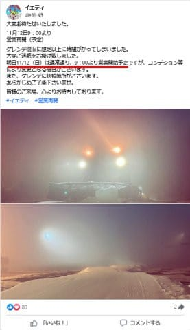
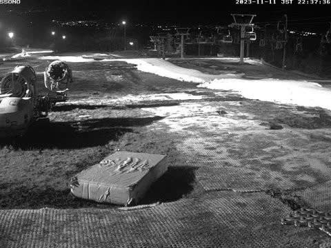
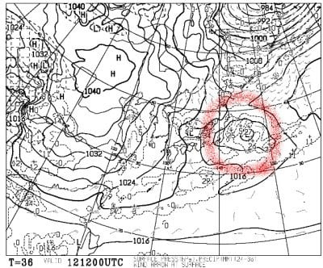
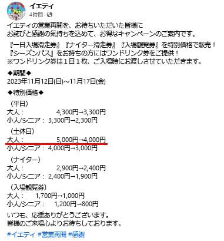

# 11月12日(日)からイエティ復活！17日まではリフト券割引みたいだけど，ゲレンデはすごい狭くなってそう…

📅 投稿日時: 2023-11-12 00:12:06

えー．

結局イエティがオープンできなかった本日．

ライブカメラを見ると，やっぱり

軽井沢がかなり混んでたみたいですね…．

([軽井沢スキー場ライブカメラページ](https://skiday.app/v5XpDAiHz0PL2Cp8ADxt/869223040349613/embed)より)

朝10時のリフト乗り場を拡大して見ると，

これ，結構並んでますね～…

([軽井沢スキー場ライブカメラページ](https://skiday.app/v5XpDAiHz0PL2Cp8ADxt/869223040349613/embed)より)

菅平も11月8日現在のゲレンデ造雪状況が

ホームページで報告されてましたが．

うーん．雪山が全然つながってないし．

オープンはまだまだ先の予感…

（[菅平スキー場ホームページ](https://sugadaira-snowresort.com/news/1399/)より）

24時間体制で造雪作業してるみたいですが，

オープンはもう少し先かな～（泣）

でも，これ，浦太郎ゲレンデじゃなく，

ファミリーゲレンデだよね？？

（[菅平スキー場ホームページ](https://sugadaira-snowresort.com/news/1399/)より）

一方，イエティの方はと言えば．

今日，11/11(土)のオープンをあきらめ，

12日オープンするかどうか判断する，

ということでしたが…

18時頃になって，

12日オープン決定

と通知されました…！

（[スノーパークイエティFacebook](https://www.facebook.com/YetiSnowtown)より）

ただ…ゲレンデのライブカメラを見ると．

オープン日も2週間弱かけて雪を作るところ，

実質4日程度の造雪ってこともあり．

コース幅はすんごい狭そう…（泣）

（[WNIスノーパークイエティライブカメラ](http://webcam.wni.co.jp/KAC24326/loop.html)より）

そして，よく見ると…

まだコースがつながってませんね（涙）

今晩の造雪で何とかするんでしょうね…

この部分は．

（[WNIスノーパークイエティライブカメラ](http://webcam.wni.co.jp/KAC24326/loop.html)より）

で．

明日の日曜のイエティ．

天気は晴れ~曇りと書きましたが，

太平洋側のそばを通過する低気圧が

予想以上に発達する予報に変わったので…

明日のイエティは曇り．

時折ほんのぽつぽつと，雨が降るかも…

という予想になりました（泣）

うーん．

ゲレンデ状況も悪そうだし．

天気はそこまでひどくないけど，あんまり

よさそうじゃないし…

明日行くのはあきらめようかな？？

とも一瞬思ったけど．

…仕事もろくに進んでないけど．

でも，滑らないと死ぬので，明日滑りに

行きます～！！！

ちなみに．

イエティもこのゲレンデ状況悪化を受けて．

緊急でリフト券割引を決めたようです．

17日まで，休日リフト券，平日リフト券とも

昼間は1000円引き，ナイターは500円引きに

なるようです…！！

（[スノーパークイエティFacebook](https://www.facebook.com/YetiSnowtown)より）

…しかし．

明日のイエティ，オープンの週よりコース幅

狭いんだろうなぁ…

大丈夫かなぁ…

とりあえず，どんなだったか帰ってきたら

レポートします…！
