# 2月9日の志賀高原は…昼間わずかに日が射すものの，おおむね雪降りの一日

📅 投稿日時: 2014-02-09 22:28:54

🏷️ カテゴリ: [2014スキー滑走日記](c992167609b6415052179ee69ea1ea7d8.md)

というわけで．

誰かの日ごろの行いの悪さのせいか．←だから，自分でしょっ！！

激しい吹雪に襲われ，午後3時に全リフトが終わってしまったという，

悲惨な土曜日があけたわけですが．

本日の朝は…

風も収まり，小雪で始まりました～．

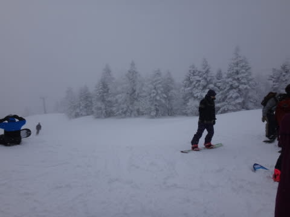

気温もマイナス10度と，平均的．

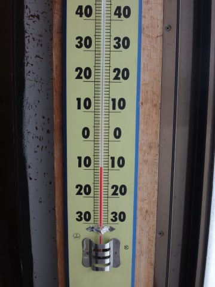

あー．やっと，

平均的な，穏やかな志賀高原が帰ってきたよ…(安堵）

雪は，昨晩からの20cmほどの積雪に圧雪がかけられ，

その上に5cm程度の新雪が軽く乗ってる感じ．

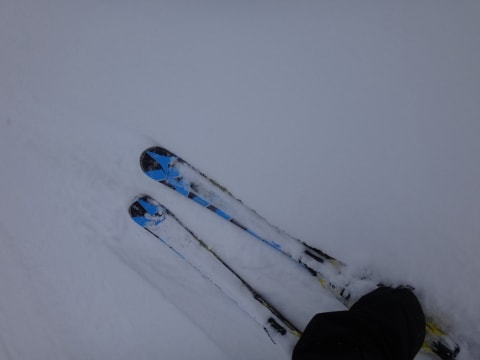

んだけど．

パウダーを求めていくと…

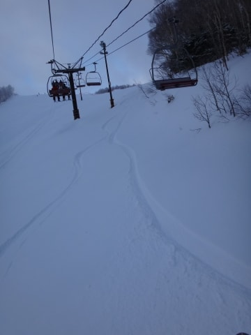

昨日の風が強すぎたのか，表面がクラストぎみで．

ぼそぼそした感じの，あまり快適ではない雪…（涙)．

うーーーーーむ．

せっかくの積雪なのに．

残念っ！

んでも．

圧雪斜面は，「新雪か？」と思うほどの，やわらかめの圧雪．

圧雪なのに，スピードが出て行くと，スキーが潜るよ～！

…って雪を数本大回りすると．

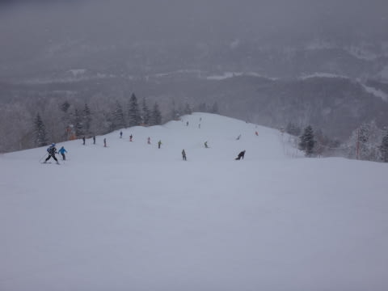

…さすが2月の週末．

結構人が出てきたんですが…

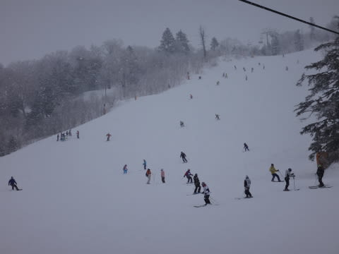

リフト待ちはそれほどでもないけど，

ゲレンデの人口密度が…(涙)

…昨日滑れなかった人が，大挙繰り出してきた感じだな～．

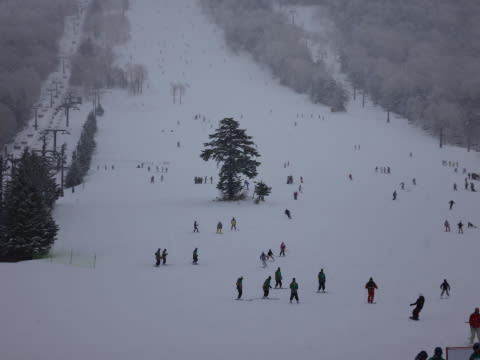

だけど，天気は．

10時ごろには雲切れ始め…

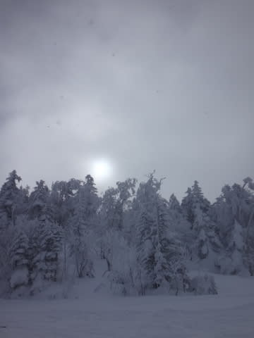

日が射すタイミングもっ！

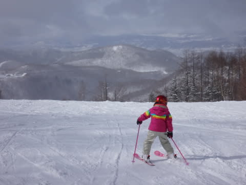

をを．

ゲレンデは混んできちゃったけど，その代わり

天気が良くなってくれるのか…？

と，思っていたら．

午後2時ごろにはまた降り始め…

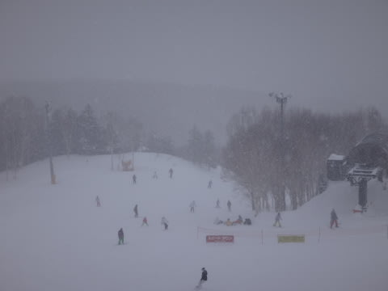

そして，2時半には激降りにっ！(泣）

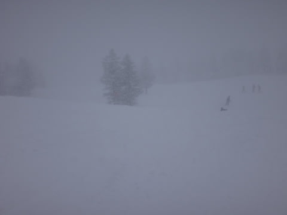

なんだか．

また．

昨日と同じく．

前が．

前が見えないんですがっ！

雪のでこぼこが全く見えないんですがっ！

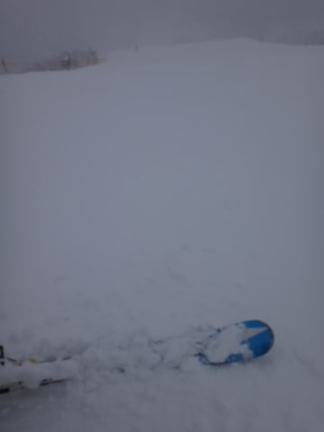

…せめてもの救いは，ゴンドラが減速運転には

なったものの，とまらなかったのが救いかな…

ってことで．

昼間はときどき薄日が射す瞬間もあったけど．

基本的には雪降りで．

午後2時半ごろからは激しい雪となり．

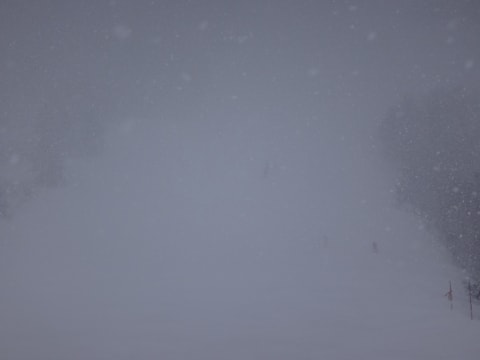

2日連続で，こーゆー感じのゲレンデを滑ることに

なっちゃったのでした…(涙)

…でも．

昼間はちょっと日が射しておだやかだっただけ，昨日より

128倍くらい良かったかな～

…

そうそう．

今回，3泊4日なので．

今晩も志賀高原泊のSkier_S．

当然，ナイターに行き．

昨日ナイターができなかった鬱憤を晴らしまくって

来たわけですが．

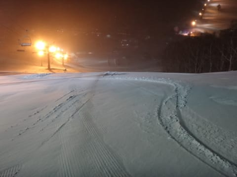

今日は，飛び石連休の谷間ってことで．

普通は土曜しか営業しないダイヤモンドナイターが

営業してましたね～！

あな嬉しや！

ナイターでも，時々かなり激しく降ってたので．

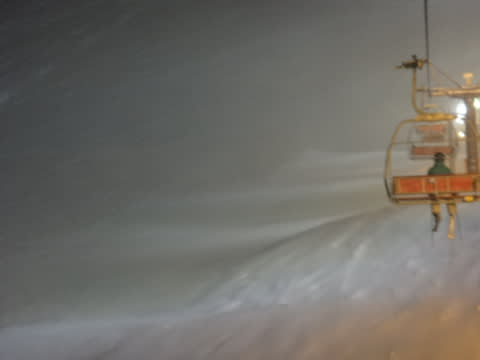

明日までに，そこそこ積もってくれるかな？
