# 菩提峠から塔の岳へ登ってみた，その2…三の塔から鳥尾山荘

📅 投稿日時: 2022-08-19 00:51:25

🏷️ カテゴリ: [登山・旅行](c1d637a11a25b457ac978d197adbdafc5.md)

えー．

書類上は今日から夏休み明けなのですが…

なんだか，休み中はずっと家にいたし．

今日も仕事とはいえ在宅勤務だったので…

まぁ，朝から夜まで会議は続いたものの．

結局一日家に板という点で変わらないので，

休みなのか勤務日なのか，最近は違いが

よく分からないですね…（涙）

ってなことで．

今日も昨日に続いて，塔の岳への登山レポートです！

というわけで．

スタートから約30分で二の塔を通過！

次は，三の塔へ向かうわけですが…

このあたりは木道も整備されていて，

結構歩きやすいですね．

…でも．

やっぱり両側から草が迫っている

ところも多くて．

結構固い枝もあったりして，

半袖だと腕にいっぱい擦り傷が

付きました…（涙）

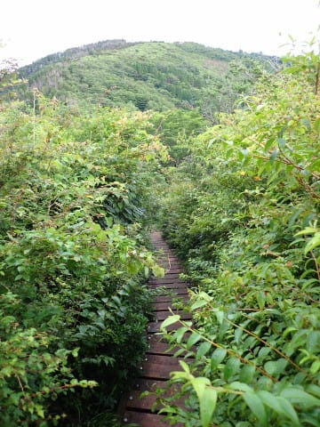

ってなことで．

今度は二の塔から10分ちょいで，

5時44分には三の塔へ到着～！！

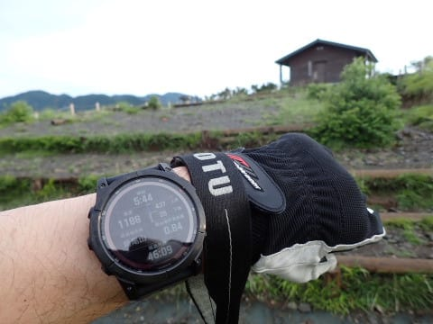

三の塔は見晴らしが開けてて，

丹沢山頂よりいいかも！！

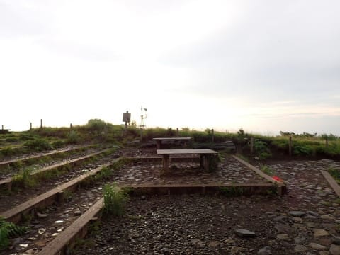

自由に出入りできるあずまや的な

小屋もあるし…

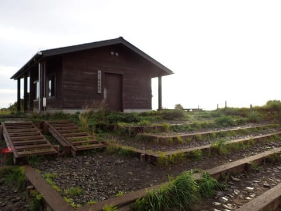

ここを目的の登ってくる人がいるのも

うなずける景色の良さ！

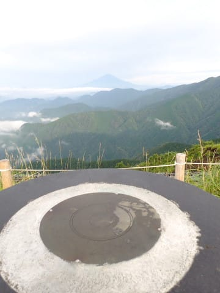

まだ朝5時台．

太陽も低く，雲がきれいに輝いていて．

いやー．

意外と三の塔，悪くないじゃないか！

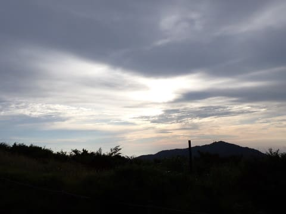

ってなことで．

まだスタートして45分ほどですが．

ここで5分ほど景色堪能のため，

休憩…

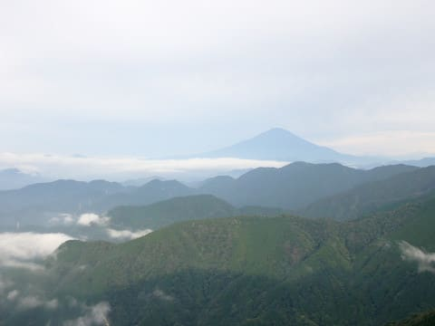

5分ほど景色を堪能してから，

5:50に三の塔を出発しますが．

目的地の塔の岳から，丹沢山方面まで続く，

これから歩いていく稜線が見張らせますね…

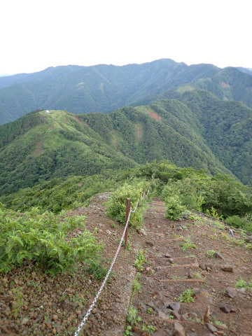

木道も整備されていて，歩きやすいな…

と思っていたら．

結構な下りが続き，

いきなり急なはしごやら．

‘

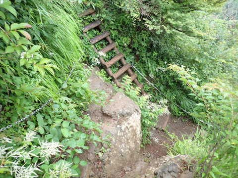

鎖場の下りが現れます…

まぁ，鎖を使わなくても降りれる

程度の斜度ですが，

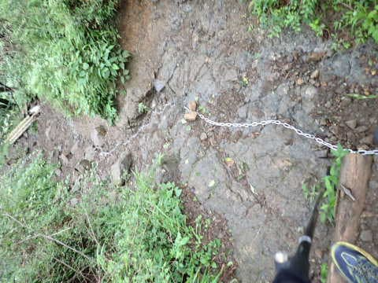

うーん．結構な標高差を下ったので．

これだけ下るということは．

帰りはこれだけ登るってことだよな…

…と思いながら，稜線っぽいところを

歩いていくと…

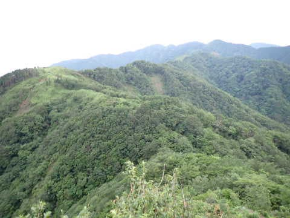

三の塔から約15分．

6時5分には，鳥尾山荘へ到着！

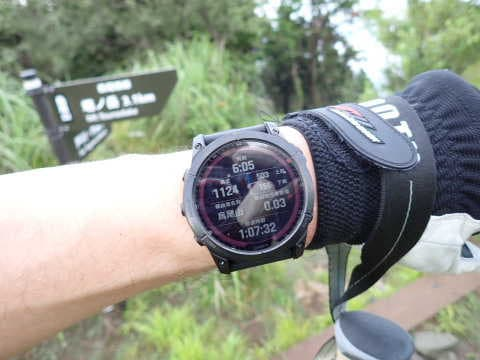

これが鳥尾山荘ですか…

ここも見晴らしはそんなに悪くないですが．

だんだん雲が出てきて，見晴らしが

効かなくなってきましたね…

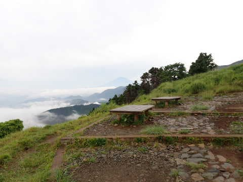

あ，あとここにはトイレがありました…

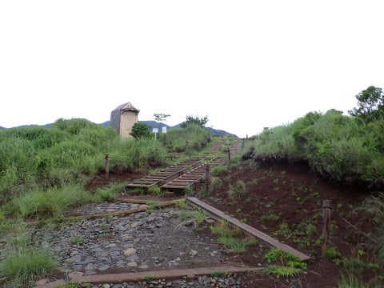

さっき三の塔で休んだばかりなので．

鳥尾山荘も休憩せずに，通過！
