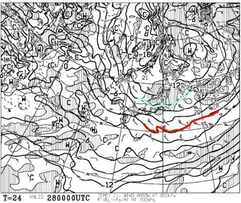
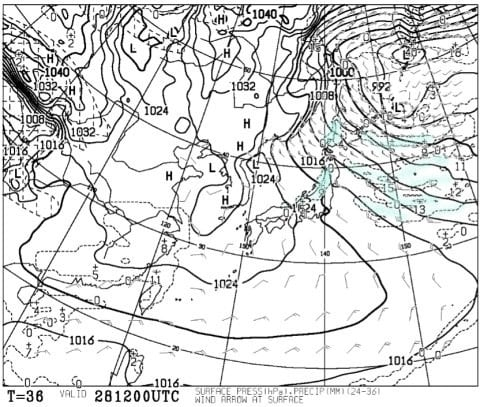
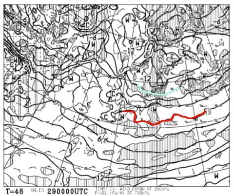
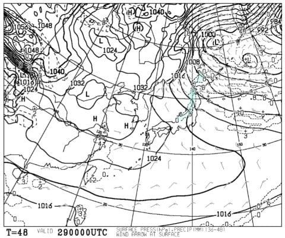
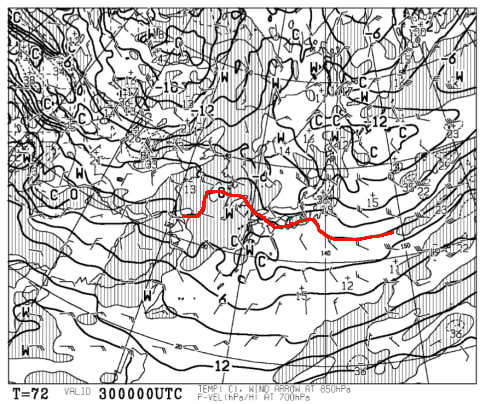
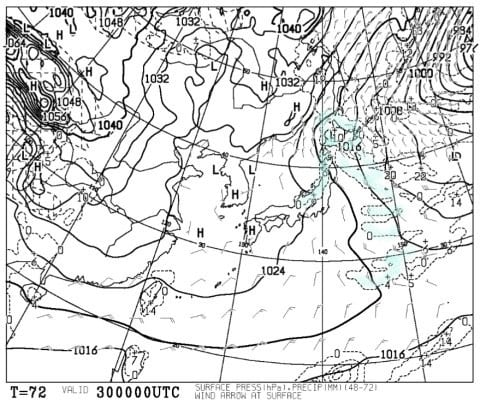
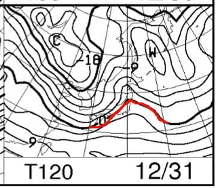
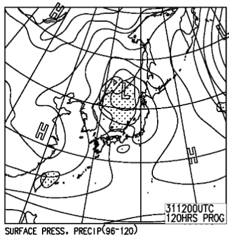
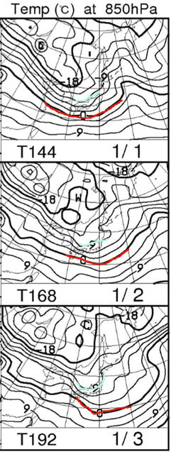
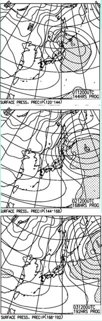

# 年末年始，志賀高原スキー場の天気予想詳細版…そして私は明日パフパフ志賀日帰り予定っ！

📅 投稿日時: 2017-12-27 22:52:29

どうやら本日．

志賀高原はかなりドサドサ降ったようで．

（27日は西風で志賀はそれほど降らないと踏んだんだけどなぁ…）

今でもまだバサバサ降り続けているらしい今日この頃，

皆様，いかがお過ごしでしょうか．

ってなわけで．

この2日間ほど，Blogをまともに更新できない

日々が続いていましたが．

…本日，復活！

というか．

明日，なぜか仕事を休んで志賀高原にスキーに行きます．

ふははははは．

今シーズン初の，平日スキーだぁっ！！！！

ってことで．

本日は．

明日の予想を含め，昨日まともに書けなかった

年末年始の天気予想の詳細をば…

えー．

まず．

明日ですね．

私が平日スキーというゼイタクを味わう日の，

850hpa気温を見ると…

うは．

0℃線は日本のはるか南だし．

志賀高原は水色に塗った-9℃線どころか，

-12℃線が近づいてますよ！？？

…これは．

志賀高原では，28日の朝．

マイナス15度レベルの冷え込みか？？

おそらく．昼間も-10℃以下でしょう…

地上天気図を見ると．

うむ．日本海側には積雪が予想されており．

今晩からドサドサ降りそうなので．

明日の朝はひざパフレベルのパウダーが

楽しめそう…！！

天気は終日雪降り．

コース上は，いつもうっすら新雪が積もり続ける

感じかな…

そして．

皆さんがこの日から休みになるであろう，

29日の850hpa気温図を見ると．

うむ．

この日も，水色の-9℃線が志賀に近づいているので…

朝は-10℃程度の冷え込みですな．

29日の地上天気図は…

冬型が弱まってくるので，28日までよりは

降りは弱まるけど，でも，まだ日本海側に

水色で塗った降水域があるので．

29日も弱いながら雪が降り続けそう…

朝は10～20cmくらいの新雪が楽しめるかな．

そして．

30日も，0℃線は本州のはるか南．

志賀高原には-6℃線が掛かっている程度なので．

朝は-10℃以下には冷えなさそう．

-7～8℃くらいかな？

30日の地上天気図は…

この日もまだしつこくうっすらと水色の

降水域が日本海側にかかってますね．

この日の午前中くらいまで，雪が

ちらつき続けるかな？

続いて．．

31日，大みそかの850hpa気温図は…

うむ？？

ちょっと赤く塗った0℃線が志賀に近づき，

危険っぽいけど…

でも，志賀よりは北に行っておらず，セーフかな…

大みそかの地上天気図は．

低気圧が近づいてきてますが…

降水域の網掛けが志賀に掛かってないので．

朝のうちは晴れ，午後から曇が増えて

いく感じでしょうか．

低気圧の発展具合と志賀への近づき方によっては，

ゴンドラが止まったり減速したりするかも？？

そして．

その後．

年が明けて，1月1日～3日は．

うむ．

3日とも，志賀高原は水色の-9℃線が掛かるレベルなので．

朝は-10℃程度．

昼間も-6，7℃といった，冷えた

日々が続きますね…

地上天気図を見ると．

うはーーー．

3日とも，見事な冬型っ！！

これは，3日ともそこそこ雪が降りそう…

まだ断言できないけど．

この天気図のままなら．

1～3日の3日間．

ずっとパウダーねらい目デーじゃないですか！

…逆に言うと．

3日連続，ちょいと荒れた吹雪っぽい

天気かもしれませんが（ちょい涙）．

ってなわけで．

まとめると．

28日：朝はひざパフ新雪！パウダーデー！

　終日-10℃以下の冷え込み＆雪降り．

　時折強く降って，さーーむいよ！

　でも，エンドレス新雪供給デーになるか？？

　雪は軽くてGood．

　終日，軽い雪がゲレンデを覆い続ける．

　太陽は拝めず．

29日：朝は10cm，運が良ければ20cmの積雪か…

　この日も朝は-10℃クラスの冷え込み．

　昼間も-6，7℃くらいまでしか上がらず，

　冷え気味の一日．

　天気は終日雪がちらつく．時折やむ．

30日：朝は10cm弱の積雪があるかな？

　この日も朝は-10℃くらいの冷え込み．

　午前中は曇り～雪がちらつく．

　午後から晴れていくか？

　午後のゲレンデは荒れていく…

31日：朝はおそらく晴れ．

　気温は高めで，昼間は焼額山頂でも-3度，

　志賀でも標高が低いところは0℃くらいまで上がるかな．

　低気圧が接近するので，午後から雲が増え始めそうだけど…

　今のままなら，リフトが動いている昼間は晴れ続けるかも．

　ただ，低気圧の接近の仕方によってはゴンドラは

　減速・運休がありえそう…

1日～3日：朝から冷え冷え，雪降り！

　終日雪が降り続け，そこそこ積もる．

　3日連続のパウダーデーの可能性．

　ただ，ちょっと荒れて吹雪っぽいかも．

　奥志賀ゴンドラは運休の可能性あり

という感じでしょうか．

31日以外，平年より気温が低い日が続くし．

太陽が望めなさそうな感じですが…

雪はたっぷり降りそうかな？

ってことで．

明日，日帰り志賀へ行ってきます～！

あと4時間半後に出発です…

## 💬 コメント一覧

### 💬 コメント by (かず)
**タイトル**: Unknown
**投稿日**: 2017-12-28 02:09:07

27日昼すぎからさらに冷えて辛くなってきましたので防寒準備　雪軽いですが　寒くて板走りません　このへんも準備必要です

### 💬 コメント by (olaf2125)
**タイトル**: Unknown
**投稿日**: 2017-12-28 07:28:19

>そろそろ積雪が欲しいところ…

って言ってたら、「あっそ、ではどうぞ」てな感じで降らせてくれますね (^O^)

今シーズン、すごいですね！

### 💬 コメント by (Skier_S)
**タイトル**: 今日はパフパフ楽しめたな～！
**投稿日**: 2017-12-29 00:29:25

＞かずさま

今日は寒かったですね～！

でも，結構パフパフを楽しめたので

満足な一日でした．

また次は30日に志賀に復活します～！

＞olaf2125さま

いやーーー．

すごい積もってましたよ．今日は…

パフパフ楽しめました～！

また年末お会いしましょう！

