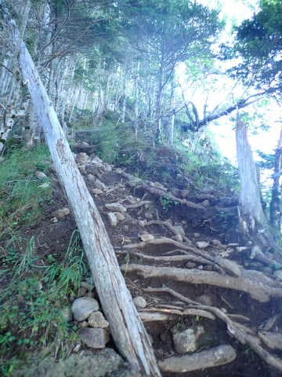

# 八ヶ岳の阿弥陀岳・赤岳ピストン登山！その2…最初は緩やかお気楽ハイキングだったけど…途中から激烈急坂に

📅 投稿日時: 2022-09-24 07:21:44

ってなことで．

7月の最後の週末の土曜日に，

阿弥陀岳・赤岳ピストン登山を

決行することにしたんですが…

この週もかなり激務が続いたうえ，

前日の金曜は12時過ぎに寝て，

そして土曜朝3時前には出発という，

睡眠時間2時間半の強行軍

だし．

午後から雨が降るかも…

って予想だったので．

まぁ，無理はしないで．

ダメだと判断したら阿弥陀岳だけ登って

帰ろう…

と，出かけた土曜朝．

なんとか朝3時に家を出て，

朝5時前に船山十字路駐車場に

到着しますが…

この時点で駐車場，空きスペースは最後の1台．

ギリギリ車を停めることができました…

ってなことで．

朝5時ぴったりに船山十字路登山口から

出発したわけですが．

このとき，かなり眠く，疲れ気味だったので．

うむ．赤岳まで行く精神力が続くかどうか，

確率は50%くらいかな？

という気分でスタート．

ってなことで，林道入り口のゲートを

通り抜け，歩き始めますが…

空は曇り空．

明け方雨が降ったのか，路面が

濡れてます…

うーん．雨が降らなきゃいいな…

アスファルトの林道を100mも歩くと，

すぐに脇の登山道への分岐があるので，

登山道の方に入っていきます…

この山は，前半は割と淡々とした

登り坂が続く山で．

最初のうちはこんな感じの，

緩い登りやすい坂道が続きます…

うん．

阿弥陀岳，激しい山だけど…

前半はかなり大人しいのね．

ってな感じで淡々と1時間ほど歩くと…

美濃戸口からやってきた登山道と合流！

ここまでは3kmほどで標高差500mと，

それほど急じゃない坂道が続く，お気楽

ハイキングコースって感じですが…

ここまでで，標準コースタイムなら

既に2時間6分ぶん歩いてます…

ここまででスタートから57分．

まぁ，緩い道なら順調にコースタイムの

半分の時間で歩けてますね．

この分岐から1分ほど行ったところに，

「御小屋山」がありましたが…

平坦な道の途中にある感じで，

あんまり山頂って感じがしないですね．

…ちなみに，この登山ルートは

「御小屋尾根ルート」と呼ばれてます．

で．

ここからはまたしばらく，さらに

緩めの傾斜が続く道で…

時々上ったり下ったりと，

歩きやすい道が続きます．

そして．

心配していた天気も．

だんだん空が晴れていき，いい天気に

なってきました…！！

むふふ．やはり私の日ごろの行いが

いいからだな…！

朝日が差し込む中，

気持ちよく程よい登り坂を登って

行くと…

御小屋山から25分ほどで，

不動清水分岐へ到着！

…水場へはちょっと下らないといけない

ようなので．

水場へは寄らず，ここはあっさり通過！

ここまで，標準コースタイム2時間50分

くらいのところ…

スタートから1時間27分で通過ですね．

ここまでもコースタイム半分くらいで，

良いペースで通過したぞ…ふふん♪

と．

ここまではお気楽に登ってきたけども．

ここから一気に登山道はその性格を一変して．

「ふふふ．お遊びはこれまでだ．

　ここからが本番だぜ！」

と言わんばかりに．

急斜面に激変して，目の前に

立ちふさがったのだった…

