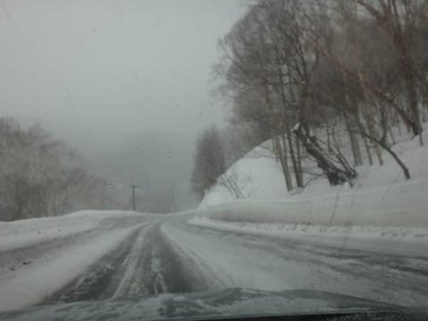
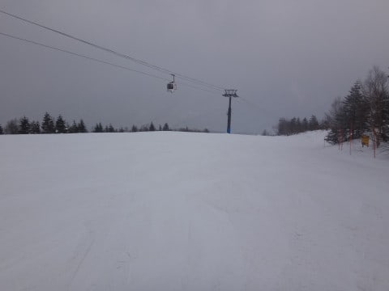
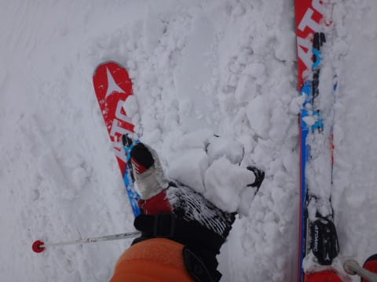
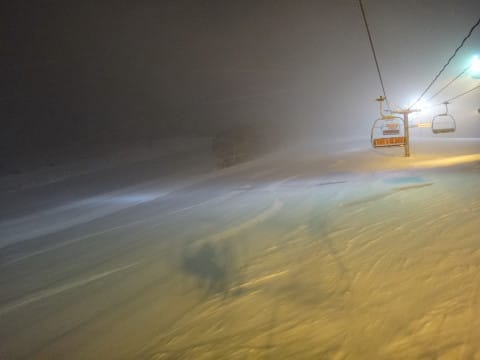

# 3月19日，3連休中日の志賀高原は…すごい混んだよ（涙）．そして雪降り…天気予想外しました（泣）

📅 投稿日時: 2017-03-20 00:06:40

えー．

なぜ本日終日雪降りになったのか，いまだに

把握できていない，Skier_Sです．

と，のっけから書いているように．

今日の天気．

　朝は曇り，時折雪もちらつくかも．

　でも，日が射したり曇ったり．

という，比較的穏やかな天気の予想でしたが．

実際は

　終日曇り時々雪，時折強く降る

という天気で．

太陽は全く拝めず，それどころか，風が強く

奥志賀ゴンドラは止まり．

さらに雪は時折かなり激しく降る，荒れ気味の天気…

はい．

天気予想，外しました（涙）

…でも．

直前予想では．

他の天気予報が「晴れ」と言っていたところ．

　曇が多め，雪がちらつくかも…

というところまで予想していたところは，偉い！

…と，自分を慰めていますが．

予想外してすみません＞KonSukeさま

と，User1985aさんより伝えられたメッセージに

回答したところで（^^;

本日の本題．

今日のスキー場レポートです…

本日，朝から雪がちらついており．

道路もうっすら積雪路．

風も強く，奥志賀は第1ペアリフトを除いてすべて運休…（涙）

という，朝．

焼額は予定通り，全リフトが営業だったので．

焼額第1ゴンドラで山頂へ上がると…

朝の気温は-6℃ですか．

結構冷えてますね．

で，山頂は雪降り．

まぁ，朝のうちは降るかも…

って予想だったし．

ここまでは想定内．

ゲレンデは3cm程度の積雪があったようで…

うっすら重めの新雪が覆ってます．

朝の30分は，人が少なかったけど…

9時を過ぎると．

コースの人が増えてきて…

そして，9時半には．

うぎゃーーー！！

奥志賀がほぼ全面運休だから，

焼額に人が流れてきたのか…

こんな時間でもうこんな待ちが発生するとはっ…！！

…しかし．

このくらいは甘かった．

次にゴンドラにやってくると…

うぎゃーーーーー！！

なんてこった！！

もっと列が長くなってるよ…！

今シーズン最長のゴンドラ待ち！

結局．

11時近くまで．

こーゆーすごい待ち時間が…（涙）

表記は30分待ちでしたが．

実際は15分待ちくらいだったかな…

コース上も，雪質がちょっとぼそぼそとした

滑りにくい新雪だったので…

奥志賀ゴンドラが営業開始した11時15分，

奥志賀へ脱出！

北斜面の奥志賀は，やっぱり焼額より

ちょっといい感じの雪質だったけど…

写真ではわかりにくいけど，ちょっと

新雪が黄色く，かなり黄砂で汚れた雪．

で．

運転開始直後の奥志賀ゴンドラも．

あれ．10分待ち…（涙）

強風で出ている搬器が少なく．

待ち時間が長かったようで…

だもんで．

ゴンドラは1本であきらめて．

高速リフト側，エキスパートコースへ移動！

まだリフトが営業開始してないので，

ガラガラのコースを滑り下り…

無人のエキスパートコースをおいしくいただき…

そして，第2高速ペアの営業開始を待って…

営業開始とともに，第2高速ペアに搭乗！

営業開始すぐは，誰も滑ってない，

気持ちよさそうなバーンコンディション！！

オープンしたてのフラットバーンを，

貸し切り状態で滑れる快感！

…しかし，数本滑ると．

あら．

やはり，このコースも人が増えてきたか…（ちょっと涙）

リフト待ちもちょっとあったけど…

でも．

午前中誰も滑っていなかったバーン．

他のバーンに比べれば荒れてなくて，

バーンコンディションは激烈に良かったなぁ…

で．午後3時近くには，なぜか．

全く予想外に．

かなり雪が強く降り始めました．

そして，時折視界も悪化…

うーむ．

こんな天気になるとは，全く予想外…（涙）

で．

やはり焼額がホームゲレンデの私．

3時過ぎには焼額に戻りますが…

意外と夕方の焼額．

新しく積もった雪が良かったのか，

雪質もよく．

意外とコースもフラットで．

コース上の人は，夕方までちょっと多かったものの．

でも，ゴンドラ待ちはなし！

って感じで．

今日もいつも通り．

4時半の焼額ラストゴンドラまで，

ひたすら滑り続けたのでした…

…しかし．

午前中の激烈ゴンドラ待ちが惜しかったけど．

日差しで雪が緩むことは全くなく．

…それどころか，結構いい感じの新雪が積もり．

午後までかなりフラットなバーンを滑れて．

まぁ，満足な一日だったかな～，

…が．

皆さん，おわかりですよね．

まだ終わりませんよ～．

はい．いつも通りのナイターです．

今日は，ダイヤモンドナイターへ参戦！

ゲレンデは，シマシマというより．

夕方に降った雪がうっすら積もった新雪状態！

では，いただきまーす！

という感じで．

2時間半．

たっぷり気持ちいいゲレンデをいただいたのでした…

で．

今日，現在も雪が降り続いてます…

明日の朝は，また数㎝のうっすら新雪が

圧雪された，柔らかめの圧雪でスタートかな～．

しかし．

今シーズン．

3月下旬としては恵まれたコンディションが

続いてますね～…

## 💬 コメント一覧

### 💬 コメント by (いか)
**タイトル**: ついにヤツが、、、
**投稿日**: 2017-03-20 14:35:17

今回降った雪にはかなりの黄砂が混じっていましたね。(お隣に出張しまして)いいもりの急斜面で盛大につんのめりました(笑) ちなみに、麓は雨で朝起きたときのテンションの下がりようは、、、

そろそろシーズン終わりが近づいてきましたね(ノω・｀)

### 💬 コメント by (Kyura)
**タイトル**: 志賀高原スキー
**投稿日**: 2017-03-20 20:25:10

３月１５日・志賀高原スキー場スキー友達と行きました。ヤッパリ本場のスキー場・焼額山～一の瀬～寺小屋～ブナ平～ジャイアント～高天ケ原マンモス～サンバレー等思う存分スキー出来ました。雪質が違い明日も長野方面雪みたいまだまだスキー出来そう次回は天候の良いときお出掛けをして下さい。志賀高原スキーは良い❤

### 💬 コメント by (めいめい)
**タイトル**: Unknown
**投稿日**: 2017-03-20 20:46:11

お疲れ様でした。

日曜、1ゴン降り場でやっとお会いできましたね！乗り場で滑り降りてきたSさんを発見しておりましたｗ

奥志賀が止まっていた関係で、降り場でああでもないこうでもないと策を練っていたところでした。我々読者3人には、Sさんは有名人と同格ですｗ

お連れ様がみえたのでお話しも早々に切り上げさせていただきましたが、次回機会あれば少しゆっくりお話ししたいです。シールいただけず残念（涙）

今回は2泊3日でしたが所属クラブでの行動で自由が利かず、焼額に行けたのはあの時だけでした。1ゴンの見たことがない長蛇の列に恐れをなし、一ノ瀬へ戻りました・・・奥志賀のバカ（涙）

### 💬 コメント by (こじろう)
**タイトル**: 残念
**投稿日**: 2017-03-20 22:15:28

土曜日、焼額山の早朝でお会いできるかと張ってましたがまさかの奥志賀とは。お目にかかれるかのを楽しみにしていましたが今週の動きは読みきれませんでした。

### 💬 コメント by (Skier_S)
**タイトル**: いっぱい滑った3連休でした…
**投稿日**: 2017-03-21 01:58:50

＞いかさま

来ましたね…黄砂．

でも，昨日の午後に降った雪で

黄砂の層がすぐに隠れたので，

それほどひどい影響はなかったですが…

で，白馬は雨だったんですか？？

…やっぱり，春の時期は志賀がいいですよ（笑）

＞Kyouraさま

初コメですよね？？

ようこそ，我がBlogへ…

そして，志賀高原へようこそ．

15日というと…結構冷えて雪が降った日ですね．

寒かったんじゃないでしょうか？？

志賀はまだまだシーズンです．

GWまでありますので，また志賀で滑ってください～！

＞めいめいさま

あ，あの1ゴンてっぺんでお会いしたのは，

以前コメントくださっためいめいさんだったのですね…

わざわざ声かけてくださってありがとうございます！

…ステッカー切らしてて申し訳なかったです．

一緒に滑っていたのは，Gokuraku SkierさんとれおさんというBlog読者仲間だったので，一緒に滑っていただいても全然良かったのですが…

＃むしろそのほうが盛り上がったかも（笑）

ちょくちょく志賀高原にお越しなんですよね？

また次の機会にはゆっくりお話ししましょう～！

＞こじろうさま

すみません…

金曜は12時近くに帰宅だったので，早朝に行く元気がなかったです（汗）．

というか，早朝に行ったら死んでたと思います（笑）

…ご期待に沿えず申し訳ありません．

土曜は奥志賀スタートでしたが，9時過ぎから1時頃まではいつもの1ゴングルグルでした…

今回はすみません．

また，次の機会に…！

### 💬 コメント by (いか)
**タイトル**: Unknown
**投稿日**: 2017-03-21 23:54:55

日曜日の早朝は村内は雨でした。スキー場は下部でもぼた雪でなんとか雪でした。シーズン券だとなかなかほかのスキー場行く機会ができませんねヽ(´〜｀； たまには志賀も行ってみたいです。

今回のいいもりでお受験を終えられたので、つい月曜日に早上がりして黄色いお店で14AX174を継ぐ大回り板をゲットしてしまいました(笑) 今度白馬に行ったときに板ごと持って帰ってきて、ビンディングを乗せ替え、うまくいけば4月頭には乗れるかもです(´ー｀)

### 💬 コメント by (Skier_S)
**タイトル**: いかさま
**投稿日**: 2017-03-22 04:06:25

私も志賀のシーズン券を持っていると，

八方に行くことは無くなりました（笑）．

やっぱり志賀，雪がいいので…

で，14AXの後継機Getですか？？？

機種は何でしょう…

ビンディングが使いまわせるんだから，

LX？Redster GS？

…あるいは…私と同じ，X-race？？

