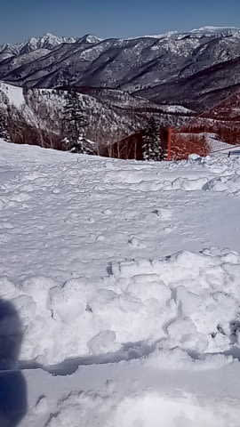
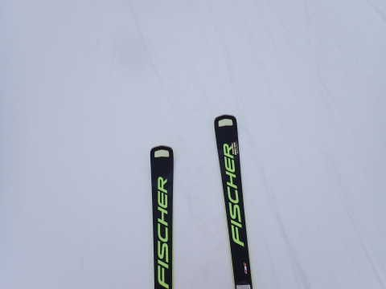

# 2023/2/26(日)の志賀高原詳細モード＆2月27日の特派員レポート！…26日は激冷え吹雪気味，27日は晴天でちょっと気温が上がりぎみ

📅 投稿日時: 2023-02-28 00:24:12

🏷️ カテゴリ: [2023スキー滑走日記](cd943df30cfcc3d0896469e2ff98720cd.md)

本日も．

志賀高原に送り込まれている

何人かの特派員の方から写真が

送られてきましたが…

今日は昨日とうって変わって，

雲一つないすっきり快晴で．

圧雪バーンは見事なシマシマ！！

ただ，意外なことに，

昨日からの積雪は10cmほどあったようで．

コース脇やオリンピックコースなんかは，

新雪だったようです…！！

で．

あさイチは結構冷えて，冷え冷えの

最高雪質で．

天気も良く，景色も楽しめたようですが…

あさイチの気温は-7℃と冷えていたものの，

昼ごろには0℃近くまで上がっちゃった

みたいで…(涙)

昼ごろに，オリンピックコースは

ボソボソした感じになっちゃった

みたいだし．

コース脇の新雪も，モサモサに

なっちゃったみたいです(泣)

でも，終日快晴で景色も良く．

平日らしくガラガラだったので，

圧雪は最後までフラットで，

滑りいいバーンだったようです…！

うーん．

気温が上がっちゃったのは残念

だったけど．

激冷え吹雪で数多くのゴンドラや

リフトが止まった昨日より，今日の

コンディションで滑りたかった…

ってなことで本題へ．

今度は昨日速報レポートした

26日(日)の志賀高原の，詳細レポートです！

えー．

まず．

あさイチの気温は-12℃と，結構な冷え込み

でスタートした本日…

昨晩から降り続いた雪は，20cmほど

積もっていて…

ゴンドラが減速運転になるほどの

強風＆雪降りの，実質吹雪という

状態で始まりました…

ちなみに，焼額はゴンドラは減速運転に

なりつつも全リフトが動いてくれたけど，

奥志賀はゴンドラも第2高速ペアも

止まっていたようです…

で．コース上は，圧雪バーンでも

圧雪の上に薄いところで2~3cmほどの

積雪があり…

圧雪した時間が早かったであろう部分は，

10cmほどの新雪が，圧雪上に乗って

ました…！

でも，雪はかなり冷えた軽い雪で．

ほぼ圧雪を滑っているのと変わらない

滑り心地で…

圧雪に完全底付きした状態で，

2~10cmの新雪を蹴散らしていく感じ！

しかし…

朝は降雪もかなり激しく，視界は悪かったし…

そして，飛び石4連休で人が多いからか．

天気が悪いにもかかわらず，焼額第1ゴンドラの

待ちがゲートの外のそこそこまで伸びて…

普段は混まない第3高速もかなり

列が伸びてました…（泣）

ただ，混んだのも11時まで．

11時を過ぎると，ゴンドラ待ちも

かなり解消され…

午前中は吹雪気味だったのもあり，

屋根もフードもない第2高速は

終日ガラガラでした…！

天気は，午前中は雪降り~曇り空

だったけど．

昼ごろから空が時々明るくなることも

あり…

午後は視界も回復！

昼間の最高気温も，-10℃を越え

なかったので…

雪質は，午後になっても最高のまま！！

とはいえ…

圧雪後に10cmほどの積雪があり，バーンは

柔らかかったので．

午後になると，GSコースなどは柔らかい

雪が蹴散らされて，凸凹になってる

ところもあって．

ちょいと滑りにくいかな～…

とも思ったけど．

GSコース以外は，そこまでひどく

荒れているところもなく．

午後は時折薄日も射す，絶好の

大回り日和だったのでした…

うーん．

冷え冷え雪で，雪質は最高だったけど．

天気が悪くて，かなり寒かったのが

ちょっと惜しかった…

で．

この日は，意外なことに．

午後3時近くにスキーを終えて切り上げる

という，ほとんどの読者の予想外の時間に

スキーを終了してしまいました…

いや．私はもっと滑りたかったんですが．

今回は久しぶりの家族スキーで．

あまりもの悪天候に，家族は早々に

スキーを切り上げ．

早く帰ろうオーラを出すので．

やむなく，泣く泣くリフト営業終了前に

切り上げたのでした…

というか，今シーズン初めて，焼額の

営業終了前にスキーを終えちゃいましたね…

いつも一人で滑っている罪滅ぼしの

家族サービススキーだから仕方がないけど．

ラストまで滑りたかった…（ちょい涙）

## 💬 コメント一覧

### 💬 コメント by (スシネコ)
**タイトル**: Unknown
**投稿日**: 2023-02-28 13:02:41

両日とも板は発見したのですが（笑）、お会いできずに残念でした。

毎週参戦していると、さすがに罪滅ぼしの家族サービスが大事だと思いました。

「桜が咲いたら参戦終わりだよ」と言われているのでリンゴとアップルパイをお土産にしつつ、夜は（興味のない）中国ドラマを一緒に見てご機嫌取りに必死な毎日です（笑）。

### 💬 コメント by (レインボー75)
**タイトル**: Unknown
**投稿日**: 2023-02-28 16:52:17

火曜日の志賀高原情報

今日の奥志賀はシーズンベスト。硬めのフラットバーンを、アール25 182cmに初乗り。エキスパートをあんなに気持ち良く余裕をもって滑れたのは初めて。道具によって快感がこうも違うとは！

ただめっちゃ重い板なので、昼食後は板交換。なんせ老人なので。

やけびも楽しすぎました。午後は撮影のプロを追い撮りしたりで、最高の一日を送れました。それでも２時(レインボー)きっかりにニゴンに戻れましたよ。

スシネコ様、私も家に帰ると興味のない韓国ドラマを一緒に観させられる拷問を、甘んじて受けておりますよ。

### 💬 コメント by (Skier_S)
**タイトル**: 明日も晴天！
**投稿日**: 2023-03-01 02:40:41

＞スシネコさま

今週末はお会いできませんでしたね～…

ぜひうちの娘にもスシネコシールを渡してほしかったのですが（笑）．

私も今週は家族スキーで，早めに上がって帰りに小布施でジェラート・マローネや

竹風堂本店の栗おこわ定食など，家族サービスに務めました…

＞レインボー75さま

いや～．やっぱり志賀高原の朝イチは，ロングの板がいいですよ！！

重さゆえの安定感が，どこまでもスピードを出せる安心感につながって，

気持ちよく飛ばせますから…！

