# 2023/2/23(木・祝)の志賀高原に日帰りスキーに行ってきた…うす曇り時々晴れ．気温は高めだったけど良かったよ！

📅 投稿日時: 2023-02-24 01:47:47

🏷️ カテゴリ: [2023スキー滑走日記](cd943df30cfcc3d0896469e2ff98720cd.md)

ってなわけで．

行ってきました．

犠牲者心優しい方に

往復の運転をかなりやらせたやっていただいたおかげで．

ここ数日の睡眠不足状態では無理…

と諦めていた日帰り志賀高原に行って

きました！！

(そのかわり今日仕事が進まずいろいろ苦しくなってることは忘れることにしている)

で．

朝の志賀高原の登りは…

意外と雪がありませんね．

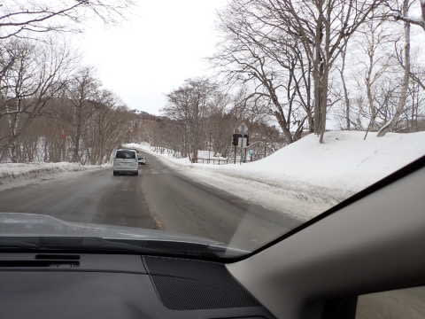

でも，スキー場のそばまで来ると

本格的雪道なので，ご注意を！

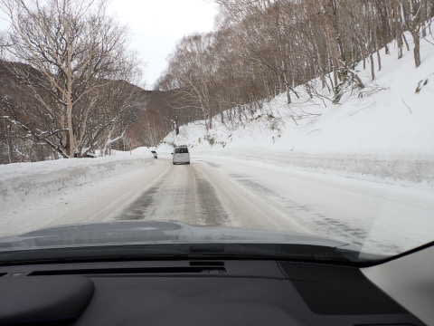

ってなことで．

いつも通り，8:30の通常営業開始を

狙って焼額第1ゴンドラに並びますが…

週の半ばの1日だけの休日と考えると，

普通の土日と同じくらい人がいて，

予想より人が多め…

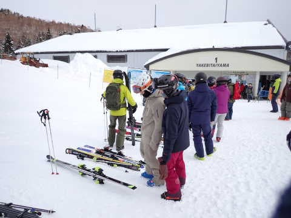

そして．

朝イチゴンドラで山頂へ登りますが…

山頂の気温は-5℃と，[月曜の予想](e24dd4ac9fd67399bb6947092aeb62185.md)が

ぴったり！！

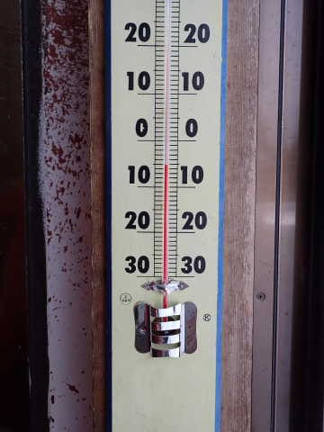

でも．

晴れ予報のはずが曇り空で，うっすら

日が射す程度…（ちょい涙）

まぁ，すっきり晴れの予想じゃなく

　雲は多いかもしれないけど，

　一日晴れてくれそう．

と書いていたので完全外れではない，

と主張してもいいかな←自分に甘くないか？

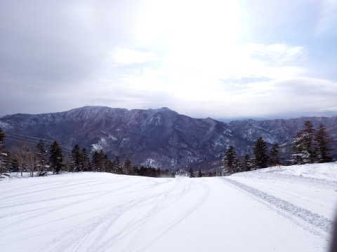

で．

なんと．

今日の祝日は7:50から営業のファースト

トラックの営業が予定されておらず．

いつもなら通常営業からの参戦だと，

ファーストトラックの人に滑られた

跡のあるバーンを滑ることになるけど…

今日は通常営業からの参戦でも，

誰も滑ってないシマシマだぁ！！

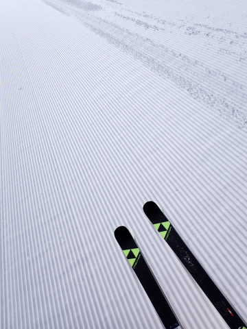

ぐほぅっ！！！

シマシマっ！！！

柔らかめだけど，降りたてのふかふか

より少し締まり気味の，

柔らかいけどしっかりエッジが効く，

トップシーズンらしい快楽の

シマシマっ！！

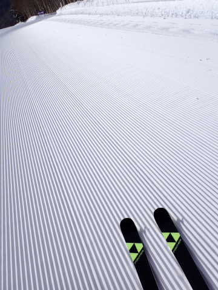

すっきり晴れではないけど，

薄日の射す中，最高のシマシマが滑れて，

これだけでも，今日は来たかいがあった

というもの…

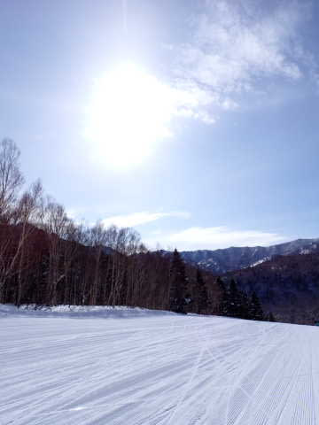

ただ，朝10時ごろにはゴンドラが一瞬

ゲートの外にまで並んだけど…

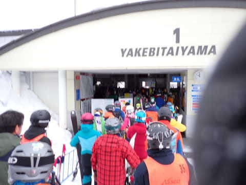

コース上の人は，祭日とはいえそこまで

多くなく，朝のうちは飛ばしたい放題！

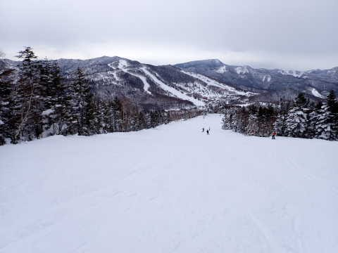

そして，ゴンドラは11時以降はゲートの

外まで並ぶことは無く…

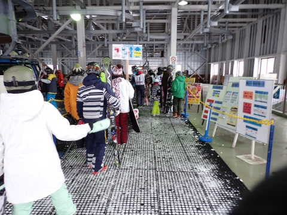

リフトもガラガラ！！

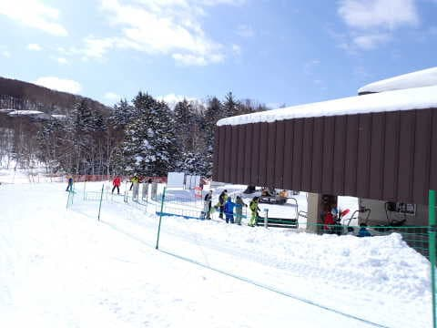

あ，でも．

今日も朝10時ごろには，日体大の団体さんが

出てきて…ちょっと人口密度が高いところも

一部あったものの，混んでいたのは

サウスコースだけ．

そこを避ければそれほどの混雑はなかった

です～！

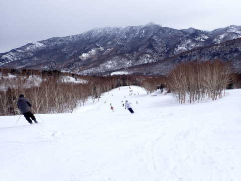

…雪質は，昼間はGSコースのごく一部と，

唐松の急斜面の一部だけ，日差しで雪が

暖まって，ボソボソになってきたところも

あったものの…

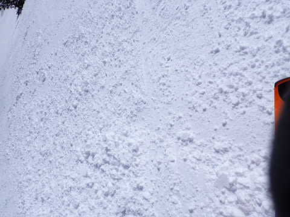

天気はすっきり晴れじゃなく，うす曇りで

日差しが弱かったのもあり．

昼間は0℃くらいまで上がったけど，

ほとんどのコースは一日中雪質はいい感じ！

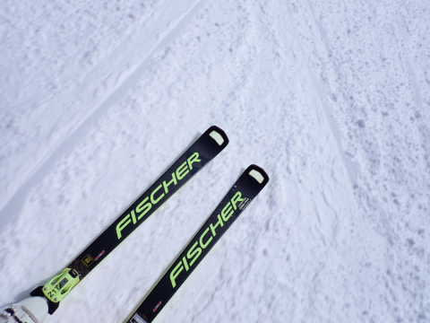

…というか．

天気は昼過ぎに一瞬，予想になかった

雪が舞うタイミングもあったものの…

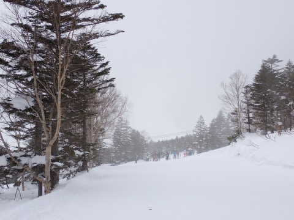

基本的に曇り～晴れで，寒くもなく

強すぎる日差しで雪が融けることも

ない，いい感じの天気で．

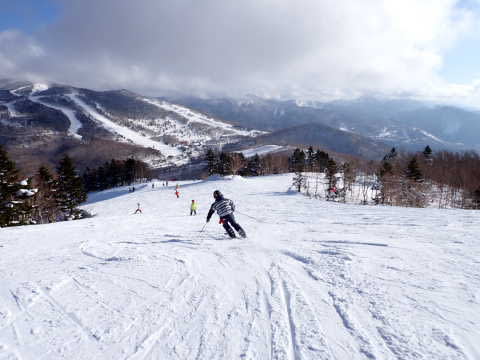

人が少なめだったこともあり．

ラストまでバーンはほとんど荒れず，

気持いい大回りバーンのまま！

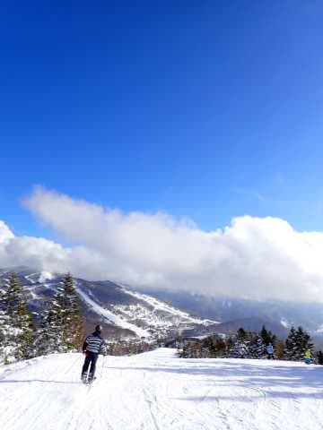

ってなことで．

今日もいつも通り，昼休みもとらずひたすら

ラストまで滑り続け．

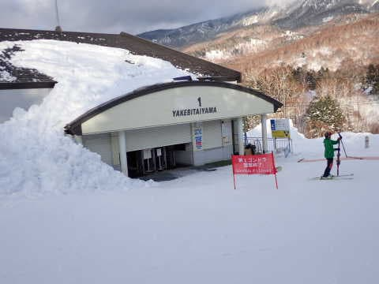

…そして，そこから車で帰路を走り，

夜10時半過ぎに帰宅したのでした…

で．

そこから片付けやらBlog書きやらして

いるともうこんな時間（涙）

今日も睡眠3時間で起きてから，

活動時間が23時間を超えてるんですが（泣）

やはり志賀高原日帰りはキツい…

でも，今回は行き帰りの車で1時間ずつ

くらい寝られたので助かった…

## 💬 コメント一覧

### 💬 コメント by (いか)
**タイトル**: Unknown
**投稿日**: 2023-02-24 20:46:46

昨日の朝はありがとうございました〜。気持ちよいロングターンの連続で、GSを封印してても結局腰は痛いです笑

16時過ぎて間違えて1ゴンに降りて強制終了でした。

また、よろしくお願いします！

### 💬 コメント by (Skier_S)
**タイトル**: ＞いかさま
**投稿日**: 2023-02-24 23:21:39

昨日はお久しぶりにお会いできましたね！

…ってか，ウェア変わったのに良く見つけましたね…

怪我もありますし，無理しないでくださいね～！！

