# お待たせ！2015シーズンのスキー試乗インプレッション，いよいよ連載開始！

📅 投稿日時: 2014-03-12 00:28:02

…なんだかですね～．

このBlogで最大ページビューを稼いでいるのが．

なぜか，自動車関係のネタで．

＃スキーBlogのはずなのに…

んで．その次の人気は，

スキー板の試乗インプレッションってことで．

…本来メインのはずの，天気予想やスキー場レポートは

どうしたっ！？？

って感じの今日この頃．

…皆様いかがお過ごしでしょうか．

…ということなので．

来シーズンは板を買わないつもりだったのに←って言ってても買っちゃうと思う人，多数

試乗レポートを期待されている…という，強迫観念に駆られ．

ええ．

行ってきましたよ．今年も，スキーの試乗会に．

読者の皆さんのために…←自分が行きたかっただけでしょ！

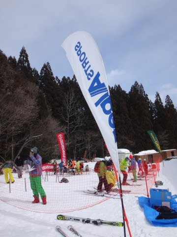

…それも，[志賀高原の太ももパフのパウダーを捨てて](e3c35e4791b8c5b19c5027b31016c2c9e.md)まで…

＃払った犠牲は大きかった…

ってことで．

今回試乗したゲレンデは，五竜のいいもりゲレンデ．

雪の状態は，気温はマイナスで冷え冷えなれど，

先週溶けた雪が固まったアイスバーンの上に，うっすら新雪．

アイスバーンともさもさ雪が交互に現れるという難しいコンディションで．

…端的に言って，あまり試乗に適したコンディションとは

言い難かったです…

だもんで．

今回の試乗，あまり正確な評価ができなかった板が多かったかも…

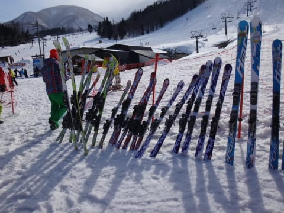

で．

いつもの注意書きですが．

試乗した人間は，テククラも指導員資格も何も持っていない，

単なるレジャースキーヤーですので．←ここ強烈に強調するところ

私が絶賛した板でも，「なぜこの板を誉める？？」ってがあるだろうし．

私が「合わない…」と思った板でも，いい板はいっぱいあると思います．

なので．

まぁ，参考程度に読んでやってください．

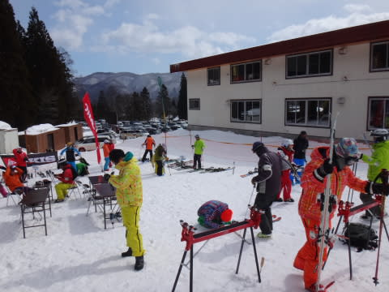

んで．

今回試乗した板は…

SALOMON X-Race Z12 165cm 

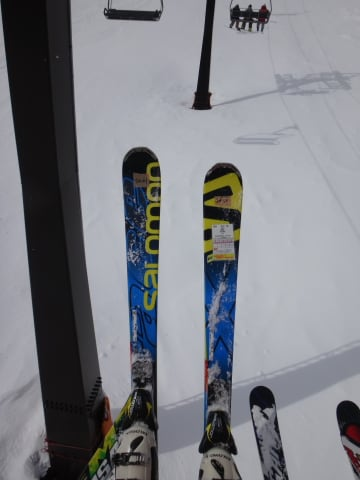

SALOMON 24hours MAX 170cm

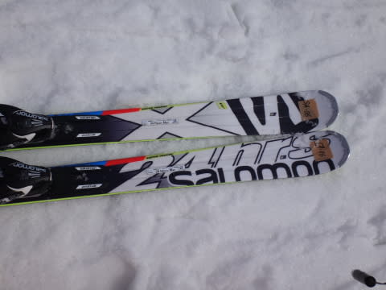

ATOMIC BLUESTER DOUBLEDECK 3.0 SX X12TL 165cm

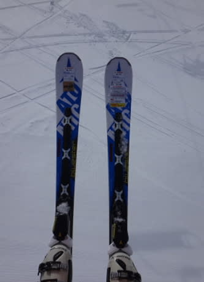

ATOMIC BLUESTER DOUBLEDECK 3.0 LX X12TL 166cm

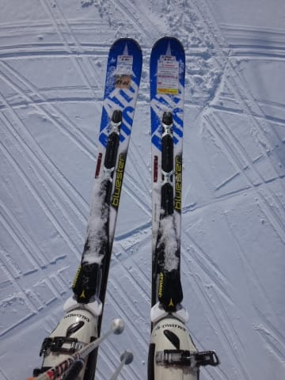

OGASAKA TC-SZ + RC600FL 165cm

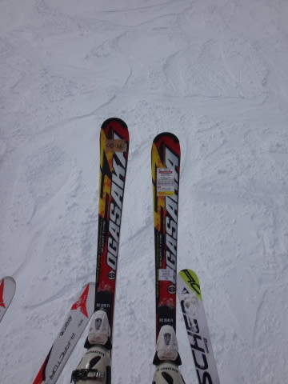

OGASAKA Keo's RS + RC600FL 170cm

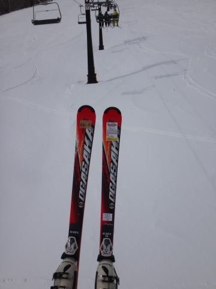

HEAD i.Supershape SPEED 170cm

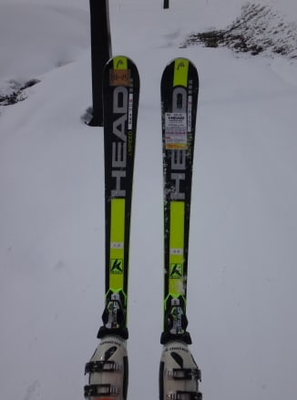

FISCHER RC4 Worldcup SC RACETRACK 165cm

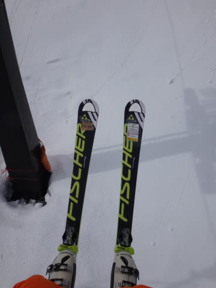

VOLKL PLATINUM CD Speedwall 178cm

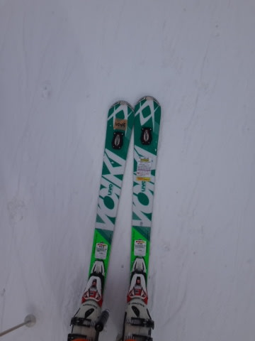

NORDICA DOBERMANN Spitfire PRO 168cm

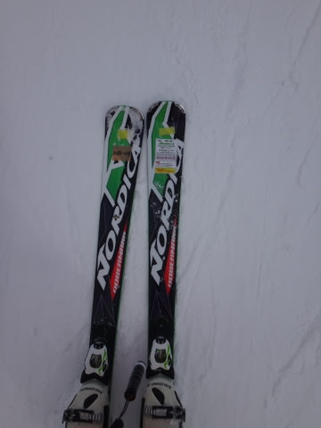

ROSSIGNOL DEMO ALPHA R20 RACING 165cm

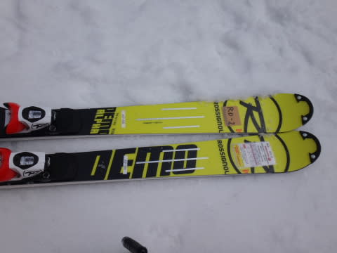

ELAN RACE SLX FUSION 165cm

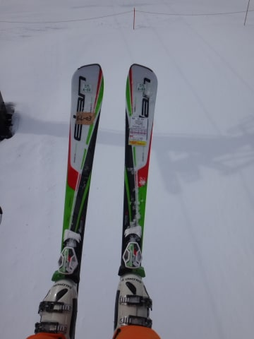

HART C9.2ST VFS 165cm

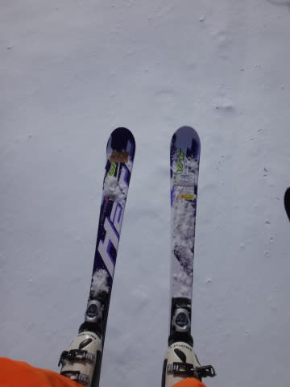

という，11ブランド13機種．

ってことで．

次回以降．

詳細レポート，連載開始です！

…

…お楽しみにっ！

おたのしみに…

…楽しみにしている人，いるはずですよね…（自信なさげ）

## 💬 コメント一覧

### 💬 コメント by (いか)
**タイトル**: Unknown
**投稿日**: 2014-03-12 00:50:09

Atomic、Ogasakaあたりが気になってますー。「マイルドになったTC-SEちゃんよ、シーズン最後までがんばって」と励ましながら乗っています。

あとは、VolklのCDがどう変化したのかも、気になりますね^ - ^

レポート期待してまーす！

### 💬 コメント by (Skier_S)
**タイトル**: いかさま
**投稿日**: 2014-03-13 00:57:32

いやー．

今回はいろいろと驚きがありましたよ．

いい意味でも悪い意味でも…

また，レポートをお楽しみに！

