# 2014年8月　オスロブagain…再び，子連れでジンベエザメと泳ぐぞ！　その１

📅 投稿日時: 2014-09-01 00:56:04

🏷️ カテゴリ: [ダイビング日記](ce3a7a8d424d112fce83ee85c81a0e344.md)

とゆーことで．

本日より，2度目のオスロブ旅行記，

本編へ突入するわけですが．

出発前に，かなーりリアルな可能性として

危惧していた，

「出発直前に仕事投げ込まれて休み壊滅クラ～ッシュ！」

やら，

「休み期間中に不在にできない予定突っ込みアタ～ック！」

という必殺技を食らうことなく．

なんとか，無事迎えることができた，出発日当日．

行きの飛行機は，14:25発の飛行機なので．

ちょうどお昼ごろに成田空港へ到着して．

セブ行PR433便にチェックイン．

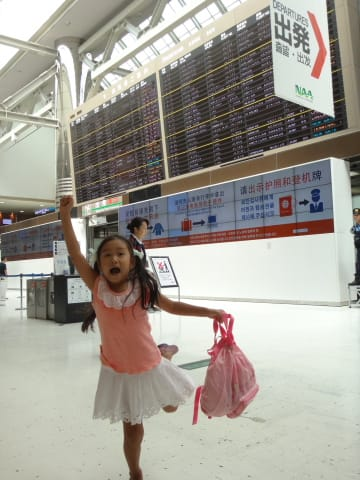

搭乗時間ぴったりを狙って，お昼ご飯をゆっくり食べて，

出国審査をくぐり．

ゲートに到着すると…

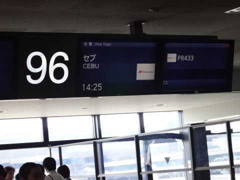

すぐに搭乗時間！

飛行機が大好きな娘は（ここも親の血を引いている…），

いつも通り大喜びで飛行機に乗り込みますが…

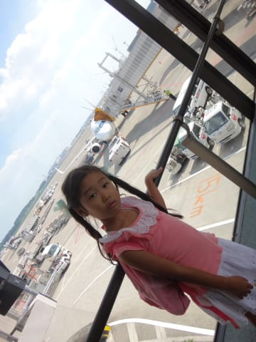

あれ？

前回はA330だったけど．

今回の飛行機は，A321と，かなり小型化

しちゃってるよ…

しかし．

このA321.

経営危機のフィリピン航空だというのに．

なんと，最新の，ブレンデッドウイングレット付きの機体ではないか！！

＃エアバスはシャークレットっていうんだっけ

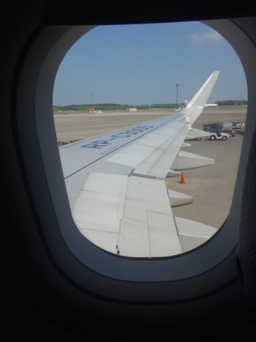

A321に，ブレンデッドウイング付きってあったんだ…

知らなかった．

＃最初遠目でみて，「え？B3-800!??」って思った

でも．

最新の機体の割に．

やっぱり機内エンターテイメントシステムは

ついてないのだ…（涙）

パーソナルスクリーンがついていないのは仕方ないとしても．

前面の大型スクリーンどころか，イヤホンジャックすら

ないという…（悲）．

約5時間のフライト，映画も音楽も，何もなしで

すごさなくてはならないわけですね…（残念）．

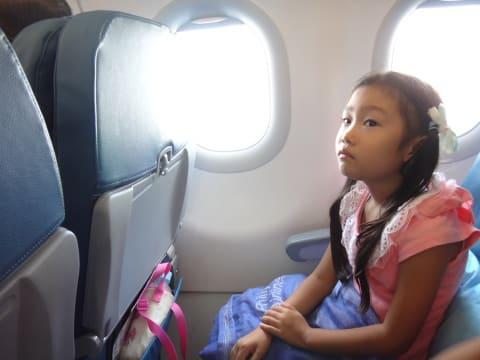

娘もちょっと残念そう．

でも．

離陸直後，飛び立ってからわずか30分ほどで．

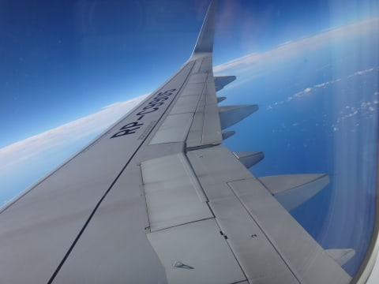

他の乗客の食事が配られる前，一番最初に

娘のチャイルドミールが運ばれてきました．

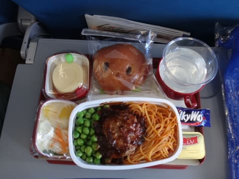

娘～，楽しみにしている，機内食が来たよ～！

と，思ったら．

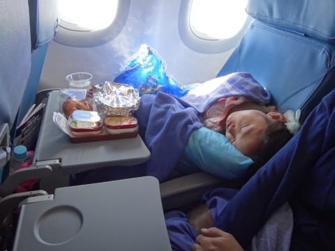

あらら…

もう寝てるのかい．

寝ている娘の横で，両親はビールやらワインやら，

たらふく飲みつつお食事．

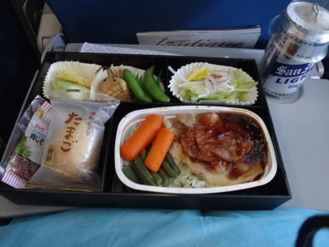

…でも…

うーむ．

PRの機内食，やっぱりちょっとイマイチ感が…．

＃前回同様，チャイルドミールの方がおいしかった

＃きがするのは，気のせいか？

親が食べ終わった後，娘は起きて食事を

取りましたが．

食べ終わったら，またぐっすり熟睡．

うーむ．

飛行機が大好きな割に，乗ったらずっと寝てるんだよな…

まぁ，親は相手をしなくて済むので，楽ではある．

到着まであとわずか，と言ったあたりで．

娘も起き出しましたが．

飛行機はきれいな夕暮れを横に見ながら

飛んでいきます．

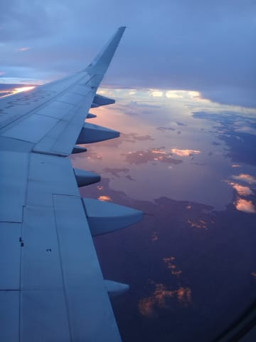

娘も窓にかじりついて，

「きれーい！」

とか言いながら，景色を眺めてました．

とゆーことで．

娘にとっては，

寝て食べてまた寝て，最後に1時間弱，

きれいな夕暮れの景色を見ていたら．

あっという間に着いちゃった…

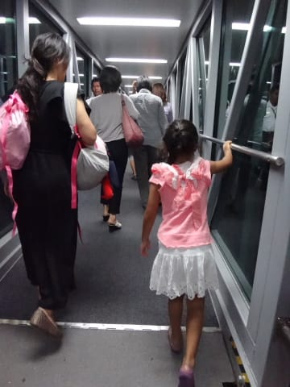

って感じみたいで．

もう，国際線は慣れっこですね．
