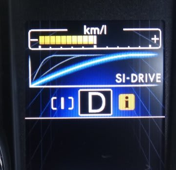

# プロジェクトX第2章…BRレガシィで，月山往復1200km走ってみて　その2

📅 投稿日時: 2013-06-24 01:27:28

えー．

数日前のこと．

ディーラー「納車1週間になるので，様子伺いに電話をさせていただきました～

　車の調子はいかがですか～？」

私「…絶好調のようです」

ディーラー「不具合はないですか～．」

私「…無いです」

ディーラー「では，納車1ヶ月後か，1000km走ったあとに，

　　1ヶ月初期点検になりますので…」

私「…1000km，とっくの昔に走ってますが…」

ディーラー「え…？まだ一週間ですけど…もう1000km走ったんですか？」

私「…もう1400kmほど走ってますが…」(納車1週間で，月山往復してるし…）

ディーラー「…で，では，今週末にでも，1000km点検の予約を…」

ということで．納車2週間経たずして1500km走ってしまった我が車．

昨日，1000km点検に出してきました．

…とりあえず，いまんところは絶好調です．

てことで．

BRレガシィE型のインプレッションを，引き続き…

とりあえず．

アイサイト効果もあり，長距離運転はすげーーーー楽な車ですが．

今回は，月山のかなりタイトな上り下りを走ってみたので，

その感想を…

とりあえず．

LEGACYの2.5リッター，新型FB25エンジンですが．

トルクは十分．

NAのくせに，そこそこな坂道でも，2000回転前後の回転数で

ボディーを軽々と引っ張って行きます．

CVTなので，過剰に低速ギアに変速せず，その場その場で

必要トルクを出せる回転数をキープする感じ．

うーーーむ．

5速ATだったRB2オデッセイより，かーーーーなり軽快に

登っていきますね～

＃RB2オデッセイは，上り坂で車が重く感じた

SI-ドライブをSモードにすると，高い回転数をキープして

かなりぐいぐい車を引っ張っていってくれます．

(SIモード切替は，D型からステアリングのこんなボタンに変更)

うーん．山道でも，普通に走るにはIモードで十分ですね～．

ただ，ステアリングを頻繁に持ち変えるタイトなターンが

続く場合では，パドルシフトよりシフトレバーの

シーケンシャルシフトの方がいいかな～．

下り坂でタイトなコーナリングをすると，

かなり大きく，フロントが沈み込むようなダイアゴナルロールが出ます．

あえて大きくロールを出してる感じ．

＃かなり太いスタビが入ってるんですけどね～

でも，フロントが沈み込むようなロールが出るので，

不安感はそんなに無いです．

サスのブッシュ容量はかなり大きそう．

…サスそのものより，サブフレームとボディをマウントしている

ブッシュの容量が大きいのかな？

フロントタイヤのコーナリングフォースが立ち上がって，

ワンテンポ遅れてボディーに横Gがかかってきます．

ロールが大きい中でも，ロール時のフロントアウト側タイヤの

対地キャンバーが適切なのか，

かなりフロントタイヤのグリップをしっかり使ってくれる感じ．

標準でついているタイヤはBSのB250という，国内では

一般に売っていない，いわゆるエコタイヤの部類ですが．

スキール音が出始めるのはかなり大きな横Gをかけた領域になります．

＃対RB2オデッセイ比

…オデッセイでは，ロールは小さかったけど，そこで強引に横Gを

立ち上げていくと，フロントのキャンバーがかなりポジティブになる

らしく，フロント接地面積の減少感(簡単にスキール音を出し始める)

のあと，傾いたコインが斜めに転がっていくような，タイヤが

外へ外へ転がっていくフロントの逃げ感があったんですけどね～．

…強烈なアンダーが出るので，それに負けないように

ステアリングを切り足していくと，雪道みたいに

フロントタイヤの向きと車の進む方向がずれていく…という．

＃あとでフロントタイヤの外側の減りを見ると，

＃「そんなところまで接地してるの？」

＃っていうポジティブキャンバー．

＃どう考えてもフロントロールセンター高すぎだろ～＆バンプ側キャンバー変化

＃少なすぎだろ～＆キングピン角立ちすぎだろ～

で．

レガシィのフロントアウトタイヤの接地感は良いのですが．

横Gをかけた領域で路面のうねりや段差などでサスがストロークすると，

ちょいとフロントがラテラル方向に揺すられる動きが出ます…

かなりコンプライアンストーコントロールが大きい感じで，

路面のうねりで横Gが抜けるとトーが大きく変化する感じ．

サスを見てみると，フロントはマクファーソンストラット．

ロワアーム後方が長いLアームで，Lアームのリア側ボディマウント

ブッシュは上下串刺し型の，かなり容量が大きそうなブッシュが入ってます…

うーむ．

オデッセイのフロントサスもコンプライアンストーコントロールを

積極的に考えた，ロワアームボディ側にかなり容量の大きい

上下串刺し軸タイプのブッシュが入っていて，前後方向には硬く，

横G方向にはやわらかい大容量異方性ブッシュを入れてましたが…

＃レガシィのブッシュは前後方向もそんなに硬くなさそうなので，

＃横Gトーコントロールだけじゃなく，ブレーキングトーアウトも

＃狙ってるのかな？？

これ，横G一定なら問題ないけど，横Gが変化してブッシュのつぶれが

変化すると，ステアリング動かしてないのにトー角がうにょうにょ

動いて気持ち悪いので．

過剰なコンプライアンストーコントロールはどうかな～？

って思うんですけどね～．

＃昔，ニシボリックサスってのもあったなぁ…(リヤサスだけど)←知ってる人いるかな？？

とりあえず．

レガシィのNAが狙っているのは．

クイックにフロントが反応するギンギンのスポーツカーではなく，

ある程度のブッシュ容量を持たせた．上品な乗り心地なのかな～，

…って感じです．

＃微小なストローク領域では，ダンパーが動いてなくてブッシュで

＃振動吸収している感じがする…

でも．

ブレーキはドライ下り坂でABS効くぐらい十分強いし．

かなり横Gかけてもフロントアウトの接地感は抜けないし．

2.5L NAでも，上り坂を感じさせない低い回転数でぐいぐい

登っていくし．

高速だけじゃなく，山道もすごい楽な車でした．

PS.月山山頂につくころ，リアデフからデフオイルが加熱している

　香ばしい匂いがするのは，デュアルポンプ四駆と同じでした…

…次回は，アイサイトのインプレッションなのだ．

## 💬 コメント一覧

### 💬 コメント by (かわち)
**タイトル**: 高回転はいかがですか
**投稿日**: 2014-03-11 21:14:08

中回転までは良いですが・・・高負荷（上り坂）の高回転（4000～5000回転）のフィーリングはいかがでしょうか？自分のFB25はカシャカシャとノッキングらしい異音が発生して、それ以上回す気になれません。

### 💬 コメント by (Skier_S)
**タイトル**: かわちさま
**投稿日**: 2014-03-12 00:02:42

えー．

コメントありがとうございます…

高負荷の高回転ですが…

フィーリングはあんまりよくないですね～

FBエンジン，乗っていたら気づくと思いますが．

4000回転以上ではトルクが落ちていく感じが

あります．

これ以上回しても，「あれ？こんなにパワー伸びないの？」

って感じで…

さらに，4000回転以上からは，吸排気系のノイズが

かなり出てくるので，あまり回したくない感じです…

4000回転までがおいしい領域ですね！

うちのRB君は，ノッキングらしい音は全くないですよ～

でも，4000RPM全開付近では，インテークマニホールド

周りや排気系の音が勇ましくなってきて，ちょっと

回す気にならなくなってくるのは全く同意です～！

