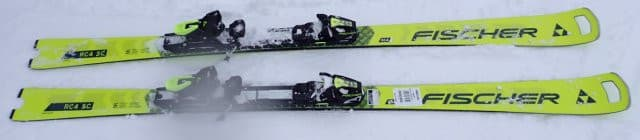
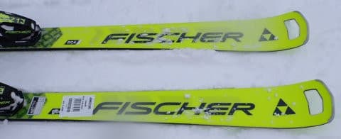
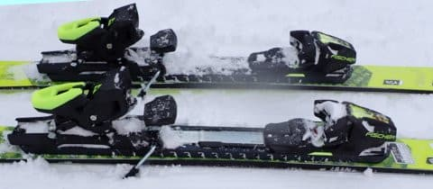
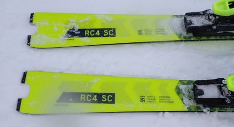
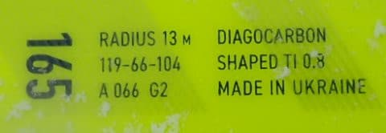

# 2025シーズンモデルのスキー板，試乗レポートその3… FISCHER RC4 Worldcup SC Pro

📅 投稿日時: 2024-05-19 01:59:57

えー．

スキーシーズンはまだ終わってませんが．

大変残念ながら，かぐらスキー場の営業が

先週で早くも終わってしまった今．

今シーズンの毎週末のスキー行脚も

先週のかぐらファイナルで終わっちゃって，

これから毎週のスキー場レポートがなくなり，

週7日間休まず記事を書くネタもなくなって

しまった今日この頃なわけで．

…今シーズンはまだ冬モードですけど，

これから時々，週末土日はどちらか

更新を休ませてもらいます～！

…すみません…

いや．

ホントは今週も結構激務で，毎日

Blog書いてるどころじゃなかったん

ですが…（泣）

いつもなら，夏モードに入ってから，

週末1日休みをもらっていたところ．

ちょっとまた仕事が重くなってきたのもあり．

今シーズンはちょいと早めに週末の

休みをとらせてもらいます～！

というか．

先週も結構激務でいくつか仕事

取りこぼしたりヤバかったのに，

よくまぁ休まずに記事を書いたなぁ…

と，自分を褒めておく．←仕事取りこぼすくらいなら

Blog書いてないで仕事しようよ

ってなことで，本題へ．

今日も2025シーズンモデルのスキー板

試乗レポート．

本日はFISCHER編です～！

〇FISCHER RC4 Worldcup SC Pro 165cm

基礎小回り用．

小回り用のSCは，しっかりしたM-Plateが

ついたPROと，優しめの

M-Trackがついたノーマルバージョンの

2種類がありますが．

来シーズンも，ノーマルバージョンは黒色と

水色の2種類の展開で，

PROは黄色のコスメになるようです…

基本的には今年度にプレートがM/O-Plateから

M-Plateに変わりましたが，

来年度は今年からの継続モデルで，

仕様は全く変わらないようです．

滑ってみたところ…

うん．

私がもっている'23モデル．最後のM/O

プレート採用のSC PROと比べると…

ちょいと板が硬めになったように感じます．

以前のM/Oプレートのモデルだと，

谷回りで板が捉え始めてもすぐに

板が回らずに，

捉えたあとにたわみが出てから，

たわみに沿って回っていく感じの，

粘りのある板だったのですが…

Mプレートになって，谷回りの反応が

早くなった感じ．

板が硬い分，谷回りでとらえた瞬間，

たわみが出る前にサイドカーブに乗って

板が回り始めます．

板の面が切り替わった瞬間に，

カツンとエッジが捉えて，板の方向に

回り始める感じ．

たわみというより，強いエッジグリップで

サイドカーブに乗って回っていく感じで，

ターン仕上げ時もたわみが返ってくる

というより，強めの旋回力で板が

回っていって体の下を通過して

切り替わっていくような感覚があり，

以前のM/Oプレートの板のように，

切り替え時にたわみが解放される

バネ感が弱い感じ…

板に溜まった圧がビヨーンとバネのように

解放される切り換えというより，

左から右に板が抜けていく素早い切り替え

といった感じ．

昨年の試乗の時も同じ感覚を受けましたが，

これまでのSCよりも鋭さや反応の

早さが増した感じ．

これがMプレートの狙いなのかな．

カービングで滑ると，強めのエッジグリップと

サイドカーブで，強めの旋回性を示しますが，

たわみの量で回転弧をコントロールする

というより，板なりに回されてしまう

感じが多少あります．

谷回りのたわみの出方は，FISCHERのSL

モデルのRC4 SLのほうがたわみが出て，

たわみでターン弧を自由に制御できて，

切り替え時にたわみが戻るバネ感も感じます．

SCの方は，たわみが出る前に回っていき，

ターン終了時もすっと素早く切り替わる

素早さを感じる板．

ただ，乗り味の鋭さは増したけど，

ガチのSLモデルと比べるとエッジグリップは

わずかにマイルドなので，板を動かす

自由度はあり，谷回りで板をずらして

弧をゆがめることもできます．

ずらしの小回りとかもできますが…

やっぱりこの板はエッジグリップさせて

カービングで回る板．

どちらかというと，板の張りの強さもあり，

コブ斜面とか荒れた斜面よりはフラットな

整地で実力を発揮しそうで，柔らかい

新雪が荒らされたこの日の試乗バーンでは，

あまり実力を発揮できなかったのかも…

このあたり，好き嫌いの次元だと

思いますが．

やっぱり私は，以前の粘りとバネ感がある，

以前のM/Oプレートのほうが好きでした…

## 💬 コメント一覧

### 💬 コメント by (愛読者)
**タイトル**: Unknown
**投稿日**: 2024-05-21 08:05:25

RCPROでなくSCPRですね

### 💬 コメント by (Skier_S)
**タイトル**: ＞愛読者さま
**投稿日**: 2024-05-22 03:53:55

コメントありがとうございます~！！

確かにSCです！！なんで間違えたんっだろう…

直しておきました．

ご指摘ありがとうございました！！

