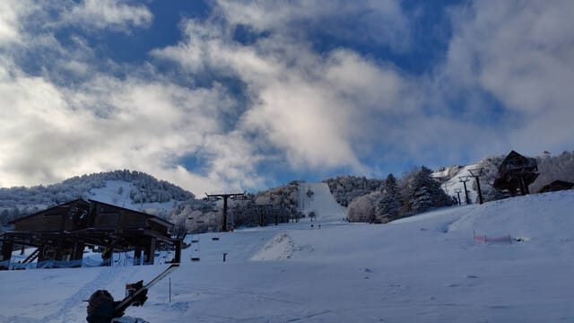
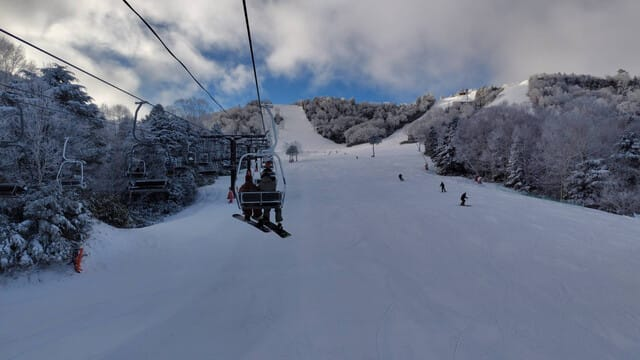
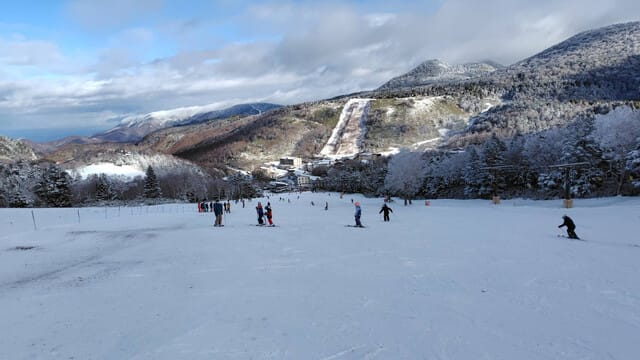
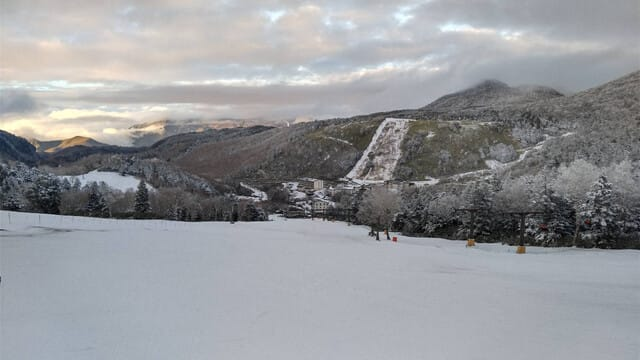
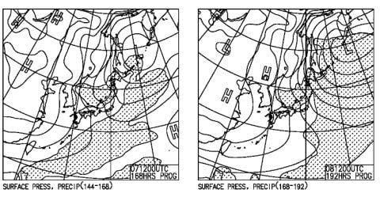

# 昨日の夜は早くに寝てしまった…特派員によると12月1日熊の湯スキー場はちょっと雪が薄めみたい

📅 投稿日時: 2024-12-02 07:58:24

えー．

昨日は朝からいろいろ車のタイヤ交換やら

洗車・ワックスがけやら室内掃除やらを

やっつけて．

夕方はまた家族と出かけて…

という感じで，仕事はなかったけど

バタバタしていた一日で．

帰宅したら，知らぬ間に寝てました(泣)

だもんで，朝に手短に更新！

昨日日曜，熊の湯に滑りに行った特派員からの

報告によると．

12月の週末というのに，熊の湯はそれほど混まず，

午後はリフトが飛び乗りになるくらいガラガラ

だったようです…

一見コンディションは良さそうに見えますが，

コース下部の人工降雪の厚みは結構あるけど，

上部の雪がかなり薄くなっており…

コース上部はかなり石ころがでていて，

石ころを踏む覚悟で滑らないとヤバい

レベルだったようです…

昨晩から天然雪は降ってないけど，

夜は冷えたので人工雪が乗って

今日以降，ちょっとずつマシに

なっていくのかな～…

今日・明日の12月2，3日は気温が上がって

昼間は人工雪が打てなさそうだけど…

でも，天気図を見ると4日以降は冷え始め．

特に7，8日の週末は，強い冬型になり

かなりの雪が積もりそうな予感…！

…できれば週末の前に降って，

週末は晴れてほしいけど…

でも，この週末は期待できそうな感じです！
