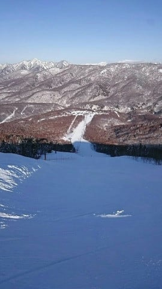
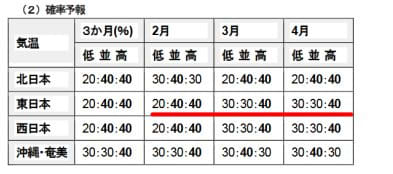

# 気象庁の3か月予報が出たので見てみると…え？2月は気温高め？3月も平年並みか高め？スキー場が冷え冷えなのはわずか12月下旬～1月上旬までの間だったのか

📅 投稿日時: 2021-01-26 04:11:16

🏷️ カテゴリ: [スキー天気予想](c6554f5c3c106093b511a8daae23757e8.md)

ということで．

本日，1月25日の月曜も，現地在住の特派員による

レポート情報から！

えー．

まず．

朝の気温は-6℃程度と，冷え込みが戻って

来ましたね～！

そして，朝の積雪は駐車場で5cmほど

あったようですが…

（比較対象が「おこみん人形」ってのがいい…）

朝までには雪が止んで，すっきり晴天だったようです！

そして，コース脇には，5～10cmながらも

うっすら新雪も乗っており．

圧雪バーンはシマシマ圧雪！

…でも，この写真を見ると，西館山頂付近は

朝に圧雪されて無かったようで，

うっすら新雪だったみたいですね…

とりあえず，すっきり晴天で，景色も良く…

送られてきた写真を見ると，焼額も…

一の瀬も．

そして，ジャイアントも．

さらには奥志賀まで，全て．

人がいなくてガラガラで．

そのおかげで，午後になっても

全くゲレンデが荒れている気配が

ありませんね…！

昼ごろには気温がギリギリ0℃を超えたようで，

日差しが強い，焼額の東側の白樺コースや

唐松コースはちょっと緩んだみたいですが…

それ以外のコースは，午後まで雪が

緩まず良かったようです！

とりあえず．

今シーズンの志賀高原は，本格的な雨に

たたられることなく，雪不足もなく

比較的平和なシーズンになってますね…

…

…コロナウイルスさえなければ（涙）

で．

緊急事態宣言のおかげで，志賀高原は

平日の寺子屋，タンネの営業と

一の瀬ナイターを取りやめましたが．

これに追加して，

今日からは西館山スキー場が午後だけ営業

という，微妙な営業時間になるようです…

（[志賀高原中央エリアホームページ](http://shigakogen.co.jp/archives/9273)より）

とりあえず，スキーに行けない今日この頃．

コロナウイルスの状況が収まり，

緊急事態宣言が解除された後まで

このいいコンディションが続くことを

家の中で転がり回りながら願っている

わけですが．

本日1月25日に，気象庁から3か月予想が発表されたので．

果たして2月以降の天気も冷え冷えなのか？

という，スキーヤーなら100人中1億8000万人が

気になって気になって，夜も寝られないであろう

あたりを，ちょっと見てみましょうか…

（1月25日発表，[気象庁3か月予報FCCX93](https://www.sunny-spot.net/chart/FCXX93.pdf)より）

えー．

まず，気温傾向を見てみると…

え！？？

えええ！？

2月の東日本，気温が平年より低くなる確率は20％で，

高くなる確率が40％！？？？

2月，気温が高くなるの？？

…3月，4月も，気温が高くなる確率が40％って…

ラニーニャで気温が冷えるんじゃないの？？

…なぜだか．

どうしたわけか．

この2月からの3か月は，平年より気温が

高くなる確率の方が，気温が低くなる

確率より高いようです…（涙）

まあ，でも．

まだ3月，4月は平年より気温が冷える確率も

30%あるので．

そこにかけるしかないのか…

気温傾向の予想グラフも，2月以降は

平年より高くなりそうな傾向が

出てますね…（涙）

そして，降水確率は…

うむ．ここはおおむね平年並みに

収まりそうな予想なので…

高温の上，さらに全く雪が降らなくて

途方に暮れる…ってことはなさそうな

感じ．

とはいえ．

2月の解説を読むと．

赤下線部にあるように，

寒気の影響を受けにくく，高温傾向

と書かれちゃってますし…（涙）

3月の解説だと．

「850hpaの正偏差は2月に比べて高まる」って…

いつも参考にしている850hpa気温．

平年比プラスの度合いが2月より高く

なるってことなので…

やっぱり高温傾向ってことですね（泣）

さらに，

寒気の影響を受けにくいってことなので，

激烈に冷えることは無さそうな予想ですね（涙）

そして，4月のは…

まあ，ここは平年並ということなので．

うーん．温まるよりマシだけど…

去年みたいな奇跡の冷え冷え4月になる

可能性は低い，ということか（泣）

ということで．

コロナが収まったとしても．

毎日激冷えパウダードサドサ2月は

望み薄のようです（激涙）

とりあえず．

コロナが収まる時期まで，ゲレンデがいい

コンディションをキープしてくれるように，

遠くK奈川の地から踊り，歌い続けるしか

無いですね…

ああ．

冷え冷え期間の1月上旬に滑りに行けなかった

のが，返す返す悔しい…っ！！

くやしい…っ！！

もし．

これで．

予想と違って，2月3月が強烈冷え冷えに

なったならば．

その時は，私の怨念が冷え冷えを呼んだと

思ってください…←違うから

## 💬 コメント一覧

### 💬 コメント by (yumi)
**タイトル**: Unknown
**投稿日**: 2021-01-26 08:26:19

Ｓさぁ～ん😢😢😢

西舘山午後の部❗️シマシマ💖・・・

っと思って 一時を待って行きましたが・・・

なんと❗️❗️❗️

ほったらかしでしたぁ～😅

ガタガタのぼこぼこ😢😢😢

### 💬 コメント by (いか)
**タイトル**: Unknown
**投稿日**: 2021-01-26 08:43:19

やはりここからは暖かい傾向ですかね、、、

先日、センター149mmの太板を買ってしまったのですが笑

今シーズン使えるようにいろいろなお祈りをしておきます！

### 💬 コメント by (レインボー73)
**タイトル**: Unknown
**投稿日**: 2021-01-26 11:43:24

火曜日の志賀高原情報

時折うっすらと日がさす程度の曇り空。新雪はゼロ。ヤケビ、奥志賀は相変わらず快適バーン。

ただ、奥志賀第６のボードのオブジェは、プレオープンはしたらしいのですが、オープンは2月からのようですので、ご確認のうえおこしくださいませ。

嬉しいのは、新潟の高校がご来志賀くださっており、高天や一ノ瀬はかすかな賑わいをみせていることです。

そういえば新潟の人と血液型の話をしたときです。

『何型？』『僕はAB型』『私はＢ型』『僕はにいがた』

ごめんなさい。

ファミリーもいい状態でした。高天はちょっと荒れてたかなあ。

今日も高天の銀嶺でざる蕎麦です。go to eat 対応なので、800円が650円ほどで食べられます。

タンネが動いていないし、西館も一時まで休止なので、昼食の選択肢が限られてしまいます。まあ仕方ないですが。

### 💬 コメント by (レインボー73)
**タイトル**: Unknown
**投稿日**: 2021-01-26 17:05:53

火曜日の志賀高原情報２

高天での昼食後、今日は圧雪された西館を降りたのですが、なんと今シーズン初対面の、しましまバリバリ溝ありコロコロアイスバーン。笑っちゃいながら初対面を結構楽しめました。その難行苦行の甲斐あってか、ファミリーがとても簡単に思えて、スイスイ気持ち良く降りることができました。

ヤケビに戻るも表面が硬くなり、太板では疲れるので、少しだけ早退してしまいました。

でも、初体験の、長板、太板、アール23は、すごく楽しめたし自信もつきました。毎日滑ってて、どうして飽きないのでしょう？

### 💬 コメント by (スキー好き)
**タイトル**: Unknown
**投稿日**: 2021-01-26 20:20:07

こんばんは

スキーに行きたいですね⤵️

緊急事態が解除されるのをじっと待ってる毎日です。

何も考えずに

やりたい事を、好きな様にやれる人達が

羨ましいです。

自分の為、家族の為　まわりの人達の為に

もう少し辛抱ですね。

### 💬 コメント by (はなげの女房)
**タイトル**: Unknown
**投稿日**: 2021-01-26 21:09:34

先週、月曜木曜は今シーズン1位2位の最高の平日スキーでした。ヤケビブルーの空の下、いつもの10時の職人さんの一服もなければ、ランチタイムも惜しくてひたすらヤケビを滑り続けました。本当に気持ち良かった。心から祈ります。一番滑りたいであろうSさんがゲレンデ復帰出来る日まで、このベストコンディションが続きますように。

### 💬 コメント by (Skier_S)
**タイトル**: 早く緊急事態宣言解除になってほしい
**投稿日**: 2021-01-27 03:52:53

＞yumiさま

…あ，夕方圧雪して，昼間で放置されていたのではなく，全く圧雪されて

無かったんですね…

経費削減ですね(涙）

＞いかさま

センター149mm！？？

何と悪逆な板でしょう．

フルロッカーですか？

…とりあえず，私にとっては太板が使えるくらいの時期に，

緊急事態宣言が解除になることの方を祈るのが先決です(笑)．

＞レインボー73さま

西舘，手ごわかったんですね(笑)．

太板でふかふかパウダー滑るとやめられませんよ．

あぁ…私も志賀の麓に移住したい…！！

＞スキー好きさま

行きたいです…

白い粉禁断症状に苦しんでいます．

ゲレンデにいる幻覚を見て，怪しい言葉を発するという，

まさに中毒患者のようです…

とりあえず，もう少し我慢すれば状況が良くなることを祈って…

＞はなげの女房さま

コメントありがとうございます~！！

平日スキー，良かったみたいですね…

まさか，レストランイチゴン仲間になるとは(笑)．

とりあえず今は，これから先の4月，5月．

そして，6月くらいまで，冷え冷えパウダーが続くよう祈ってます！！←それは無理

