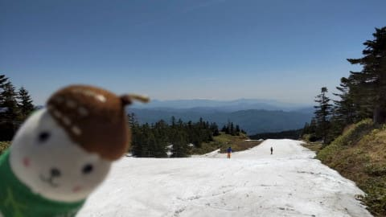

# 2022/5/22(日)かぐらスキー場ファイナルデーの詳細レポート（前編）…営業最終日の雪の状況など

📅 投稿日時: 2022-05-25 01:30:46

🏷️ カテゴリ: [2022スキー滑走日記](cc9cb73e4320f6a97af6fccc37587a61a.md)

本日．

いつものおこみん特派員から

今日の渋峠スキー場の写真が送られて

来ました～！

ふーむ．

先週は比較的気温が低めだったのもあり．

雨が降ったにも関わらず，雪はそこそこ

残ってますね…

まだゲミュートコースもウェイバーコースも

両方とも滑れるみたいで…

まぁ，雪質はともかくとして．

この状況なら，まだあと1週間は間違いなく

行けそうだし．

なんとか6月5日の週末までもちそうな

感じですね…！

でも．

かぐらが終わった今週末．

渋峠，混むんだろうなぁ…

ってなことで．本題へ．

日曜に速報レポートしたように，

ファイナルかぐらに行ってきた

わけですが…

今日は，2022シーズンのかぐら営業終了日の

ゲレンデの積雪状況がどうだったか，

詳細レポートしてみましょう…！

まず．

みつまたロープウェーを降りた後は…

ほぼ雪がないですね(涙）

ロープウェーを降りてしばらく歩いたら

雪が残った廊下があるので，

ここから板を履いてみつまたクワッド

リフトに滑って行けます…

だいたい，ロープウェー降り場から

雪があるところまでこれくらい

離れてた感じですね～．

で．

先週まで滑って降りれたらしい，

みつまたクワッド沿いのコースは

もう雪が残って無くて．

みつまたは，帰りはクワッドリフト

乗車になります（残念）

でも，みつまたクワッド降り場からは

また雪がつけてあって…

ここからゴンドラまで，滑って

行けるように雪の道ができてます！

…いや．

だいたいこの時期は，ここはもう雪が

かなり薄くなってるけど…

まだあと何日かはもちそうな

雪の量ですね！

硫安がガンガン撒いてあって，

かなり硬めのバーンだったので

ボードの方は苦労してましたが…

ってなことで．

みつまたクワッドを降りて

ゴンドラ乗り場前まで滑ってくると．

ゴンドラ乗り場前，まだ結構

雪が残ってます！！

これは，例年のこの時期より多いかな．

そして，ゴンドラで山頂に登ると…

やっとメインバーンに到着！

写真左側のコブ斜面側は大穴が

開いているけど．

右側はまだ雪がいっぱい残ってるし．

パークもまだ巨大キッカーが

残っているので．

この時期としては，積雪はまだ

たっぷりありましたね～！

…ちなみに．

昨シーズンの5月23日のゲレンデは，

こんな感じだったので．

今シーズンが恵まれてることが

よく分かります…

（2021年5月23日の写真）

で．

いつもなら廊下になってる，

和田小屋から高速リフトに向かう部分も，

まだまだ幅いっぱい雪がありますし…

クワッドリフト乗り場前も，まだ

雪の量は問題なし！！

ちなみに，朝9時頃まで，リフトはガラガラ

でした～！

でも，残念なことに．

テクニカルコースはもう終了して

いました（涙）

しかし，メインバーンを見てみると．

この写真の手前側は雪が消えていて，

コース幅いっぱいは滑れないものの…

人工降雪がつけてある，下から見て

右側はまだかなり幅広く雪が残って

ますよ！

これだけあれば，幅は十分ですね…

ちなみにここも，昨シーズンの5月23日は

こんな感じだったので．

今シーズンは雪が多い！

リフト降り場付近も，雪はまた十分残ってます．

ただ…

この日の朝は，山頂付近はちょっとガスっていて．

雪質も，まぁこの時期だから期待しちゃ

ダメですね…

とはいえ，朝のうちは大回りできる

コース幅と人口密度だったし．

いや…

この時期にクワッドリフトでこれだけの

バーンをグルグルできたらいいんじゃない

ですか！？？？

…と，気持ちよく滑っていたら．

10時近くになると…

気持ちよく滑るにはつらい人口密度に（泣）

…この人口密度は厳しい…

人の間を縫って滑る感じです（涙）

あ，この右側，一列に並んでコブを

掘ってましたが．

夕方になってもこのコブラインに土が

出てなかったのがすごい！

まぁ，人が多かったものの．

午前中はバーンに土も出てなかったし．

朝まで雨だったこともあり，板も

滑る雪だったし．

天気も，朝8時半には完全に雨は止んでいて．

時折日も射すタイミングもあったけど，

終日大体曇り空．

この時期，うかつに晴れるより曇りの方が

雪が滑るので，ありがたい…

リフトもそこまで混まず，

ペアリフトは終日数人待ち程度で．

この時期としてはかなり恵まれた

感じだったかも？

でも．

昼ごろになると，バーンも全面でこぼこになり…

ありりり？？

なんだか，雪がうすくなってきたところが…（涙）

ってなあたりまで書いたところで．

あまりにも記事が長くなりすぎたので…

明日，後半戦に続きます！！

…明日，記事を書く時間が取れることを

祈ろう…（ひとりごと）
