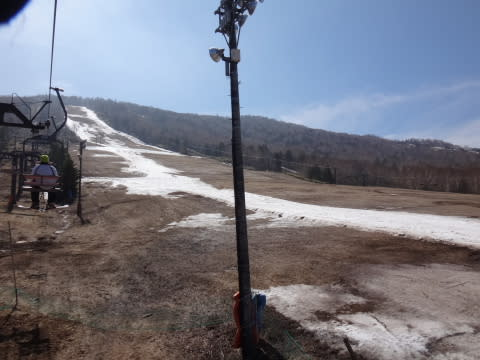

# 4月24日，日曜の志賀高原の状況，速報モード…一の瀬・高天は壊滅．横手も終了，残るは渋と熊のみ（涙）

📅 投稿日時: 2016-04-25 00:45:39

🏷️ カテゴリ: [2016スキー滑走日記](c70c67ed5248e9432b899dcd5747048bb.md)

ということで．

引っ越した唯一のメリットが，志賀高原が近くなった

ということなわけで．

本日も，ラストリフトまで滑ったにもかかわらず，

自分にとって夜10時半という早い時間に

帰宅できるというシアワセだったのですが．

でも．健康な時間に早く寝たいので．

本日も，日曜夜定例の速報モードにて…

えー．

晴天で始まった本日．

一の瀬ファミリースタートとしましたが…

当然，クワッドは動いておらず．

滑れるのはペアリフトの短いほうだけです（泣）．

…ゲレンデ状態は，昨日からさらに状況は悪化して．

完全に廊下状態ですね…（涙）．

なんだか，10月のイエティを思い出してしまうのですが…

で．午前11時過ぎには．

その廊下ゲレンデもかなり雪がイケてない

感じになってしまい…

もう，ほとんど直滑降するしかないような，

かなり楽しくないゲレンデ状況…（泣）．

だもんで．

12時過ぎに一の瀬を脱出しましたが．

その後，一の瀬ゲレンデを滑っている人は

完全にゼロ

という状態に…

まぁ，楽しくないから当然っちゃぁ当然の状態かも．

で．

午後は横手山に移動してみますが…

横手山の第2ゲレンデは…

ええ！？？

ここも紐状態？？？

…

まぁ．

横手山も本日で終了だという意味が

分かりました…（泣）．

そして，今のところ5月1日まで営業予定の渋峠．

ここも，驚くことに．

ウェイバーコースは積雪不足でクローズ．

滑れるのはゲミュートコースのみ（泣）．

うーーーーーむ．

渋峠も，廊下状態なんですけど…（涙）．

そして，決して楽しくない感じ…（残念）．

さらに．

熊の湯まで足を延ばしてみますが．

山頂からの滑走は，本日でラストらしく…

…確かに，馬の背から下部の緩斜面につながるところ，

結構マズいかも…

でも．

下半分の緩斜面は，まだちゃんと雪があって．

…志賀高原の中で，一番まともだったかな？？

ということで．

とてもGW前と思えない，史上最悪の小雪となっている

志賀高原でした…（激烈涙）．

また，明日．

写真たっぷりで詳細レポートします…
