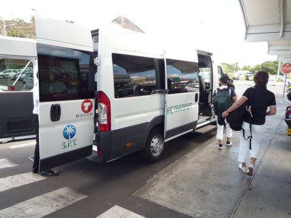
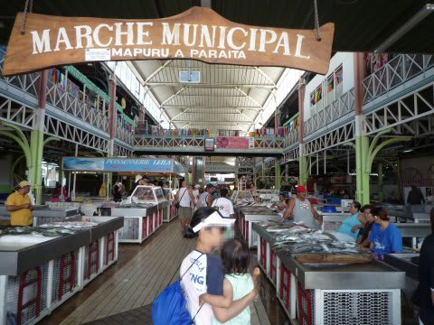
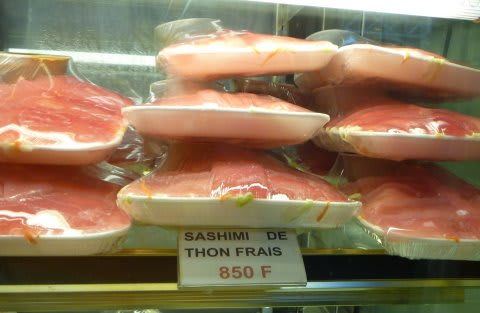
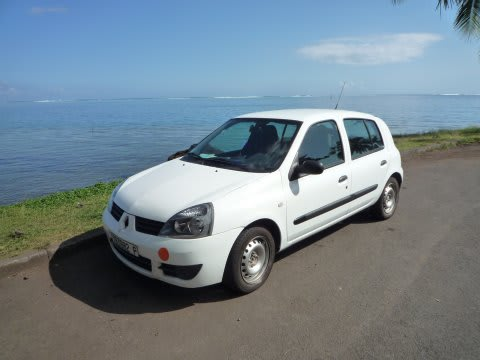
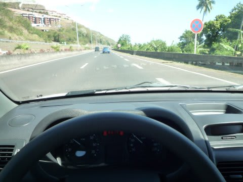
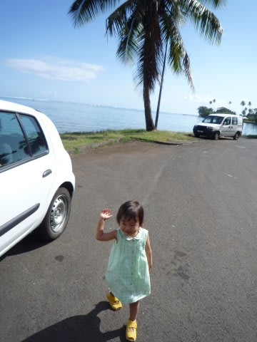

# 2009年　初の海外子連れダイビング旅行記　28　Tahiti island

📅 投稿日時: 2012-09-28 00:44:55

🏷️ カテゴリ: [ダイビング日記](ce3a7a8d424d112fce83ee85c81a0e344.md)

あー．

いろいろ忙しくて，モルジブレポートをまだ一行も書いていない…

タヒチレポートが終わったら連載開始予定ですが，

これまでみたいな毎日更新は，無理かな？？

とりあえず，タヒチレポート，続きます．

---------------

さて．

タヒチ・パペーテ空港に到着したら…

旅行社の送迎バスで15分ほど．

タヒチ島最大の町，パペーテの街中にあるホテル

「ホテル・マンダリン」へ．

荷物を置いたら，速攻観光へGO！

パペーテの街中は海沿いにあり，

市庁舎や公園，市場，海沿いの公園などが

ほぼ徒歩圏内にコンパクトにまとまった町です．

…コンパクトです．

コンパクトなので，一回見れば大体十分．

というわけで，タヒチ2回目の我々は，レンタカーを

借りて「ゴーギャン博物館」へ行くことに．

時間があまりないので，お昼ご飯は市場でサンドイッチを

買い込み，車の中で食べましょう…

ということで市場で買出し．

さかなやらくだものやら売ってますが，

最近のタヒチでは，「サシミ」が流行のようで，

そこかしこの店でこんな感じで売ってましたね～

「SASHIMI」 DE THON FRAIS

って書いてあります…

英語で言えば，Sashimi of tuna filletかな？？

で，バゲットサンドを買い込みレンタカー屋へ．

レンタカー屋さんは街中に何件かあるので，いきなり

飛び込みで入ってみると…

「うちは5時までだから，5時までに車返してね」

え？…今，午後1時過ぎなんですが．

4時間，ありませんな．

ゴーギャン博物館まで，海岸沿いに島を半周．

距離はだいたい50km．

行って帰ってぎりぎりですのー．

車はルノーのコンパクトカー．

安く上げるために無謀にもマニュアルミッションを借りてみました．

…タダでさえなれない左ハンドル．

普段はオートマに乗ってる私が，

右手でシフトチェンジのマニュアルミッションという，人生初の体験．

交通標識もよくわからないタヒチで，こんな車を

無事運転できるのかっ（かなり無謀）．

とりあえず，タヒチではほとんど信号がないのでなんとかなっちゃいました．

車で約1時間半…

10分も走ると街中を外れ，田舎の海岸道になって行きます．

あ，海岸道っていっても，ボラボラやランギロアとは比較にならないですねー．

タヒチ島は火山島．

海岸の砂が真っ黒なんですよ．

真っ白なきれいなビーチを見慣れた目には，あまりきれいなビーチとは

思えない… 

こんな感じで1時間くらい運転すると，ゴーギャンミュージアムへ到着です．
