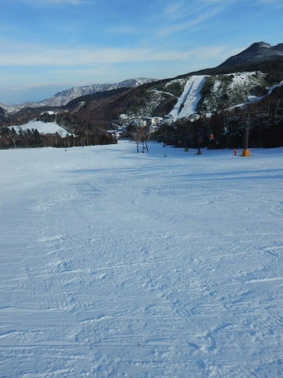
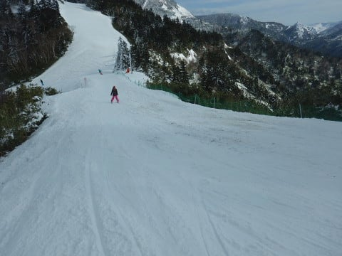

# 11月26日（日）の熊の湯の詳細…コースも広いし，雪もいいし，11月としては上出来！

📅 投稿日時: 2017-11-29 02:06:36

🏷️ カテゴリ: [2018スキー滑走日記](c11b88dc181f34079ab41db74a3587646.md)

ってなわけで．

日曜は日帰りで，志賀高原は熊の湯へ

行ってきたわけですが．

…そうです．

私にとって，ついに志賀高原のシーズンが

スタートです！！

…って，実は．

私にとって，11月中に志賀高原で滑るのは

初めてだったりします…

読者のみなさんには意外かもしれませんが．

でも．

例年なら，焼額のオープンと同時に，

私にとっての志賀がスタートするんですよ…

普通は．

ただ，今シーズンは，あまりにも熊の湯の

コンディションがよさそうだったので，

11月の志賀高原．

初めて足を延ばしてみました…

ってことで．

ちと遅くなりましたが．

本日は，昨日の熊の湯の詳細レポートをば．

えー．

まず．

熊の湯に上がってくる途中．

久しぶりの雪の志賀高原になるわけですが…

なんと！

11月にもうサンバレーが真っ白だよ…！！

そして．

蓮池を超えると，道路はもう

本格的雪道です…

実に．

実に久しぶりの，雪の志賀高原！

…でも．

焼額じゃなく，熊の湯での志賀シーズンインとは，

私にとってちょいと新鮮…

って感じで，やってきました熊の湯．

朝イチのリフトに乗ると…

いや，もう，全面真っ白！！

そして，青空っ！！

もう，最高のスキー日和っd！！！

は，早く滑りたい…（じゅるるる）←よだれの垂れる音

で．

まずは中間駅で降りて，

第2緩斜面ゲレンデに出ると…

うほ！！！

シマシマっ！！！

ちょっと締まり気味の，

ガッツリエッジが食い込むけど

スピードが出る，超快適バーンじゃないですかっ！！！！

トップシーズンでも，これだけいいコンディションは

そうそうないよ！？？？

うひょひょひょひょひょ～っ！！

もう，スピードが出せて，傾けるよ！

コースも幅いっぱい行けるので，気持ちよく大回り

できるよ！

…すごい．

もう，11月にして，トップシーズン以上の

コンディションだよっ！！

で．

次は山頂へ出ると…

馬の背コースは，昨晩人工雪を打ったようですね．

人工雪を打った後に，圧雪をかけてないみたいですが…

一見，硬そうに見えるこの打ちっぱなしの人工雪．

これが，予想外に優しく，エッジが引っかかる雪で．

意外と滑りやすいよ！

でも．

ちょっとコースの端には，わずかに浮石が

見られたけど…

でも，昨日はコース全面を殺人コロコロが

覆っていたらしいことを考えると．

かなりマシな状態かな～．

そして．

本日は．

なんと第4イベントコースもオープン！

きれいに圧雪はかかっているものの…

ただ，コース取りつき部の雪がすごく薄く．

かなりブッシュや小石が出ていたので…

小石を踏みたくない人には，ちょっと厳しい感じかな．

下半分は良かっただけに，

ちょっと残念…

さらに，第3クワッド下の下半分，

第3緩斜面もオープン！

いや…今シーズンはなんて恵まれてるんだろう！

ここもコース幅いっぱい行けますよ！

第2リフト上部横，第2Aコースは

一見もう滑れそうな積雪量に見えましたが…

残念ながら，ここはオープンしませんでした…

でも．

第2リフトで滑れるコースは，

この第2A以外，すべてコース幅いっぱい

滑走可能じゃないですか！

…なんと素晴らしい…

これだけ滑れるのに．

リフト待ちは平均的にこのくらい．

SAJの団体さんとぶつからなければ，

待ちの無いタイミングもあり．

素晴らしい…

素晴らしいよ，熊の湯！！！

…この熊の湯のコンディションの良さに．

異常なほど志賀高原への忠誠心が高い

20000mクラブな皆さんが集結し．

昨年のSkilineのシーズン総標高差，

2位，3位，4位，6位，7位，8位が

揃ってるじゃないですか！←こういうSkilineネタが，もう今シーズン使えなくなるのが残念…

…これだけ上位ランカーが一堂に会するのも

珍しい…

そのほかにも，いつも焼額でお会いする

知り合いの方にいっぱいお会いして．

いやーーー．

本格シーズンインですね！

もう，天気もすっきり晴天だし．

それなのに，雪も良く．

あぁ…

恵まれてる…

恵まれてるよ，

今シーズン…

って感じで．

超気持ちよくガシガシ滑っていましたが．

やはり，午後になると，

第2リフト山頂から馬の背へ向かうコースなど，

ところどころに．

うーむ．

わずかにブッシュが出始めてきたか…（ちょっと残念）

そして，ちょいと曇り始めてきたかな～？？

とはいえ．

相変わらずガラガラのGoodコンディション！！

この日は，ちょっと訳ありで，

昼過ぎに切り上げましたが…

とても11月下旬と思えない，

雪よし．

天気よし．

混雑無し

の，トップシーズン並みの最高のコンディションで，

ハイスピードターンを思いっきり腹いっぱい

堪能できた一日だったのでした…

いやーー．

このコンディションがずっと続いてほしいなぁ…

## 💬 コメント一覧

### 💬 コメント by (kon suke)
**タイトル**: お揃いのようで
**投稿日**: 2017-11-29 13:43:12

熊にしようか迷ったのですが、野沢に行ってしまいました。

skilineが無くなり、志賀からの呪縛が解けた幸せを・・・。

野沢リフト待ち無、減速ですがクワッド２機、焼額第２高速より面白いコースが５本、疲れまくりました。

今週より志賀に参戦します。

会長ほかゴールドメンバーにお会いできるのが楽しみです。

### 💬 コメント by (Skier_S)
**タイトル**: Kon sukeさま
**投稿日**: 2017-11-30 03:26:47

あ，野沢やってたんですね…

Skilineの呪縛から逃れられて，

実はシアワセだったんですね（笑）

熊の湯で，「Kon sukeさんがいれば

20000mクラブ全員集合だけど…」

と言っていたのですが．

野沢に行ってらしたのですか…

Blog見ましたが，志賀に泊って

2日間野沢ですか！

野沢，良かったんですね…

では，今週末お会いできるを

楽しみにしています～！

### 💬 コメント by (yumi)
**タイトル**: 呪縛が解けたのは･･･
**投稿日**: 2017-11-30 14:15:40

Ｓさぁ~ん🎉

お久しぶりでぇ~す🎵

今年こそ、膝を治して、金のお札をと。

密かに狙っていたので、skilineが無くなって少し残念ですが、反面、気が楽になったりもして。

konさんのコメントを見て、共感しました。

今シーズンは、無理しないで自分のペースで滑れるので、いっそう楽しみにです✌️

･･･なので、先週、たかまぁーのプレオープンに行って来ました🎵

くまちゃん🐻は、私には遠すぎて･･･

今週末は２ゴンに行きまぁ~す🎵

Ｓさん探しも頑張ります💪

怪しいお札、もらっとかないと⁉️

### 💬 コメント by (Skier_S)
**タイトル**: yumiさま
**投稿日**: 2017-12-01 05:42:17

お久しぶりです！

あ，熊じゃなく高天滑ってらしたんですね．

高天までいくなら，距離的には熊もそんなに

変わらない気がするのですが…（笑）

今週末は焼額ですか！

もしお会いできたら，シルバーステッカーを

お渡ししますね～！

ただ，Skilineが無くなっても

iSKIなどのスマホアプリやSunnto，

ポータブルGPS等で1日20000mを確認

できれば．ゴールドステッカーを出しても

いいんじゃないかな～…

と思っているので

＃Kon sukeさんと要相談ですが

まだ，金のお札を狙うチャンスはありますよ～！

