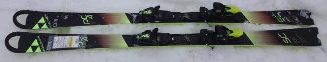
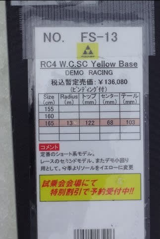
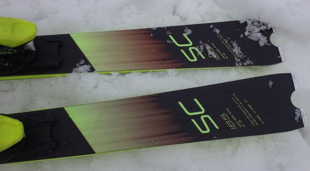
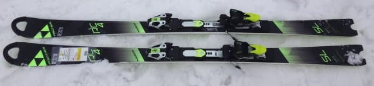
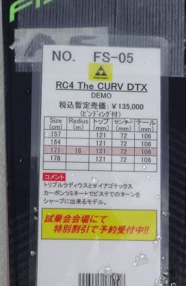
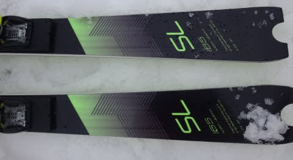

# 2018シーズンモデル，スキー試乗レポート第18回…FISCHER編その3

📅 投稿日時: 2017-06-13 03:00:36

うーーーむ．

今年は，スキーシーズンが充実していたので．

「夏はまだまだだよな…」と思ってしまい．

ついつい夏休みの計画を立てないまま

今まで来てしまい．

そろそろ夏休みの計画を立てないと

マズいなぁ，と思っているSkier_Sです．

本日も，気分的には「夏はまだまだ…」

って感じなんですが．

スキー試乗レポートが続きます．

前回に引き続き，フィッシャー編．

今回は，RC4 SCとWorldcup-SCの2機種．

RC4 SCは前回のダイヤモンドスキー場での試乗に続き，

2回目の試乗になります…

では，どうぞ～！

---

◎FISCHER RC4 Worldcup SC Yellow Base 165cm

基礎小回り．

165cmでR13mと，小回りスペシャルな感じですが．

ズレで小回りと作っていく板じゃなく，

カービングマシンっぽい感じ．

エッジが食い込んで切れていくけど，

谷回りのたわみが自由に作れて，旋回半径が

自由にコントロールできる感じ．

反発の速さ，スイングウエイトの軽さが相まって，

板自体はかなり軽快に感じます．

谷回りで意図したとおりに板を動かしていける感じ．

この板も，谷回りのコントロール性高いです．

軽快なコントロール性を備えるのに，板のトップから

エッジがしっかり食い込んで，キューンと

回っていきます．

柔らかくすっとたわむのに，エッジグリップが強めで，

しっかり板を食い込ませたままかなり小さめの半径で

グイッと回っていけ，さらにばね感が強く反発が速い…という，

私の好きな特性を備えている板で．

結構気に入りました．

◎FISCHER RC4 Worldcup SL WCP 165cm

SL競技用．

トップからテールまでのエッジがみじんもずれないほど

ガッツリと捉えて，すっと回る，良いカービングマシン．

板が捉えた後は，SL板っぽい小さめの旋回半径で，

非常に楽に板がすっと回っていきます．

板自体かなり重く，どっしりした安定感があるので，

荒れた斜面でも雪を蹴散らして滑っていきます．

…普通のスキーヤーが履くとミドルっぽくなるかな．

しっかりたわませられればきれいなショートターン．

返りもそこそこ早くて気持ちよく切り替えられる．

ただ，足元がどっしり重く．

重さが軽快さを失わせる感じがあります…

軽快に振り回せる板ではありません．

決してコブとか滑ろうと思わない，

そういう重さ．

整地の固い斜面で，どっしり感と強さを利用して，

しっかりきれいにターンしていく…

そういう板です．

高速耐性は驚くほど強い…というより，むしろスピードが

出たほうが滑りやすいと感じるくらいの板．

スピードが出れば出るほどグリップが増し，

張りの強さが活きる感じで，

スピードにはめっぽう強いです．

特筆すべきは，すごく切り替えがしやすいこと．

謎なほど切りかえがしやすい板でした．
