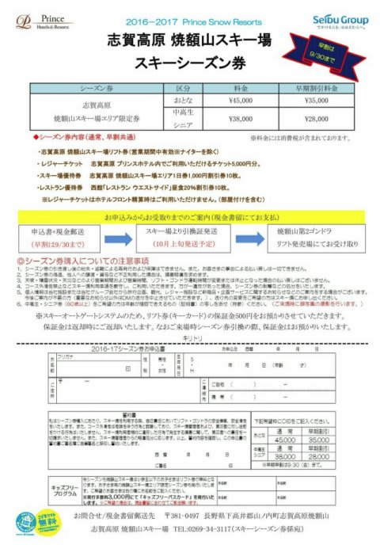
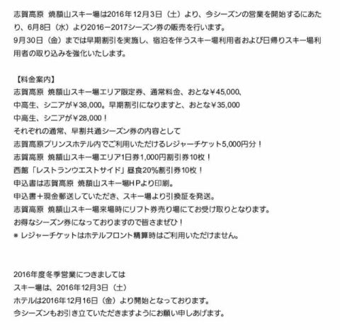

# え？来シーズンは焼額限定シーズン券が販売！？？9.30まで申し込みの早割で35000円？？

📅 投稿日時: 2016-06-17 01:57:26

🏷️ カテゴリ: [スキー雑談](c1f9d2cb7478308da16419928ea3945e9.md)

本日．

志賀高原の焼額山スキー場のホームページを

何気なく見た時．

うむ？？

[Facebookの投稿](https://www.facebook.com/yakebitaiyama/posts/1007288759366470)に，なにか新しい記事がありますね…

ふむふむ…

…

こ，これはっっ！？？

なな，なんとっ！！！

焼額エリア限定シーズン券！！？？

それも，9月30日までに申し込めば，

35000円！！？？

…これは．

ほとんど焼額しか滑らない自分にとって．

67000円もの高額なシーズン券を買わずとも

済むじゃないかっ！！！

これは，お買い得っ！！

と，思いつつも．

このシーズン券を買おうかどうしようか悩んでいる自分…

いや，やはり，せっかくの志賀高原．

時々は焼額以外のスキー場も滑りたくなるだろうし．

それよりなにより．

来シーズンも，焼額が4月頭で終わってしまうようなら，

志賀全山シーズン券より一か月以上有効期間が短い

このシーズン券は，魅力がないのだ！

＃4月頭からGWまでで10日以上滑ると考えると，

＃10日券が余計に必要な分，共通シーズン券の方が

＃圧倒的に安い…

…ってことで．

来シーズンは，いつまで営業するんだろう…？？

…この末尾には．

12月3日から営業とあるけど…

肝心な，いつまで営業するのかが書かれてませんね～…

うーむ．

来シーズンの焼額，GWまで営業してくれるのかな～？？
