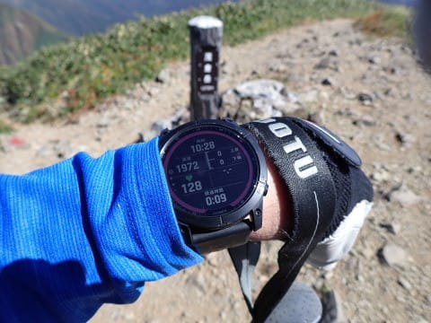

# 2022年10月，谷川岳→茂倉岳に登ってみた…その7　茂倉岳から谷川岳に戻ってきたけど，谷川岳は大混雑！

📅 投稿日時: 2023-08-31 03:06:21

てなことで．

昨晩は仕事の炎上案件対応でとてもBlogを

更新できる状況ではなく…一日更新できません

でした（涙）

おとといの記事に，

　明日更新がなかったら，

　「Skier_Sは死んだか…」と思ってください．

と書いてあったように，

昨日一日，ほぼ死んでました

今日の朝方に，なんとか炎上案件の火が

消せそうな気配が見え始め，

今日の夜にかけて，無事鎮火しました…

おかげさまで，今日は何とか日付が変わった

直後くらいに帰宅できましたが．

明日も事後処理やらなにやらの予定が

突っ込まれ，朝9時から夜10時まで11時間，

休みなくびっしり打ち合わせが…（泣）

（今のところ昼休み30分だけ空いているけど）

この裏で本業の仕事を走らせねばならない

のですが？？

金曜締め切りの書類仕事が2件あるのですが？？

明日，書類を作っている暇が全くないのですが！？？

…ということで．

今晩これから，明後日締め切りの書類を

泣きながら作る，Skier_Sだったのでした…

だもんで．

Blogを更新する暇などないはずなのですが．

1本分の記事は書き溜めてあったので．

書き溜めておいた山登りレポートです！

ーーー

ってなことで．

[前回](eee5047b9274d7354f0493b7d06b2e056.md)，無事目的地の茂倉岳に到着し．

20分ほど景色を堪能して．

10:30ごろに下山スタート

したわけですが…

また，こんな穏やかなアップダウンの

ゴキゲンルートを，向こうに見える

一ノ倉に向かって戻ります．

一ノ倉岳山頂が近づいてきましたが…

一ノ倉山頂はとんがってなくて，

緩やかなルートの途中にあることが

よくわかるかと．

一ノ倉を越えて，その向こうの谷川岳も

くっきり見えます．

うーん．あそこを越えて帰るのか…

ってなことで．

茂倉から一ノ倉は，わずか13分40秒．

一ノ倉山頂はこんな感じのところですが…

一ノ倉では止まらずに，ひたすら谷川岳に

向かって歩きます…

ここからは急こう配の下り坂がしばらく

続きますが．

目の前に広がる景色は，紅葉に彩られた

見事な景色…

いや．

美しい…！！

そして．

振り返ってみるとこんな感じの

急こう配を下り終えると．

こういうちょっとしたピークがあって…

こいつがノゾキと呼ばれる場所のようですね．

そこからさらに，ゴキゲンの景色を眺めつつ…

谷川岳に戻っていきますが．

オキノ耳に近づいてくると，だんだん

ルートが険しくなってきます…

でも．

ホントに紅葉もピークでいい感じ！！

そして．

浅間神社奥の院を越えると．

トマノ耳，オキノ耳が近くに見えるように

なってきますが…

トマノ耳に近づいてきたところ…

なんだ！！？？

あの渋滞は！？？

オキノ耳方面からトマノ耳山頂へ，

ものすごい渋滞の列がつながってます…

時間はちょうど昼前．

ロープウェーを使って，この時間に

登ってくる人がピークになるのね…

この列で待たされたらちょっときつい．

ガラガラの朝一に山頂に寄っておいて

良かった…！

でも…

山頂だけじゃなく，トマノ耳から

オキノ耳へのルートもかなり人が多く．

行き違いでの待ち合わせも多く．

かなりのんびり，止まりながら歩く

感じ…

谷川岳，トマノ耳から先のルートは

ガラガラなのに…

やっぱり人気のある山は侮れない！！

（[続く](ea77a2a421dede92740ef977481d9b61c.md)）
