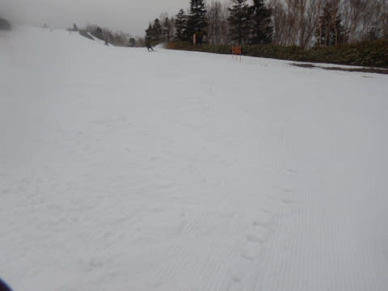
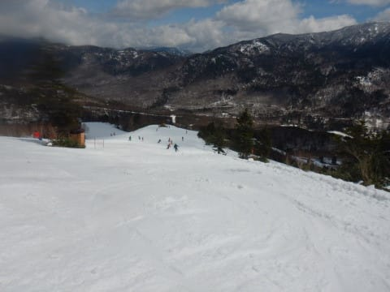

# 2022/5/3(火・祝)，GW中間3連休初日の志賀高原焼額山スキー場は…曇りのち晴れ，朝は冷え冷えGoodだけど午後は荒れ気味

📅 投稿日時: 2022-05-03 23:29:26

えー．

なぜか本日，一旦帰宅しているSkier_Sです…

でも，今日も早朝から焼額で滑ってました～！！

ってなことで．

本日の焼額ですが…

「今日も早朝から滑るぞ！！」

と．

やる気満々で，4日連続の早朝参戦のために

朝6:30前に第1ゴンドラに並んだのですが…

なんと．

ゴンドラの不具合のため，営業開始が20分ほど遅れる

とのアナウンス(涙)

せっかく早起きしたのに…

営業予定の6:30から20分経っても

営業開始せず（泣）

宿の人曰く，今日・明日がこのGWの人出の

ピークと言っていた3連休初日というのもあり…

ゴンドラ営業開始待ちの列は，はるか駐車場

まで続いてます…

結局，ゴンドラが営業開始したのは，

予定開始時刻を30分すぎた，7時過ぎ

でした…（写真の時計が7時を過ぎています（涙））

ってなことで．

7時過ぎにゴンドラに乗り，山頂へ着くと…

山頂の気温は-5℃！！

今日も冷えてますよ～！！

でも，天気は…

ちょっとガスってます（泣）

そして，さすが3連休初日，かなりの人数の

人が滑ってますね…

バーンは，かなり硬めのシマシマ！！

1本目はちょっと手ごわいレベルの，

かなりの硬さで…

そしてごく一部．

GSコースの突き当たって右に落ちていく

あたりは，圧雪でコースが均しきれてなくて，

ガチガチの凸凹で怖いところもありましたが…

でも．

GWとすれば，かなり締まったハイスピード

バーン！！

あさイチは硬いのがダメな人はかなり怖い

斜面だったと思うけど…

2本目以降は太陽も顔を出したので．

日差しで表面がわずかに緩み，

エッジが嚙んで滑りやすい雪に！

これは快感！！

やっぱりGWは早朝に限る！！

営業開始時はかなり並んだけど，

営業開始後のゴンドラ待ちはこの程度で，

3連休としてはそんなに混んでるわけでも

ないし…

それでいて，こんないいバーンを

滑れるんだから．

やっぱりこの時期は早朝に限る！！

…そして．

今日も8:30からパノラマコースがオープン

するので，当然のごとくオープン直後の

パノラマコースへ飛び込むと…

シマシマアゲイン！！

本日2回目のシマシマタイム！！

今日は気温が低めだったので，8:30になっても

それほど緩まない，最高シマシマの1本が

楽しめました～！

で．

さらに恵まれていることに．

9時ごろには空が時々曇りはじめて

きたので…

今日は雪が緩まず，バーンがそこそこ締まった

ままでいてくれてますよ！！

人が少なくて，バーンも締まってて…

今日はいい！！

と思っていたら．

朝9時にはそんなに混んでなかった

焼額第1ゴンドラも…

9:30になると．

ゲートの外にはみ出すほどの列が…（泣）

ただ，さすが3連休．

奥志賀なんかはゴンドラ，第2ペアリフト

ともに10分待ちを超えたようで，

奥志賀はすごい混んだらしく．

これでも焼額はマシな方だったようです…

でも，焼額もこれだけ混雑したのは

9:30～10:00までの30分くらい．

それを過ぎると，ゴンドラ待ちは大体平均

この程度の，搬器数台待ちレベルでおさまり，

それほど待たずに済みました…

しかし．

さすがに焼額も，午前中のGSコースは

ちょいと人が多めでしたね～．

パノラマ～サウスコースも，普段より

ちょっと人が多いかな？

でもせいぜいこの程度なので，気にせず

大回り可能！

そして，午前中は時折日が射すものの，

曇りがちの天気で…

気温も昼間で2℃程度．

午後はちょっと気温が上がったものの，

最高気温が＋3℃を超える程度

だったので．

日が陰っていた午前中は，GWとしては

かなりいいコンディションでした！！

…ただ．

午後になると晴れ間が広がってきて…

雪が一気に緩んで，緩斜面で滑りが悪い

感じの雪になっていったのが，残念…（泣）

そして．

GSコースは，コース中間点でそろそろ

雪が薄くなったところが出て来てました（涙）

ただ，この竹でバッテンをしてある部分．

その下も，雪が薄いってだけで

穴が開いているわけではないのですが…

そろそろ，気温が高い日が続くGW後半は

ヤバそうな感じ…

さらに午後は気温も上がり，あぁ日も射して

雪が一気に緩み始め…

かなり凸凹になってきました（泣）

あぁ…

曇り気味の午前中は良かったのに．

晴れなくてもいいのに…

いつもなら，晴れは嬉しいけど，

この時期は晴れたら雪が緩む一方

なので，日差しが恨めしい…

だもんで．

午後は結構な荒れ気味になり．

さらに滑りが悪くなっていきました…（泣）

ただ．

最高気温は山頂で+3℃程度だったので．

強い日差しでもそこまでザブザブにならず．

まだコースいっぱいに雪があることもあり．

まぁ，GWとしては恵まれたコンディション

だったんじゃないかな～．

…ってなことで．

今日も平年並みよりは冷えて．

比較的いいコンディションの一日

だったわけですが．

今日は急ぎの要件があったため．

大変珍しいことに午後3時過ぎで

切り上げて，帰路に着いたの

でした…←早く切り上げたって…あと45分で営業終了だから，

ほとんど最後まで滑ってたってことじゃないの？

いやー．

営業時間最後まで滑らず切り上げたのは，

他にもやんごとなき理由があった日が

1回だけあったので．今シーズン2回目かな…

ラストまで滑りたい

という心の声を押し殺して．

本日は一旦帰宅したのでした…

ってなわけなので．

4日の中1日は家にいますが．

また5日の早朝から，焼額に舞い戻る

予定です～！！

## 💬 コメント一覧

### 💬 コメント by (モイストシルバー)
**タイトル**: Unknown
**投稿日**: 2022-05-04 19:34:23

昨日・今日と早朝参戦しました。昨日は運転開始が遅く、やや残念でしたが、おかげでSさんのブログの写真に写ることができました(^^; 最初の1本にも写っていますね。今日は気温が上がりましたが、きのうよりも柔らかく、滑りやすかったです。来年また楽しみにしています。

### 💬 コメント by (Skier_S)
**タイトル**: ＞モイストシルバーさま
**投稿日**: 2022-05-04 22:07:48

あ，写真に写ってましたか！

今日で今シーズン終わりですか？

私は明日から志賀復活なので，会えずじまいですね…

また来シーズン，志賀でお会いしましょう！！

