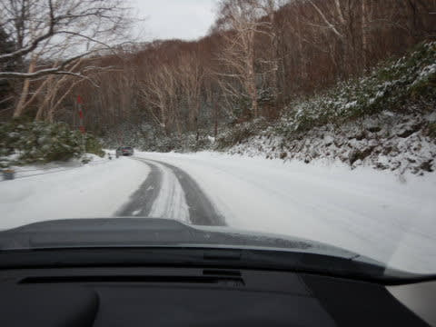
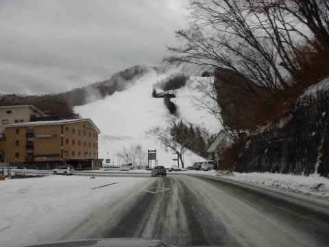
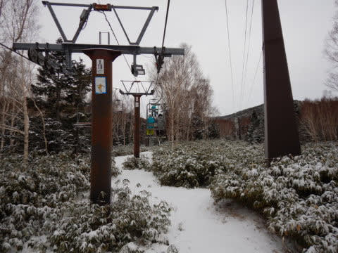
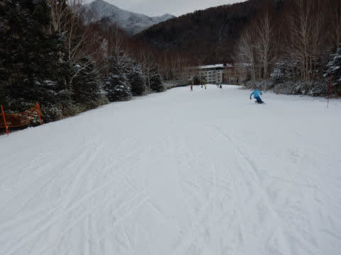

# 2019/12/7(土)の志賀高原スキー場は…曇り空，天然雪ほぼ無し．雪はちょいと固めながら，空いてたよ

📅 投稿日時: 2019-12-07 21:44:45

🏷️ カテゴリ: [2020スキー滑走日記](c282e9230de179e245c7334eabeb0a3b3.md)

ということで．

本日から，わがホームゲレンデの

焼額山スキー場がオープンしたので，

本日は今シーズン初の焼額で

滑ってきました～！！！

ってなことで．

今朝，志賀高原に登ってくる道は，

　朝はうっすら積雪道路なので，注意！

と予想した通りの積雪路でしたが，

昨日気温が上がって雪が融けてないので，

先週みたいにツルツルに凍ってなくて，

それほど苦労せず登ってこれたかな…

でも．

この時期にしては，雪は全体的に少な目で，

途中のサンバレーは，滑れるように

なるまで，まだまだかかりそうな

感じ…（ちょい涙）

というわけで．

帰ってきましたよ～！

今シーズンも，マイホームゲレンデ焼額に！！

…だけど．

今日滑れるのは第4ロマンス

だけですか（涙）

滑れるのが低速ペアリフト

1本だけだからか，あさイチに

並んでいる人はせいぜいこの程度で，

ガラガラ！

で．

営業開始と同時に，リフトに乗りますが…

雪，少ないですね（涙）

でも．

山頂付近のコースが見えてくると…

をを！

意外とコース幅いっぱい雪が着いてますよ！！！

そして．

リフトを降りてみると…

コース幅いっぱいの積雪！！

そして…

シマシマっ！！

今シーズン初の，焼額クオリティーの

シマシマですっ！！！

うははははは！

久しぶりの，焼額のシマシマバーンに

飛び込む！！

うひょーーー！

かなり締まりぎみでスピードが乗る

けど，エッジが利くいい感じのバーン！！

幅いっぱいに気持ちよくロングターンが

決まるよ…っ！！

…これだよ…

焼額に帰って来たよ…っ！！

朝イチはコースに人もおらず，

ガラガラコースを好きなライン

取り放題！！！

あぁ…

これまで，かなり混雑のイエティや，

イエティよりマシだったとはいえ，

かなりの人口密度だった熊の湯から

見ると…

このフラットさ，

このコース幅，

このガラガラ具合…

これは，天国に違いないっ！！

今日は基本的に天気は曇り空で．

　朝の気温は-5℃程度，昼間も0℃を上回らなさそう．

と予想した通り，気温も朝イチは-5℃程度．

昼間は-1℃程度と．

気温が上がることもなかったため，

雪は全く緩む気配を見せず．

終日雪質は悪くなかったのですが…

でも．

雪はほぼ完全に人工雪なので．

下地はかなり硬め．

人が滑ると，ところどころツルツルに

なっていくとともに…

…出たよ．

出ましたよ．

殺人コロコロが…（涙）

コース全面とは言わないまでも．

急斜面部分，かなりのコロコロが

覆ってて．

斜度が急な一部分，ところどころ

ツルツル＆コロコロになっちゃって，

ちょっと板が流されるところもありました…

が．

今日一日，コースが凸凹になったり

することはなく，フラットバーンを

キープしてくれて．

そして，人口密度もピークで

このくらいで．

ピークを外れれば，結構ガラガラで．

リフト待ちもほぼ0！！

これで，人工雪とはいえ，

ちゃんとコース幅いっぱい

滑ることができるし…

ちょっとのコロコロ＆硬い斜面さえ

我慢すれば．

…あ～．あと．

ムチャクチャ遅いペアリフトで，

すごい寒い中，山頂までの10分の長さに渡る，

人間凍結耐久テスト

を耐えることができれば．

ガラガラフラットバーンを，

ひたすらグルグル気持ちよく

大回りで飛ばし続ける

ことができました～！！

あぁ…感動…

やっぱり，わがホームゲレンデ，

焼額はいいなぁ…

気温も上がらず，日も射さなかったので．

雪は最後まで良く滑る，しっかり締まった

雪でした！！

…逆に言うと，最後まで硬いところは

硬いままでしたが…（ちょい涙）

でも．

ガラガラの幅広コースを，

朝から夕方までひたすら大回り

し続けられて．

日が暮れ始める，16時のリフト営業

ラストまで，いつも通りたっぷり

滑り続けたのでした…

ってなことで．

7か月ぶりに帰ってきた，

わがホームゲレンデを満喫した

一日でしたが．

これから明日の朝にかけて．

運が良ければ，志賀高原でも雪が

降りそう…

でも，積もっても5cmくらいかな（ちょい涙）

…とはいえ．

この状況なら，わずか5cmでも積もって

くれて，その上に圧雪がかかれば．

明日のゲレンデコンディション，かなり

良くなるんだけどなぁ…

## 💬 コメント一覧

### 💬 コメント by (Northfox)
**タイトル**: Unknown
**投稿日**: 2019-12-08 08:16:05

私も昨日ようやく川場スキー場でシーズンインしました。

早く志賀高原で思い切り滑りたいのですが、全面オープンはまだまだ先ですかね．．．

予報外れのドカ雪が降るように雪乞いの念を送り続けようと思います。

### 💬 コメント by (Hide)
**タイトル**: 意外と・・・
**投稿日**: 2019-12-08 11:36:15

S 様

やはり出撃しましたね（笑）

さすがヤケビクオリティです。

私は、あの長くておっそ～いペアリフトがど～も苦手で・・・

寒さに耐えるお猿さんの気持ちになります。

以前、2ゴンが故障で止まって、ペリフトがものすごい事になった記憶が・・・（汗）

### 💬 コメント by (Skier_S)
**タイトル**: 天然雪が欲しい…
**投稿日**: 2019-12-09 02:01:29

＞Northfoxさま

川場，もう滑れるんですね…！！

志賀の全面オープンは，もう少し先になりそうです．

雪になるように，例の踊りを踊ってください…

＞Hideさま

そうなんですよ…

私も4ロマの遅さに耐えられなくなるのですが．

そこしか滑れないなら，滑るしかないので…（涙）

今日も4ロマは冷凍人間製造機でした．

寒かったです…

