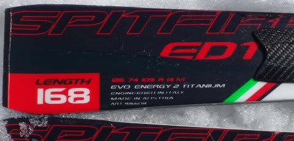

# 2016シーズンモデル，スキー試乗レポート第12回…NORDICA編

📅 投稿日時: 2015-04-15 01:44:44

🏷️ カテゴリ: [スキー板試乗](c0bd8048615710cee890e403a36cc9a2b.md)

えー．

[スキーダイエット](edd0452732278bcfc87b9419cd5bf3f1e.md)の効果がテキメンすぎて，体重が減りすぎたので．

体重をもとに戻そうと，必死におなかいっぱい

ご飯を食べていたところ．

無理な食べすぎのせいでおなかを壊し，逆に体重を

さらに減らしてしまったSkier_Sです…（涙）．

…もう，スキーダイエットの効果は強烈ですよ～（泣）．

痩せたい方は，ぜひチャレンジを…！←誰もやろうと思わないから

ってことで．

まだ続く，2016シーズンモデルのスキー板試乗インプレッション．

今日は，ノルディカ編2機種です．

では，どうぞ～！

○NORDICA SPITFIRE EVO EDT 168cm

基礎オールラウンド．

…オールラウンドって言ってますが，長さの展開的には

ショートターンベースですね．

この板，ビンディングがこんな感じで…

ダイヤルをくりくり回すとすごい簡単にブーツサイズ調整ができます．

で．この板．

履いた感じ，ズッシリ重い．

EDTプレートがついてる分，重いのかな？？

フレックスはしっかり強く，結構固さを感じます．

荷重ポイントはつま先部分，かなりトップ寄り．

角を立ててサイドカーブに乗っただけでは，R=14という

ラディウスが小さめの板としてはそれほど回り込んでこず，

比較的まっすぐ目に走ります．

板のトップ側，トゥピースから先をしっかり抑えて

いかないと回らない感じを受けます．

ただ，トップをたわませれれば，かなりの高速で

しっかりしたミドル～ショートができます．

軽快で返りが早い…って感じではなく，比較的どっしり

した板なので，ビンビン小回りに特化した板ではなく，

やはりある程度オールラウンド性に振ってある感じ．

板の重さによって，結構スピードを出しても安定感の

あるターンができるし，

あまり仕掛けなければR=14って板にしてはかなり

まっすぐ目に落ちていけるので，まっすぐ落ちれば大回り，

しっかりたわませれば小回りまで対応でき，

守備範囲の広さがあります．

ただ…フレックスが結構強く，乗り手が積極的にたわませて

半径を作っていく板なので，試乗した柔らかい雪では，

本領が発揮できない感じを受けました…．

板が結構強いので，気楽なオールラウンドというより，

レベルの高い人が履けば，ハイスピード大回りから

カービング小回りまで使いこなせる板，

って感じかな～．

○NORDICA DOBERMANN SLR EVO 165cm

SL，基礎小回り用．

こちらは，EDTがついてないシンプルな平板の小回り板です．

この板も，プレートとビンディングはSPITFIRE EVO EDTと

同じですね…

この板も，結構グリップ・フレックスが強めの板ですね～．

ただ，EDTよりはかなり軽く，軽快さを感じます．

やっぱりこの板も荷重ポイントはトップ寄り，トゥピース付近．

芯のしっかりした張りと，メタルっぽい返りの強さがあり，

トップを抑えて行くと，返りの早さで

ピュンピュンとした小回りができます．

板を回しこんで荷重をテールにぬいて，

深い回転弧で回していく小回りではなく．

トップを抑えていくと，返りの早さで板が

反対側にすっとんでいくような，そういう小回り．

この返りの早さといい，ラディウスの小ささといい，

ある程度のオールラウンド性をもたせようとしている

SPITFIRE EVO EDTと比べると，小回りに特化していることが

よくわかります…

この返りの速さについていくには，ある程度の技術と

体力＆脚力が要りますが，

気持ちいいばね感があり，整地小回りスペシャルとして

割り切れればグッドな板かと思います…．
