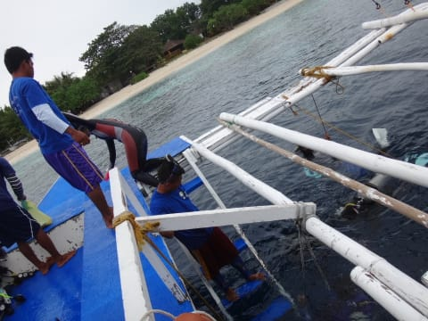
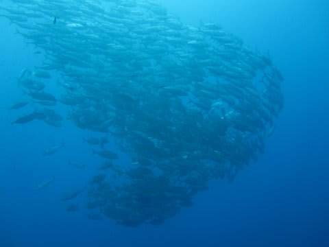
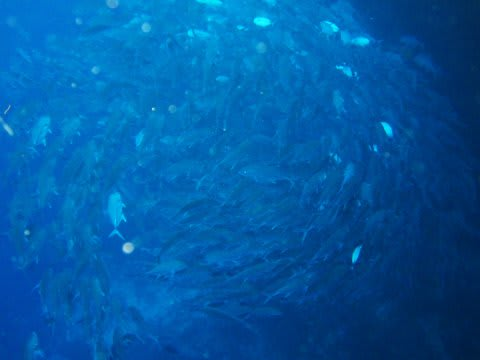
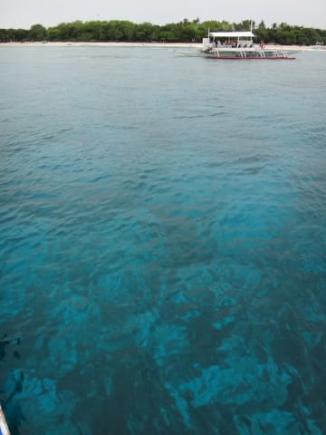
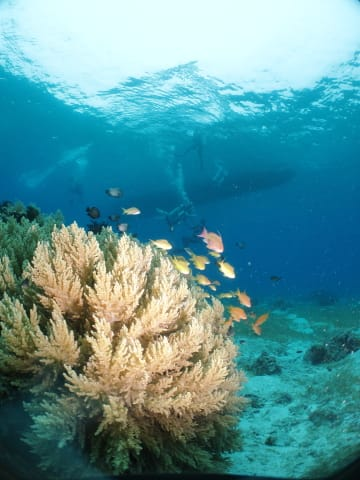

# 2014年8月　オスロブagain…再び，子連れでジンベエザメと泳ぐぞ！　その7

📅 投稿日時: 2014-09-10 01:06:42

🏷️ カテゴリ: [ダイビング日記](ce3a7a8d424d112fce83ee85c81a0e344.md)

ってことで．

一日，このBlogの本来のネタである，

スキーネタを挟みましたが．

…また，ダイビング日記に戻るのだ（笑）．

ってことで．

オスロブ旅行記，続きをGo!

-----

で，シュノーケリングを終えて，船の上で待っていると…

ダイビングチームが戻ってきましたが．

うむむ？

みんな，なんだかうれしそうですね～．

いったい，何があったんだ？

…と，妻に聞いたところ．

妻「ギンガメアジの群れ，出たよ！」

（妻撮影）

私「……

　　…

　　ふーん．

　　…それは良かった…」

＃なぜ，自分が潜っていない時に出る…！？と思っても

＃妻には言えない

なんだか．

ガイド曰く，ここしばらくギンガメの遭遇確率が

落ちていて．

バリカサグに来てもギンガメの群れに

出会わないことが結構あるらしく…

1本目から出てくれて，みんな喜んでいるようです．

写真を見せてもらうと…

ちゃんと群れがぐるぐるしてるじゃないですか！

（妻撮影）

う，うらやましい…

妻「まぁ，私は大物運が強いから．私が潜れば出るでしょ」

（自信満々）

…あのー．

…あなたが潜ったから出たわけではないと思うのですが．

…タオ島でさんざんジンベエを外したあなたが

言えるセリフではないと思うのですが．

…というセリフをぐっと飲み込んでいると．

船はバリカサグ島周辺をちょっと移動して，

2本目のポイントへ到着です．

…ここも，海はきれいそうですね～

…天気が良ければもっといいのに…

とりあえず．

1本目は妻が潜ったので．

2本目は，私が潜る番．

…なのですが．

ダイビング前のブリーフィングで．

ガイド「1本目でギンガメ出たので，ポイントを替えた2本目に

　続けて出ることはないと思います…

　ギンガメの群れは期待しないでください～（笑顔）」

え，え？　えええっ！！！！？？

ががががーーーん！！

なんてこった～っ！！！！

えーっと．

えーっと．

バリカサグの一番のお楽しみって，ギンガメの群れ

だと思うんですが…

なんというか．

これって．

その．

事実上の終了宣言ですかっ！？？？

始まる前から，終了宣言ですかっ！？？（涙）．

そんな笑顔で言われても…（激涙）．

ということで．

ブリーフィングを終えた我々．

他のゲスト3人は，1本目でギンガメを見ているので，

それほど落胆していませんが．

唯一ギンガメを見ておらず，かなり落胆した

私一人，

この4人で，海へ向かいます…

