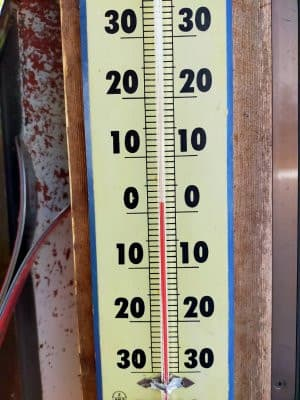
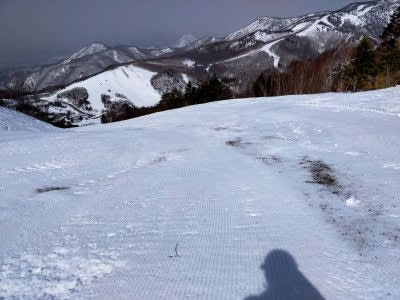

# 3連休は19日雨（涙），20日冷えて雪，21日冷えて晴れ…かな？詳細天気予想は明日！

📅 投稿日時: 2022-03-17 03:05:46

えー．

地震，結構揺れましたね～．

皆さんは無事だったでしょうか…

ってなことで，本日も志賀高原特派員からの

写真が送られてきましたが．

本日の志賀高原も，朝から晴天だったようです！

…そして，朝イチから気温はプラス（涙）

でも，朝イチは冷えて硬めの

シマシマだったようです！

…すぐ緩んだみたいですが（泣）

そして，この日も終日天気が良かったうえ，

昼間の気温は+7℃まで上がったようで（涙）

そのせいで，昼間は完全に春の雪になって

しまい，午後はちょいと荒れ気味になった

ものの．

板は滑る雪で，そこそこ楽しめたようです…

…でも．

一の瀬パーフェクターのとりつき部分．

うぎゃーーー！！なんだか，土が出てますよ！！

…今年は雪が多いと思ったのに．

雪が消えるスピードが半端ない…！！（泣）

この高温はいつまで続くんだろう…（こぼれ落ちる涙）

そろそろ平年並みに戻ってほしいところ．

ってなところで．

この週末は3連休！！

果たして3連休まで高温が続くのか？

あるいは3連休には冷えてくれるのか？

…水曜深夜恒例の，週末の天気予想をして

みましょう！！

…と，いきたいところですが．

日・月曜の詳細天気図がまだ出ておらず．

現時点では日・月の予想精度が低いので，

今日は簡単に現時点の予想だけにして．

また明日，詳細予想やります～！

ってなことで．

予想を書くと…

17日(木)：たぶん朝から晴れ．時折日が陰るかも．

　午後は完全曇りになるかな？

　水曜より気温は上がらず，最高気温+3℃くらい．

　あさイチは硬め，昼には緩んだ春雪に．

18日(金)：ヤバい．朝から降る．

　…おそらく朝は雪がパラパラと

　降ったり止んだり．

　昼間に液体っぽい感じになりそう…

　標高が高いところはギリギリ

　雪かな？

　雪だとしても，かなり湿った雪が

　パラパラと降ったり止んだりの天気．

19日(土)：たぶん前日の夜から雨が

　降り続ける．朝は雨(涙)．

　降ったり止んだり，時折強く降るかも？

　午後どこかのタイミングで雪に

　変わり，その後，夜には雪が強く降る

　タイミングも．

　

20日(日)：冷える！朝イチは-7～8℃，

　昼間最高気温も-3℃程度．

　朝から雪が降るけど…どのくらい

　積もるか，いつまで降り続けるかは

　まだわからない．

　冷えた雪降りの一日．　

　雪がいっぱい積もればゲレンデは

　冷えたいい感じに．

　積もらなければ，ガチガチに

　硬いアイスバーンに．

21日(月)：冷える．朝イチは-10℃近い？

　天気は曇り～晴れかな．

　前日に雪が積もらなければ，

　この日は絶叫ガチガチアイスバーン．

　雪が積もれば，この日は冷えて

　雪も良く，天気も良く最高に！

…って感じでしょうか．

うーん．20日の積雪量がまだ

読めないので，明日の詳細予想を

お待ちください！！

とりあえず，土曜はコンディション悪そう

だけど．

皆さんの日ごろの行いがよければ，

日・月は冷え冷え雪が積もってトップシーズン

なみのバーンに！！

…日ごろの行いが悪ければ，

雪が積もらず冷えてガチガチアイスバーンの

日・月になります…

…お分かりですよね．

このBlogの読者の皆さんは，3連休までは

普段の行いに気をつけて，神のように

品行方正に過ごしてくださいますよう，

そして，

全力での雪降れ降れ踊り

を踊り続けてくださいますよう，

くれぐれもよろしくお願いいたします…

…ちなみに，今後の焼額山スキー場の

リフト営業ですが．

3連休は久しぶりに第3高速リフトが動きます！！

久しぶりの，

高速リフト2本・ゴンドラ2本体勢です！！

…これなら，混雑緩和が期待できそう…

([焼額山スキー場ホームページ](https://www.princehotels.co.jp/ski/shiga/informations/lift_operation_schedule/)より)

その後の平日は，また1ゴン＆2高の

2本のみになるようですが…

また，26，27日の週末は2ゴンも動く

ようです．

…その後は，休日含め1ゴン＆2高の

2本営業がGWまで続く感じかな？

…どうやら，今週末の3連休が，

今シーズンの第3高速リフトの

ラスト営業になりそうですね…

あぁ…シーズンが終わっていく…

## 💬 コメント一覧

### 💬 コメント by (レインボー74)
**タイトル**: Unknown
**投稿日**: 2022-03-17 13:59:39

木曜日の志賀高原情報

朝の上林+2℃。嘘だ、暖かすぎる。冬の服装をしてきたのに。

ニゴンから白樺へ。朝イチだけは硬め。

あとはオリンピック、GS、などをクローチンク主体に楽しみました。クローチング姿勢に慣れてきたら、なんか持病の後傾癖がなおってきたみたいで、とっても全てが楽になりました。74歳なんてまだまだ上昇する歳です(昇天ではありませんよ)。

