# 2022/12/24(土)の志賀高原焼額山スキー場は…朝は積雪20cmのブーツパフ！昼間も30㎝くらい積もる雪降りデー！

📅 投稿日時: 2022-12-25 00:48:21

ってなことで．

今日も焼額に滑りに来ましたが…

いや．

ようやっと雪が積もり始めましたよ…！！！

なんてったって．

朝志賀高原に向かう途中で…

なんと．

高速は横川近辺からもう雪景色！！

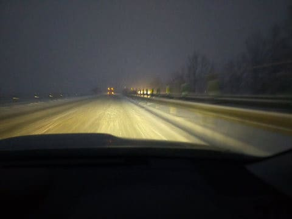

横川から信州中野まで，ひたすら雪道で．

中野市街も，かなり雪が積もってます！！

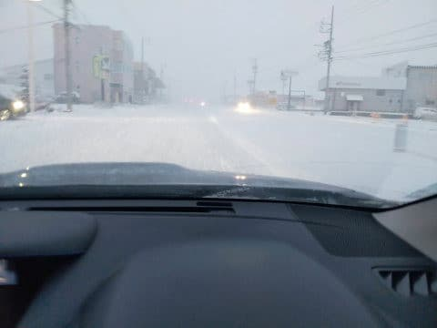

志賀の登り坂は，まだ除雪が間に合ってない，

積雪10㎝を超える本格雪道でした…

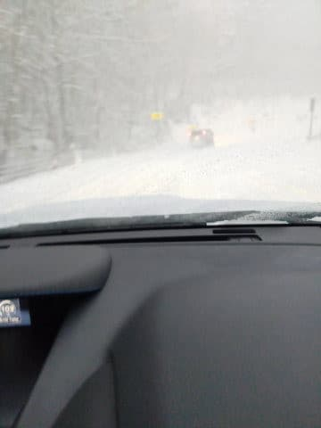

ってなことで．

今日の朝になって，この積雪のおかげで

「焼額第2ゴンドラ営業開始！！」

といううれしいニュースがあったので，

喜び勇んで第2ゴンドラにやってくると…

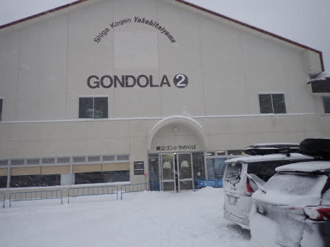

「すみません…山頂付近風速25~30mの

　強風で運休です…」

という非情なお知らせが(涙)

うぎゃーーー！

予想外の今朝からゴンドラが動くとの

ニュースに飛び上がって喜んだのに，

ぬか喜びだったか…(泣)

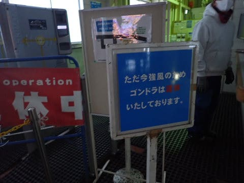

ってなことで．

残念がりながら，あさイチの第4ロマンスに

並びますが…

今日は激烈雪降りの悪天候だからか．

あさイチに並ぶ人は少ないですね．

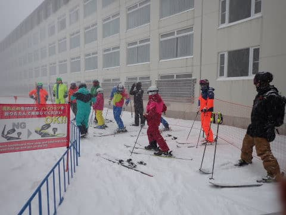

8:30営業開始のリフトで山頂に向かいますが…

すごい雪降りなので，長くて寒い4ロマは

ツライ…(泣)

ゴンドラが動いてくれれば…(涙)

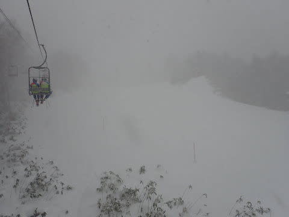

でも．

山頂に着くと…

おそらく，朝までの積雪は20~30cm．

圧雪コースも，圧雪の上に10㎝ほどの軽い

新雪が乗ってます！！

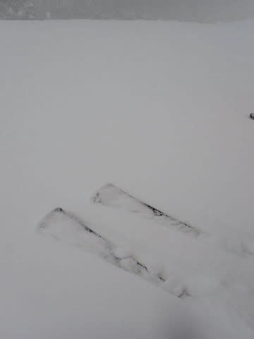

うほーーーーーー！！

圧雪コースはそれ程新雪が深くないだろう…

と，普通の板を履いてきたけど．

10㎝を超える積雪がコースを覆っているので…

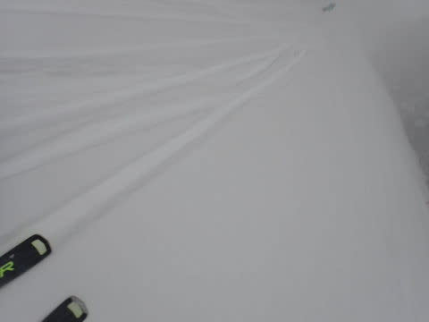

ブーツパフながらも，今シーズン初の

新雪ですよ！！！

意外と本格的な新雪ですよ！！

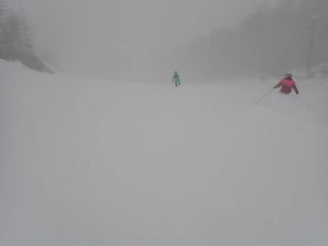

…こうなれば．

今シーズン初の太板，出動だ！！！

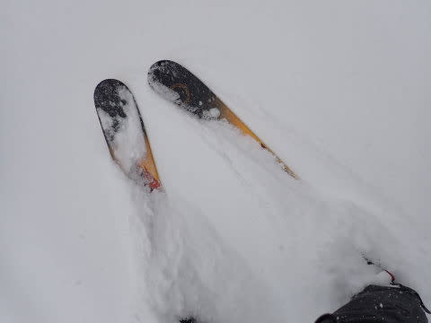

コース脇は，まだところどころ背の高い

草のてっぺんが出てたりするけど．

20㎝程度とはいえ，今シーズン初の

パフパフ感！！

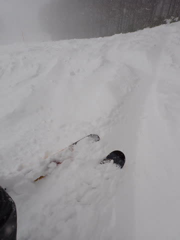

圧雪コースも10㎝程度のパフパフ感を

楽しめて．

いやーーー．

本格シーズンインですよ！！

もう，人工雪コースじゃないですよ！！

表面は100%天然雪ですよ！！

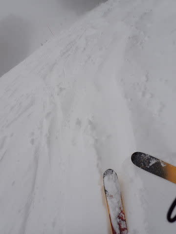

…と，楽しんでいたものの．

第2高速側の唐松コース．

リフト待ちはそれ程でもないんですが…

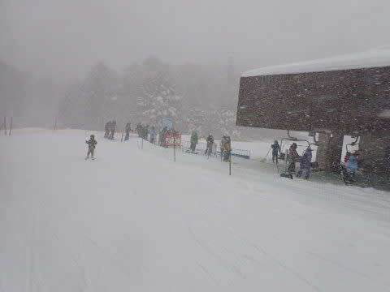

10時前には，クワッドの輸送力のせいで，

コース上の人口密度がちょいと高めに

なってきました…

雪降りで視界が悪いので，人が多いとちょいと

こわい．

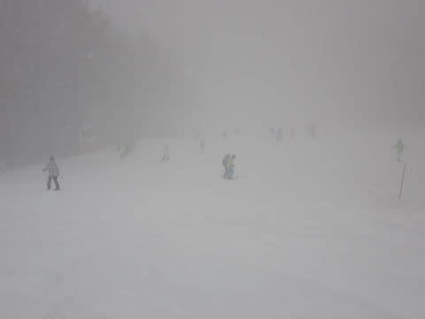

これに対して，第4ロマンス側のサウスコースは…

低速ペアリフトで乗車時間が長いのが嫌われて

いるのか．

リフト待ちも短く…

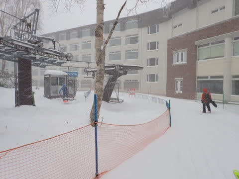

コース上の人口密度も低く．

快適に滑れます…

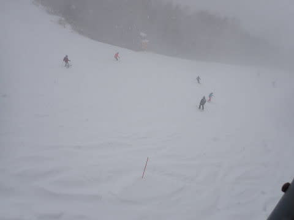

高速リフトで効率よく回せるけど，

人が多くてこぶ斜面になってきた第2高速か．

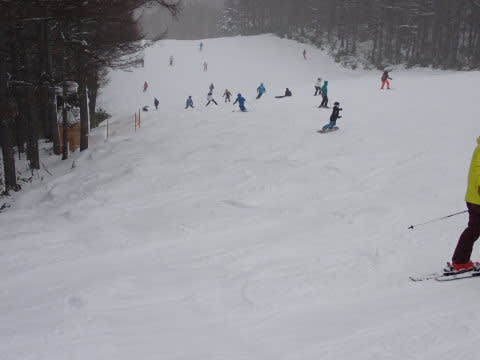

寒い雪降りの中，長時間低速リフトで

冷凍人間になるのを耐えつつ，

人がいなくてフラットで快適な

コースを滑る第4ロマンスか．

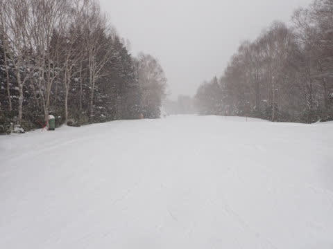

結構，究極の選択だな…

結局は，両者適宜交互に混ぜて

滑ってました…

で．

今日は一日，時折前が見にくくなるほどの

雪が降り続き…

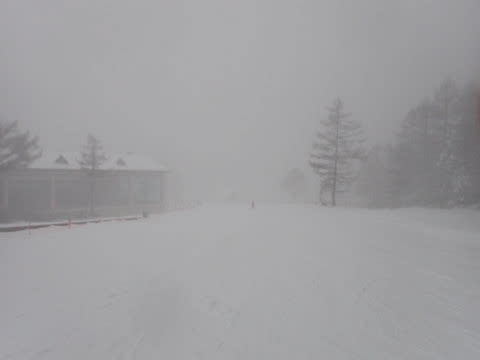

午後になっても，コース上に新雪が積もって

行くくらいで．

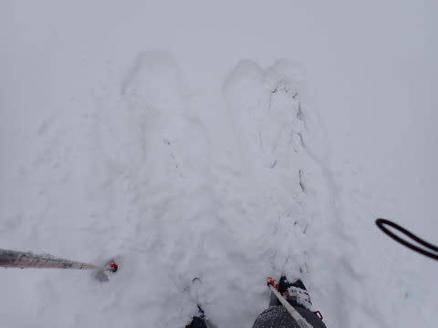

ナイター照明がつき始める，営業終了の

ころまでずっと太板を履き続けて

いたのでした…

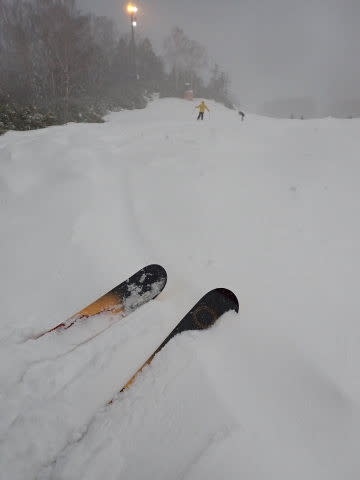

ということで．

今日も16時の営業終了まで滑りましたが．

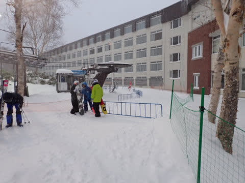

車に戻ってみると…

何じゃこりゃ？？？

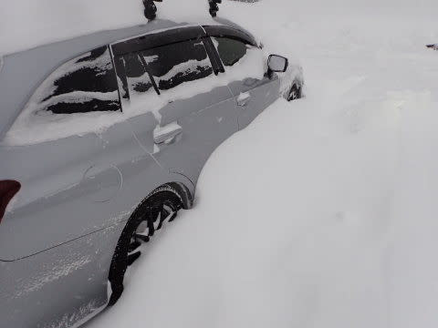

朝8時から16時までの8時間で，

こんなにも積もっていたみたいです…

30cm以上積もったのかな？？

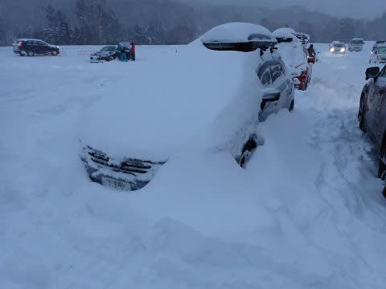

とりあえず．

これまでの雪不足を解消するような，

久々のパフパフコンディションを

一日満喫出来て．

すごくいい一日だったわけですが…

こんないい日には．

まだ滑らないともったいないですよね．

ええ．

これで帰るのは惜しいですよね…

そうです．

焼額山．

本日より，今シーズンのナイター営業

スタートです！！！

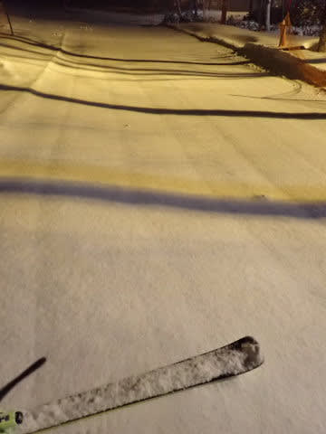

ちなみに．

営業終了からナイター開始までの間にも．

これだけ積もったみたいですね…

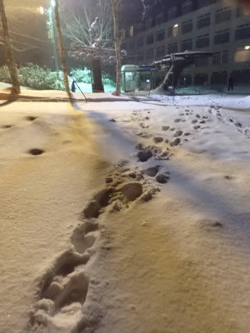

で．

普通なら第3高速でのナイターですが．

今日はまだ第3高速がオープンして

いないので，第4ロマンスでの

ナイターです…(ちょい涙)

でも，もうナイター営業しているって

知っている人が少ないのか．

営業開始時に並んでいたのは2人で，

私がポールポジション！！

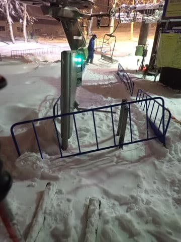

ということは…

このきれいなシマシマバーン（の上にうっすら新雪）

を一番にいただけるということです！！

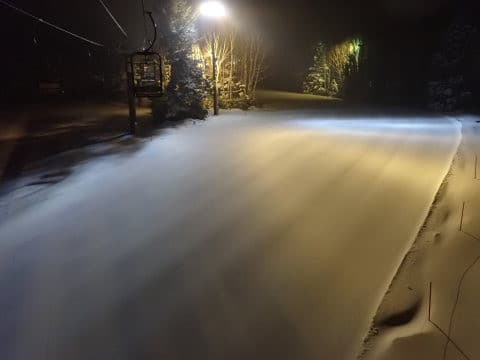

ぐははははははは！！！

前に誰も滑っていない，今シーズンの

ヤケビナイターの第1号のお客の私が．

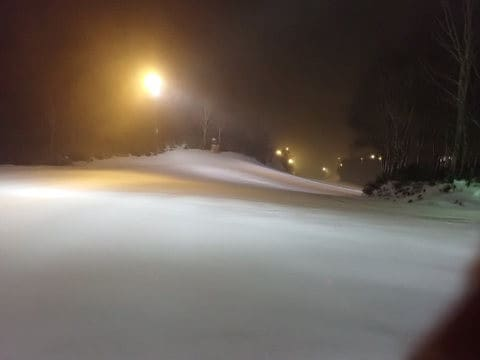

ありがたく，このぴかぴかバーンを．

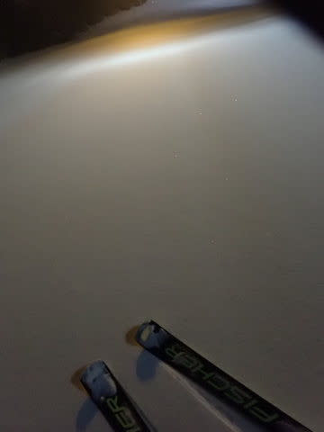

いただきまーーーーす！！！

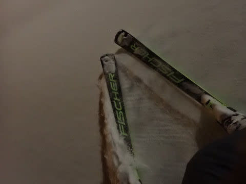

ぐはーーーーーーーー！！！

最高！！

最高の快楽！！

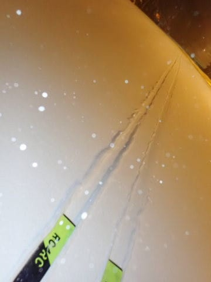

いや．

ホントにコンディション最高！！

昼間寝てでも，このナイターを

滑りに来るべきじゃないだろうか！？？

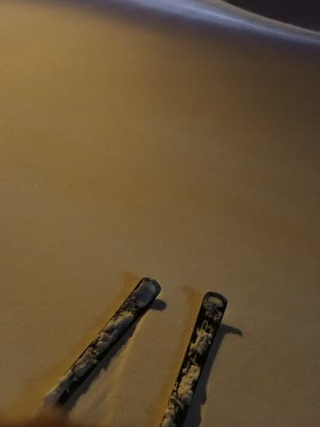

こんな最高なのに…

今日のナイターを滑っているのは10人程度．

ほぼ毎回貸し切りで滑れます！！！

なんだ，この最高のナイターは！！？？

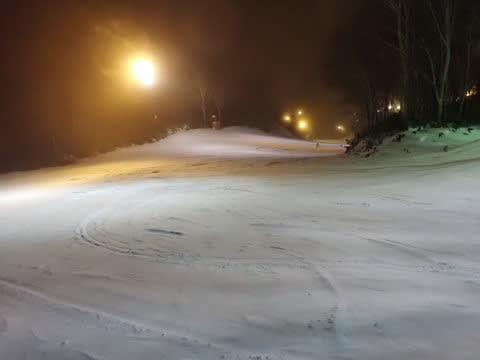

ということで．

20:00の営業ラストになっても．

まだバーンはキレイなままで．

最高の2時間を過ごせたのでした…

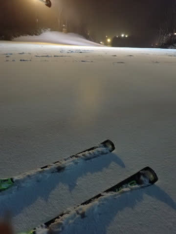

いやー．

満足．

睡眠時間2時間で無理して来た甲斐は

十分ある，満足の一日であったぞよ…

ってなことで．

今日は強風でゴンドラが動かなかった焼額

ですが．

明日から，第1，第2の2本のゴンドラが動きます！！

GSコースは滑れませんが．

パノラマだけじゃなく，白樺コースもオープン

しますよ～！！！

中央エリアも，明日までにブナ平，西舘下部，

ダイヤ，山の神が動くみたいだし．

明日からは，一の瀬と焼額の行き来が

できるようになります…

明日も，今日ほどの積雪量ではないですが．

一日雪降りになりそうだし．

明日も楽しんできます～！！

## 💬 コメント一覧

### 💬 コメント by (you160)
**タイトル**: Unknown
**投稿日**: 2022-12-25 06:32:11

Sさん

我々Familyはヤケビナイター初参戦でしたが、なにこのナイター、、、こんな快楽がこの世に存在するのか！？これは中毒になるかもという感じでしたw

一方でホテルの食事の時間があったのでやむなく19時半で撤収しましたが、長女は滑走後、Sさんパワーもあり「クリスマスプレゼントはスキー場が欲しかった」とまさかのリクエスト。

スキー場は貰えないけど、良いクリスマスプレゼントになったようです。

### 💬 コメント by (新米パパさん)
**タイトル**: Unknown
**投稿日**: 2022-12-25 09:19:26

ご挨拶できてよかったです。

イチゴンへの連絡通路は雪ものり漕がずに行けます！

### 💬 コメント by (Skier_S)
**タイトル**: 眠い…
**投稿日**: 2022-12-26 05:47:00

＞アツシさま

土曜はお疲れ様でした～！

日曜はゴンドラも動いて，さらに最高でしたよ(笑)．

これからがシーズン本番です．また焼額でお会いしましょう！

＞you160さま

この週末も一緒に滑っていただきありがとうございました．

しかし，「クリスマスプレゼントはスキー場」ですか…(笑)

私も欲しい…

＞新米パパさま

今日は私もイチゴンをひたすら回しました．

また焼額でお会いしましょう！

＞なるなるさま

今日はゲレンデコンディション最高の一日でしたね…！

雪質もいいし，楽しく滑れました．

シーズン最初にけがをするともったいないので，滑りを思い出すまで

気を付けて滑ってくださいね…！

