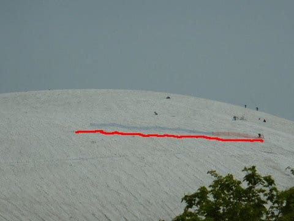
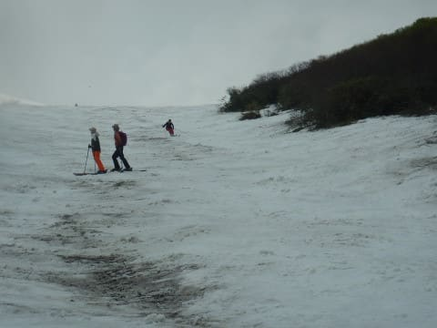

# 2022/6/11(土)の月山スキー場，いまさらの詳細レポートその2…Tバーは滑ってないけど，途中にクレバスあり．天気は曇り時々晴れ一瞬雨

📅 投稿日時: 2022-06-16 00:54:34

ってなことで．

昨日，[6月11日の月山レポートその1](e924a2aadcb78e4e979691f3abdc57307.md)を書きましたが．

今日はその続き，月山詳細レポート2回目です！

とりあえず，今シーズンの月山は，

クレバスがそこかしこにできている影響で，

写真の赤で囲った大斜面はクローズ．

リフトで滑れるのは沢コースだけですが…

この水色で囲った部分が滑れるエリア．

立ち入り禁止の大斜面の下から見ると…

やっぱり，誰も滑ってませんね．

雪がたっぷりあるのでもったいないんですが．

まぁ，大斜面のど真ん中はパックリと

割れてますし…

拡大すると，そこかしこに危ない

クレバスがいっぱい見えるので．

安全のために，近づかない方が

正解ですね．

ちなみに，沢コースの下の方は

ここの矢印で書いた部分になるので…

沢コースの後半部分は，幅が狭い一本道

なので，あんまり楽しくないです（涙）

でも，沢コースの上の方．

この水色で囲った部分がコブ斜面に

なっていて…

コブ斜面部分，別アングルから見ると

こんな感じ．

ただ，コブは大斜面ほど長くも深くもなく．

一番深いラインでこのくらい．

長さもそんなに長くないので，

コブをガンガン滑りたい人には

物足りないかも…

まぁ，そういう人には，沢コースの

谷底に当たる部分は，一本ずっと

コブラインがついていて…

斜度はそんなにないけど，ここの

コブなら長さは長いし，結構深めだったので．

そこそこ滑り応えはあるかな…

で．

私は滑ってない，山頂のTバーですが…

Tバーも，この日はそれほど混んで

なかったですね！

これならがら空きですか…

でも，左部分，コースを横切るように

ネットが張られています…

この，ネットの部分を拡大すると…

うわ．

ネットの下の部分，かなり長い

クレバスが…！！

これは危ない…！！

私の経験でも，こんなところに

クレバスができてるのは見たこと

無いですね～…

ってな感じで．

この日も結局，朝2時半に起きて

出てきたにもかかわらず，

昼休みもとらずひたすら沢コースを

グルグル滑り倒していたのですが…

天気は曇りベースながらも．

時折日が射す，意外と穏やかな

天気で．

まぁ，午後2時過ぎごろ，

一瞬雨が降ったものの…

降ったのはせいぜい3分程度だったかな？

すぐ止んだので，びしょ濡れになることは

無かったです．

それでいて，終日リフト待ちはなかったし．

雨が止んだら，また天気は回復してきたし．

日帰りで，朝2時半から出てきたうえ，

滑り終わったらまた7時間運転して

帰路につかなくてはならないので．

早く帰ろう，早く帰ろう…

と思っていたものの．

ついついゲレンデに誰もいなくなる，

ラストリフトまで乗ってしまい…

日が暮れかける最後まで．

昼休みもとらず，リフトをひたすら

グルグルし続けてしまったのでした…

ってなことで．

大斜面が滑れるのなら，もう一度くらい

月山に行こうかな…とも思ってたけど．

沢コースしか滑れないから，

今シーズンはもう満足かな…

と．

ラスト1本を滑り終えて，

シーズン終了の儀式もしてきたので．

これにて，私の2022シーズンのスキーも

終了です…

## 💬 コメント一覧

### 💬 コメント by (大阪のK)
**タイトル**: Unknown
**投稿日**: 2022-06-16 08:33:32

Sさん、長いシーズンが終了しましたね。

お疲れさまでした。

22-23シーズンが始まるまで、短いオフをお楽しみください。

私はGW明けからゴルフモードに突入してます🎵

### 💬 コメント by (Skier_S)
**タイトル**: ＞大阪のKさま
**投稿日**: 2022-06-17 02:15:16

短いシーズンが終わりました…

全然長くないです（笑）一瞬でシーズンが終わっちゃいました．

この夏も海に潜りに行けそうもないので，23シーズンが始まるまでは

山に登ってます…

### 💬 コメント by (重松といいます。70才。)
**タイトル**: Unknown
**投稿日**: 2022-06-17 08:11:58

月山、懐かしいー。

50年前に行きました。

そういえば、やはり６月でしたね。

バーンの状態、カタシャの様子など、当時から全く変わってないようです。

青春の１ページがよみがえりました。

ありがとうございました。

### 💬 コメント by (Skier_S)
**タイトル**: ＞重松さま
**投稿日**: 2022-06-17 21:08:34

コメントありがとうございます！！

50年前ですか…すごい．

今でも現役スキーヤーでいらっしゃいますでしょうか？

志賀高原では，70歳前後の方々が元気に滑ってらっしゃいますよ～！！

1日ゴンドラ48本乗っちゃう方とか，

急斜面をクロ―チングして時速100km超えちゃう方々とか…

ぜひ志賀高原へもお越しください！

### 💬 コメント by (カトウ)
**タイトル**: Unknown
**投稿日**: 2022-06-18 00:43:42

まさか、日帰りで月山まで行かれるとは！凄すぎます！

ずいぶん前の事ですが、私は泊まりで行きました。泊まった宿は当時、自家発電で山小屋のような感じでした。ロープトゥ、スキー板を手で持ってリフトに乗り、確か左を谷足で長いトラバース、そして山頂のTバーにたどり着くだけで大変だったのを覚えています。６月の月山は漸く春になったところで、ウグイスが鳴いていていいところでした。

写真を観て懐かしかったです。ありがとうございました。そして、お疲れさまでした。とてもお忙しい中、ブログ更新されていてSさんて本当にすごい人ですね！

### 💬 コメント by (Skier_S)
**タイトル**: ＞カトウさま
**投稿日**: 2022-06-20 01:23:47

日帰り月山に行くと，翌日は昼過ぎまで寝てしまい，半日使い物にならないのですが…

それでも午後は仕事をこなせるので，何とか日帰りで行ってきました～！

6月の月山は，スキーだけじゃなくてサクランボ狩りとかいろいろ楽しみがあるので，

山形泊りとかでまた行ってみてください！

