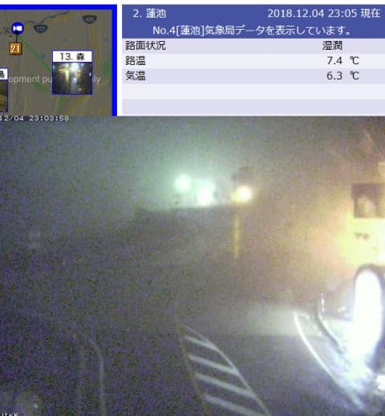
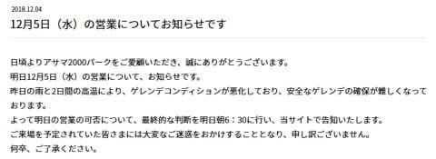
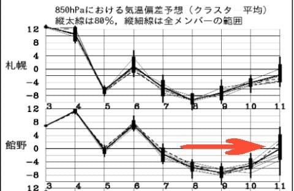

# 今シーズンも開催！？？…第8回物欲選手権！

📅 投稿日時: 2018-12-05 01:07:08

🏷️ カテゴリ: [スキー雑談](c1f9d2cb7478308da16419928ea3945e9.md)

えー．

[先週木曜日](e6953bf31dd5c1d551f24c46718d3a732.md)の段階で．

特に4日の午後遅くから5日の朝にかけて．

かなり気温が高い雨が降りそうで．

ゲレンデは結構危険な状態っぽいです…（泣）

と予告した通り．

現在の志賀高原．

気温が激烈にあがってしまい．

そして，雨が降ってます…（激涙）

12月の深夜で，蓮池で気温プラス6℃って…

ありえない（泣）．

なぜ，こんな予想は当たるんだ…（涙）

覚悟してください．

この超高温の雨は，明日の午前中まで続きます．

だもんで，[熊の湯](https://ameblo.jp/kumakumanoyu/entry-12423622620.html)や[アサマ2000](https://asama2000.com/2018/12/04/12%e6%9c%885%e6%97%a5%ef%bc%88%e6%b0%b4%ef%bc%89%e3%81%ae%e5%96%b6%e6%a5%ad%e3%81%ab%e3%81%a4%e3%81%84%e3%81%a6%e3%81%8a%e7%9f%a5%e3%82%89%e3%81%9b%e3%81%a7%e3%81%99/)は，明日5日に営業できるかどうか，

明日の朝判断するということに

なったようです…

一の瀬や焼額は，なんのアナウンスもされてないので…

明日は無事営業できるのでしょうか…？

とりあえず，明日の朝まで雨が降った後．

明後日6日木曜まで気温が落ちず．

木曜午後には，また雨になりそう…（涙）

おそらく，6日には現在オープンしているゲレンデの

ほとんどが，雪不足でクローズになる危険性も

あります（激涙）

冷え始めるのは，7日の朝から．

6日の夜も，人工雪が打てなさそうで．

7日金曜の朝になって，やっと人工雪を打てるかな…

という気温にまで，ようやく冷えます．

また，7日は雪が降りそうです．

積もってくれるのかどうかは…

まだ微妙．

ただ，7日以降は…

うむ！

7～10日の4日間は，結構冷えます！

平年より寒い状態まで冷えそう！

特に，9日なんて平年比－9℃まで冷えます！

そして，この冷え冷え期間中は，雪も降りそうで．

この3日間のゲレンデ回復に期待…

とりあえず，また明日に週末までの天気予想を

やりますので，しばしお待ちを…

ってなわけで．

本題へ．←ここまでで十分普通のBlogの記事ぐらいの長さがありそうだけど…？

どうやら，今シーズンも例の選手権が開催

されたようです…

なぜだか人気のこのシリーズ．

はてさて．今回の結果や如何に？？

（過去の選手権の様子は，[第1回](ebea1e9e359cc665d9cc2929e08045177.md)，[第2回](e4eb8b62d644e240a6080cac72ad69416.md)，[第3回](efb7a35a863f49c11192814a01ff642c2.md)，[第5回](e676591ac0d87f01c70ad0ad2ceae84f6.md)，[第6回](e7e02015f03823884a3522a56c651a398.md)

[番外編](eda7898d5cb5580b1871f3cbef83241ac.md)，[第7回](e38b4d4ca6ea3af24cebf3838ab8c791d.md)，[番外編その2](e08f88a704470a5656ebc84fecc72aa08.md)を見てね）

--

アナウンサー　「みなさんこんにちは．

　本日は，恒例，

　第8回 スキーヤーの物欲を刺激する街神田に来て，

　物欲にまみれたスキーヤーが買い物をせずに

　我慢できるか選手権　　

　をお送りします！」

解説　「…やっぱり，またやるんですね…

　この選手権…」

アナウンサー　「この選手権も，今回でもう第8回目と

　なります！

　本日も解説には，おなじみの板尾買蔵さんに

　お越しいただいております」

解説　「…もうそろそろ，読者も飽きている

　のでは…？？」

アナウンサー　「今回の参加選手は，

　1日で板2セット購入をはじめとして．

　その2週間にさらにまた板を購入，

　そして同じ板を4セット揃えてしまうなど．

　常人では理解できない，歴史的に残る

　見事な記録を残し続けてきている，

　Skier_S選手です！」

解説　「だから，そこは見事と褒めるところじゃ

　ないと思うんですが…」

アナウンサー　「果たして今回，Skier_S選手はどんな戦いを

　見せてくれるのでしょうか？」

解説　「…どんな戦いを見せるかというより…

　どう負けるのかを見る選手権なんじゃないん

　でしたっけ？

　これって…」

アナウンサー　「Skier_S選手が物欲に負けるのか，

　あるいは蟻の涙程度の良心で，銀河系すら

　飲み込むほどの巨大な物欲を抑えきり，

　見事に勝利を勝ち取るのか？

　今回もドキドキハラハラの，手に汗握る

　勝負が見られることでしょう！」

解説　「…そんなふうな，手に汗握る勝負が

　これまでにありましたっけ…」

アナウンサー　「Skier_S選手．

　特に今年は．車と家を買う

　という，普通の人なら同時に購入しない，人生の2大出費を

　ほぼ同時にやってしまっているので．

　今シーズンはいろいろ出費を抑えなくては

　ならないと思っているようです」

解説　「それも，車はもう少し乗ろうと思えば乗れたところを，

　物欲に負けて新車を，それも結構いいグレードの車を

　買ってしまったという話じゃないですか」

アナウンサー　「そのあとに引っ越しすることが決まり，

　『しまった…それが分かっていれば車を買い替えなかった』

　と言っていたという情報が，試合前のベンチレポートで

　届いています」

解説　「…それなのに，なぜ彼は性懲りもなく，

　またこの街にやってきたんでしょうか…？」

アナウンサー　「どうやら，海外出張の帰りに，

　成田から都心を通って帰るので．

　『そのまま帰るのはもったいない』

　と，この街に立ち寄ったようです」

解説　「『そのまま帰るのはもったいない』って…

　バカですか！？？彼は．

　ホテルを出てから20時間近く経っているし．

　14時間の長時間のフライトの直後だから，

　疲れ果ててまっすぐに家に帰ろうと

　思うところじゃないんですかね…？？」

アナウンサー　「Skier_S選手がバ○なのは，

　今更言われなくても，皆さんすでにご存じかと…

　たとえどんな困難があろうと，

　この街にやってくる．

　そこが，Skier_S選手のSkier_S選手たる

　所以だと思います．」

解説　「バカだ…正真正銘のバカだ．

　そこまでしてこの街に来るとは…」

アナウンサー「とりあえず，車と家を買って，

　さらに家具やらスタッドレスタイヤやら，

　それに伴う出費も続いているSkier_S選手．

　巨大な買い物をしたばかりだから，今回は

　見るだけ…ということでこの街にやって

　きているようです」

解説　「そこまでの執念でこの街にやってきて，

　何も買わないつもりって…

　もはや意味不明ですね．

　もう，負け確定ですから．」

アナウンサー　「というわけで．

　神田へやってきたSkier_S選手ですが．

　おっと．珍しいパターンです．

　いきなりいつものお店にやってきてます！

　一番最初にいつものお店って，珍しいパターンですよね…」

解説　「そうですね．

　いつもなら他の店に先によって，価格を調べてから

　最後にいつものお店…というパターンですから．

　これは，今までにないパターンですよね」

アナウンサー　「そして…まずはブーツの試し履きを

　しているようですね」

解説　「Skier_S選手の今履いているブーツは，もう

　3シーズンも履いてますから…

　すでに買い替え時を迎えていますので，

　これは危ない勝負ですよ…！」

アナウンサー　「今シーズンもATOMICのブーツを

　物欲しげに見ていますが…

　ただ，Skier_S選手が探している，昨年モデルの

　型落ちが，もう残っていないようですね」

解説　「狙っていたブーツが無くて，がっかり

　しているようですね…

　型落ちのブーツが安く出ていたら，瞬殺で

　今回の選手権が終わってましたね」

アナウンサー　「ATOMICの型落ちが無かったので，

　SALOMONのブーツなど，いろいろ履いているようですが…」

解説　「そうですね．

　彼はATOMICブーツの性能は気に入ってるようですが．

　足型に合わなくて，かなり痛い思いをしているようなので．

　今回は別のメーカーのブーツも候補に上げようと

　思っているようです」

　

アナウンサー　「SALOMON，LANGE，TECHNICAと，

　昨年モデルの，値段が落ちたブーツを

　いろいろ履いてみましたが…

　あぁ，どうやら気に入らなかったようです．

　どれも気に入らなかったようです」

解説　「ブーツをすべて棚に戻しましたね…

　ブーツは買わずに乗り越えそうですね…」

アナウンサー　「さて，Skier_S選手．

　次はどこのコーナーに向かうのか…

　まさか，板のコーナーでしょうか？」

（…[その2](e0191fb936cdf7d9e150b75a80adc5860.md)へ続く）

## 💬 コメント一覧

### 💬 コメント by (若杉勲71)
**タイトル**: Unknown
**投稿日**: 2018-12-05 09:07:22

浅間と熊はクローズだそうです。だけど、我がヤケビはやってましたよ。

でも、駐車場でyumilinさんにご挨拶していたら、足に履くべき物がない、頭に被るべき物がない、手に・・・。

雨も降ってることだし、男武蔵は潔く諦めました。つくづく自分が嫌になりました。

### 💬 コメント by (ほっぽ)
**タイトル**: 茶水
**投稿日**: 2018-12-05 19:40:01

Sさん

私も先週、出張帰りに寄りました。

負けずに何も買わずに帰宅しましたが、ICIのコンペ館には17SXの165cmがまだ数本残ってました。

そろそろ五郎君、六郎君を手配しておく時期かなと思ってます。(^^;

### 💬 コメント by (Skier_S)
**タイトル**: 明日も志賀高原は雨（涙）
**投稿日**: 2018-12-06 01:22:31

＞若杉さま

ヤケビ，よくこの雨に耐えましたね…

でも．

この日はこの雨の中滑らなくて正解じゃないでしょうか．

潔くあきらめるので良かったのかと思います(笑)．

＞ほっぽさま

あら．

物欲選手権，負けなかったんですね(笑)．

私もICIによったのですが，コンペ館にも

本館にも，予想以上にSXがありましたね…

でも，予想以上に次郎君が長生きしてくれたため，

まだ三郎君も四朗君も全然出番がない状態なので．

五郎君はないです(笑)

