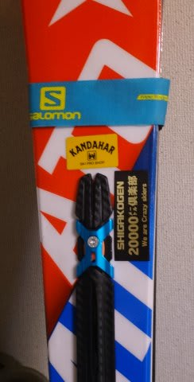

# 20000mクラブのシールができたよ！…さっそく板に貼ってみた

📅 投稿日時: 2016-03-29 03:28:04

ってことで．

日曜にスキーに行けず，悶々としているSkier_Sです．

＃ってか，土曜もスキーに行くどころじゃなかった気がするのだが…

えー．

志賀高原での滑走標高差をWebから確認できる[Skiline](www.skiline.cc/)．

このSkilineに，志賀高原シーズン累計滑走標高差ランキングという，

いろんな意味で危険なランキングがあるわけですが．

現時点のランキングを見てみると…

…このランキング．

トップ3の方は，おかしいすさまじいレベルに突き抜けてますね．

トップが熾烈な争いを繰り広げる，というよりも…

トップのKon Sukeさんは，一人だけ80万m台という突き抜けた独走状態で，

ある種おかしなすごい領域に突入しています…

＃ちなみに．

＃焼額第2ゴンドラなら，2000回乗らないとこの数字に達しません…

そして，2位は70万m台，3位は60万m台…と．

1位，2位，3位が10万mずつ離れるという大差がついており．

人間の到達可能レベルを超えた，サイボーグのみが為し得る領域で．

それぞれ着々と標高差を積み上げて行っています…

そして，4位～9位は50万m台で，5人が団子状態ですね．

このあたりは，サイボーグ同士の争いからちょっと離されて．

…まだ人間が到達可能な数字なので．

複数の人間で，抜きつ抜かれつの争いを繰り広げる状態と

なっています…

＃一応，自分が人間レベルであることを主張しておきたい

しかし．

1位と3位の差が約20万mって…どういうこと？？

20万m滑れば，順位的に50位くらいになっちゃうんですが．

…つまり，3位の人に，50位の人の滑走量を足して，

ようやっとKon Sukeさんの滑走量に達するか…

というほどの差になってるわけですね…

って感じで．

一人突き抜けた，素晴らしい領域に突入している，

Kon Sukeさんですが．

[Kon Sukeさん作成の，20000mクラブシール](e688dd723e3d1367c88701b81540a2a04.md)が完成しました～っ！！

この土曜日に受け取ったので．

[人間が超えてはいけない数字を超えた私](ee809411edc9b45bce3acb3755e370263.md)は，

さっそく嬉しそうに板に貼ってみましたが…

…うむ．

これは．

…完全に個人特定される板になってしまったのではなかろうか…

ってことで．

次からは，Skier_Sを探すときはこのシールを目印にしてください(^^;

## 💬 コメント一覧

### 💬 コメント by (いか)
**タイトル**: Unknown
**投稿日**: 2016-03-30 00:23:56

うーん、20000メートル…アルペンクワッド70回…

パウダー面ツル50センチが朝から最終まで続かないと無理ですね(笑)

しかし、毎回20000メートル近く滑る人が板に貼っていると、シールを作れど作れどすぐに次のシールが必要になってしまうのでは…！？笑

### 💬 コメント by (Skier_S)
**タイトル**: いかさま
**投稿日**: 2016-03-30 00:32:06

やっぱり，信じられないですよね．

滑走標高差が一日20000m超えるなんて…

＃しかし，パウダー面ツル50cmでも

＃アルペンクワッド70回行けない気がしますが(笑)

ちなみに，このシール．

意外と薄くて粘着力が強いので，

「いつものお店のシール」と

同じように，結構長持ちしそうな感じです…

でも．

一日平均12000m程度の私と違って．

ほぼ毎日18000m以上を余裕で滑ってしまうような，

リアル20000mな方々の場合は，確かに

あっという間に劣化してしまいそうな気がします…(笑)

### 💬 コメント by (いか)
**タイトル**: Unknown
**投稿日**: 2016-03-30 00:40:51

パウダーの日は、降りてから止まらないので1回転6.5分として7時間35分ほど必要に…

本当にリフトオープンとともにクローズまで目いっぱい使うことになりますね(笑)

ファットはその前に足がもげます…

シールは強力なんですね！むしろ板の方が先に劣化しそうな…

### 💬 コメント by (Skier_S)
**タイトル**: いかさま
**投稿日**: 2016-03-31 01:12:46

アルペンクワッド6.5分ですか！？？

速いですね～！！

そのペースをリフトスタートからストップまで

維持できたら…20000m行きますね(笑)

シールは結構強力そうです

おそらく，私の場合は板が先にヘタリます(笑)

