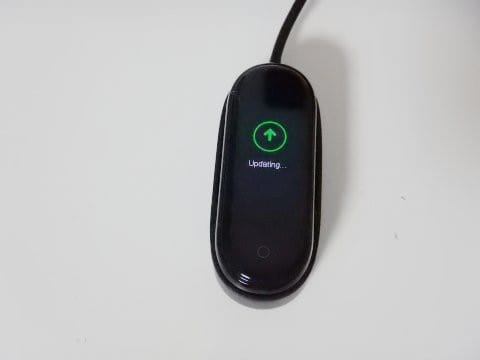
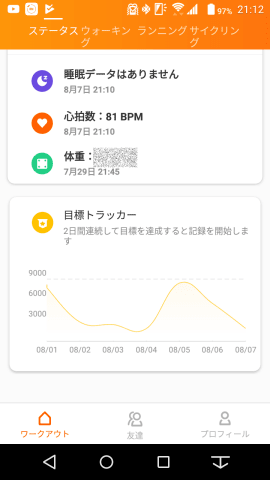

# スマートリストバンド（活動量＆心拍計＆スマホ通知），Xiami MiBand4を買ってみた・その2　使ってみたインプレッション

📅 投稿日時: 2019-08-12 00:07:58

🏷️ カテゴリ: [PC,カメラ&小物](c0d8caed13e597efe97b661a8ae56bed0.md)

ってなことで．

注文の2日後に到着した，MiBand4.

さっそく開梱！

本体が結構分厚いかな？

と心配してたけど．

それほど分厚く見えないし．

シリコンバンドも柔らかくて，

フィット感はいい感じ…

まず充電しないといけませんが．

こんな感じで本体をバンドから外し，

本体を充電器に嵌める形で

充電します．

いちいちバンドから外すのが

めんどくさいけど…

20日に一度しか充電しなくて

いいなら，これでもいいかな．

ちなみに，しばらく使用していた

妻の報告によると．

10分ごとの心拍計測＆画面を

一番明るくして使っていた場合で，

7日ほどで電池残が15％まで減った

ようです…

まぁ，それでも1週間以上電池がもった

ようなので，スマートバンドとしては

電池もちはいい方かな．

とりあえず，充電と同時にスマホに

ペアリングさせてみます．

Google Playから，Mi Fitアプリを

ダウンロードして起動すると，

一発でBluetoothペアリング完了．

ペアリング完了と同時に，本体の

アップデートがかかるようです…

このMi Fitアプリ，日本語化は完璧で．

このアプリの指示に従っていくつかの

設定をやっていくと，使えるように

なります…

起動したMi Band4はこんな感じ．

標準ではこの程度で，ちょいと暗めに

見えますが．

設定で一番明るくすると，

室内では明るすぎるほど．

日差しのある屋外でもちゃんと見えます．

有機ELディスプレイなので，画面が

常時点灯ではないですが．

タップするか腕を動かすと表示されます．

そして，基本的なメニューは，

画面をフリックしていくと

こんな感じで切りかえられて．

Statusメニューでは，一日の歩数，歩行距離，消費カロリーが表示でき．

Heart rateメニューを選択すると，心拍数計測されます．

Workoutメニューを選ぶと…

こんな感じで，ランニング・ランニングマシーン・自転車・歩行の

4種類の運動が選べ，スマホのGPSと連動して，歩行や

ランニングの記録が残せます．

あとは天気予報メニューを選ぶと，

2枚前の写真の一番右端のように，

スマホのGPSがつかんでいる現在地の

天気予報を表示してくれます．

…ってな感じで，本体のメニュー表示は

すべて英語で，まだ日本語化されて

いません…

MiBand3本体は，日本販売後に日本語化

されたようなので，

MiBand4もいずれは日本語化されるかな？

ちなみに，MiBand4は，グローバル版と中

国版があり．

グローバル版の本体表示は英語．

中国版の本体表示は中国語となります．

（中国版でも，英語版Androidと同期させると本体が

　英語になります．また，日本語版Androidを使っても

　本体表示を英語版化できるサードパーティーソフトが

　あるらしいです…）

そして，肝心なスマホの着信通知．

バイブレーションとメッセージ表示で，

着信を知らせてくれますが．

本体メニューは日本語化されてなくても，

メッセージはちゃんと日本語で

表示されるので，ご心配なく～！

LINE，Gmail，電話着信など，標準的な

アプリ通知ができるのですが．

しかしなぜか，LINE通話の着信のみ，

呼び出しが切れてから通知されるという

不思議な仕様になっています…

ちょっと残念ですが，呼び出しがあったことが

確認できるだけでもマシかな．

サードパーティー製ソフトを入れれば，

LINE通話着信もリアルタイムで分かるようですが…

このほか，本体では直接確認できず，

スマホでの確認になりますが，

一日の心拍数の記録や…

睡眠の経過・質の確認ができます．

まぁ，利用者がすごく多いだけあって．

アプリは結構よくできてますね～…

本体の時計表示のデザインも，

アプリでかなり多くの種類から

選んで切り替えられます．

これで，さらに50m防水とか，

スマホで音楽を聴いてる時の曲の

スキップや停止などのコントロールも

できるなど，

他にもいろんな機能がある，

このMiBand4.

日本語マニュアルが無いという欠点は

あるものの．マニュアルが無くても

スマホアプリが完全日本語化されて

いるので，使い方は問題なく分かるし．

妻が使っているのを見ていて，

かなりうらやましくなったので．

自分用にも，スマートウォッチが

欲しくなってきたなぁ…
