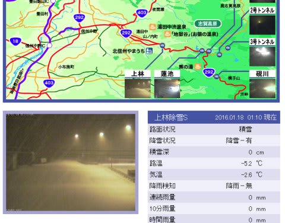
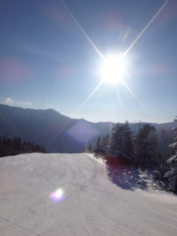
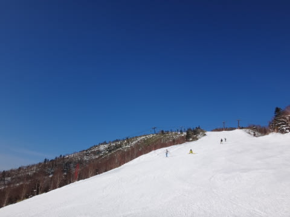
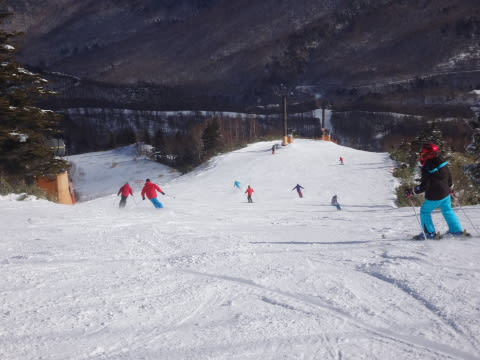
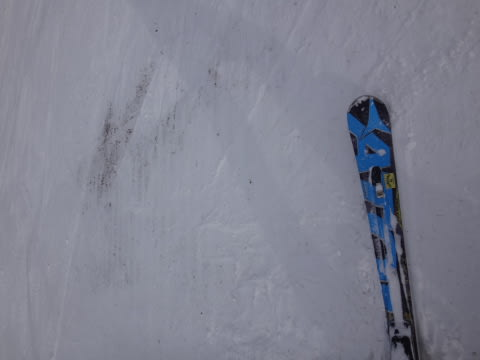
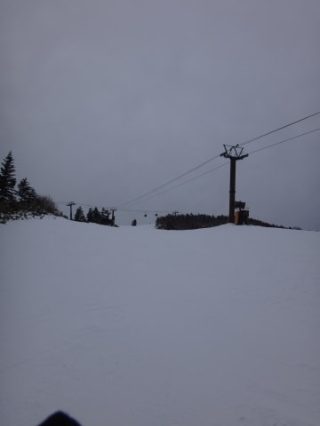

# 1月17日，日曜日の志賀高原速報モード…朝イチは良かったけど…

📅 投稿日時: 2016-01-18 01:52:43

🏷️ カテゴリ: [2016スキー滑走日記](c70c67ed5248e9432b899dcd5747048bb.md)

えー．

本日もいつも通り，帰宅がこんな時間なので．

日曜定例の，速報モードで…

あー，そうそう．

今日，志賀高原を出るときは．

全く降ってなかったのに．

…現在の志賀高原．

雪がガンガン降っているみたいです！

…天気図を見る限り．

少なくとも，このあと一週間．

「これまで，なんで降ってなかったの？」

って思うほど．

これまでの借りを返すほど，ひたすら降り続け，

ドサドサ積もってくれますよ～っ！！！！

ってことで．

本題へ．

…本日の志賀高原ですが．

まず，朝はすっきり晴天！

…いや．

でも．

何度も言うようですが．

…晴れなくていいから，

雪を…（涙）．

でも，朝イチは人も少なく，

しっかり締まった最高圧雪バーン！

…でも．

昨日よりちょっと人が多かったかな？

…まぁ，ゴンドラ待ちはほとんどなく．

午前中の一瞬，2-3分程度待った程度だったので，

それほどの混雑ではなかったので，

ぜんぜん問題は無いのですが．

…でも．

多くの人で削られたゲレンデは．

ごく一部とはいえ，残念ながらちょいとブッシュも出てきて…

ブッシュが無いところも，アイスバーン化して．

…午後はちょっと楽しくない感じに…（残念）．

で．

午後は曇り空になっちゃったけど…

でも．

いつも通り，日曜午後の志賀高原．

ゲレンデに全く人がいなくなってしまうので．

ゲレンデの状況は良くなかったけど，

まぁ好きなラインで滑りたい放題だったので，

なんとか楽しめたかな～．

とりあえず．

詳細レポートは，また明日！

## 💬 コメント一覧

### 💬 コメント by (デーコン)
**タイトル**: Unknown
**投稿日**: 2016-01-18 20:53:04

こんばんわ。

人のいない焼額滑ってみたいです。

日曜日の午後は、少ないんでしょうね。

白馬に比べ、日本人が多いですよねー。

あー行きたい。

志賀高原。

### 💬 コメント by (Skier_S)
**タイトル**: デーコンさま
**投稿日**: 2016-01-19 01:39:43

大体いつも，日曜の午後はガラガラです…

誰もいなくなります．

それ以前に，朝イチの2-3本は，一の瀬方面から

人が流れてこないので，ガラガラの

圧雪したてで，最高ですよ～！

ぜひ，志賀高原へ！

