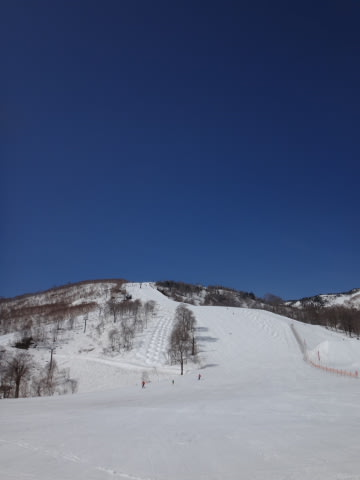
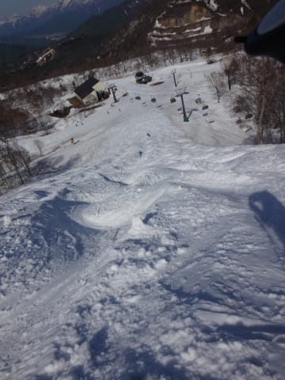

# 5月11日，日曜日のかぐら詳細…雪もたっぷり，人もたっぷり

📅 投稿日時: 2014-05-13 01:08:27

えー．

このBlogの読者数も順調に減り続け．

トップシーズンの半分以下に減ってきた今日この頃．

皆様いかがお過ごしでしょうか．

ってことで．

昨日速報した，日曜のかぐらの，詳細レポートをば…

えー．

日曜の朝は．

7時半の営業開始15分前に到着して．

ロープウェー3本待ちで乗車できましたが．

朝の気温は，プラス8度と．

暖かそうですね～．

で，ロープウェーでみつまたエリアに上がると…

ををを！

みつまたにも，まだこんなに雪がある！

みつまたからゴンドラへ向かう道も，まだまだ大丈夫だし…

ゴンドラ乗り場前なんて，まだ真っ白！

いやー．

今年は雪が多いなぁ…

で．

ロープウェー→リフト→ゴンドラと乗り継いで，

やってきましたかぐらエリア．

うむ．

快晴で，雪もたっぷり！

普段なら廊下状に雪が残っている，和田小屋→第1高速の間も

真っ白！

メインバーンはコース幅いっぱい雪がついていて，ウハウハな大回りバーン！

朝から気温が高かったので，ちょっと緩み気味の雪だけど．

でも，板が潜ってしまう緩さではなく，下地に硬さがある

感じで，しっかりスピードが出せるコンディション！

いやー．

大回り板を履いて来れば良かった！

…ただ，ところどころ圧雪が甘くて，飛ばされる

段差があったのが怖かったけど…（汗）．

朝のうち1時間はリフト待ちも少なく…

こんな感じで人も少なめの，いい感じのバーンで．

いやーーー！

今年は恵まれているよっ！

そして．

天気が良くて．

気温はもう，暑いです．

私は何を考えたか，普通のウェアのジャケットを

着ていきましたが．

Tシャツでも十分かも？と思うこの日．

暑さで死ぬかと思いました．

この日は，

・ウェアは聖職服であり，これを脱ぐことは許されないなどの

　宗教的理由

・ウェアを着ないと，宇宙からの波動を受け取れないので

　ウェアを脱ぐと滑りの質が低下してしまう…などといった

　超科学的な理由

といった，よっぽどな特殊事情がない限り，ウェアのジャケットを

着ない方がよい感じでした…

って感じの，強烈な暑さのため．

9時半ごろには，結構雪が緩みはじめ…

そして．

人も増えてきたので…

10時過ぎには，徐々にバーンは荒れ始めてきます．

さらに．

リフト待ちもすごいことに…（涙）

9時を過ぎると5分，9時半～11時半くらいまでは10分，

11時半からは短くなり，12時過ぎには3分以下，

3時ごろには1－2分と，だんだん短くなったのが救いですか…

って感じの，人の多さと，雪の柔らかさのために…

12時すぎには，もうこんな感じになっちゃって…

午後1時には，もう全面コブ化完了しちゃってます．

午後2時のメインバーンは，もう盛大なコブ祭りですね．

コブフェスティバル．コブカーニバルです．

メインバーンがコブ化したので，不整地のジャイアント

コースにでも行ってみますか…

うむ．ジャイアントコースも，まだ全面，幅いっぱい

滑れるじゃないですかっ！

こりゃすごい雪の量だ！

そして．

すごいラインコブができてますね～

この時期のコブは，練習にいいですな～．

いやー．

この時期のジャイアント，コース下までこんなに

雪があるとは…

そして．

テクニカルコースも滑ってみましたが…

ここも，まだコブ溝に土が出てくることもなく．

全面滑走可能！

そして．

午後3時を過ぎると，メインバーンのコブも

「しばらく見ぬ間に，育ったのぉ」

って感じになってきます．

もう，コースどこに行ってもすべてコブ．

コブ！

リフトストップのころには，もう．

メインバーンも素晴らしい深さのコブに！

コブ好きにはたまりませんな～！

＃コブ嫌いには，逆の意味で堪らないコースだけど←いや，コブ好きでも

　リフトストップまでこの斜面滑ったらタマラない感じだと思う

って感じで．

リフトストップまで楽しんだ後は，下山ですが．

いやー．

下山コースも，まだコース幅いっぱい雪がついてるわ！

これはすごい！

みつまたエリアに来ても，こんな感じのコース幅で．

いつもはこの時期，連絡用だけのために運転されている，

みつまた高速リフトが．

この日は普通に滑走用で動いていたのが驚き…

…ところどころ，こんな感じで穴は開いてたけど

帰りのロープウェーも，午後4時半近くだとガラガラでしたよ～

…って感じで．

GWを過ぎてもまだまだ雪がたっぷりあるかぐら．

まだまだ問題なく楽しめそうですよ～っ！！

## 💬 コメント一覧

### 💬 コメント by (千春)
**タイトル**: 恐ろしい！
**投稿日**: 2014-05-15 10:56:07

お久しぶりです！

画像見て、人の数とコブの立派さにビビリました。

こんな中を滑るなんてすごいです。

コブを滑れるようになったらボードシーズンが伸びるのになーと思いつつ、

「圧雪じゃないと滑れない病」をいつまでも患ってます。

この日、私はチャオ御岳に行って来ました。

チャオも例年より残雪が多くて驚きました。

きっと私はこれが滑り納めです。

また来シーズン、楽しく日記を読ませていただきます！

### 💬 コメント by (Skier_S)
**タイトル**: 千春さま
**投稿日**: 2014-05-16 01:12:36

お久しぶりです～！

いやー．コブは楽しいですよ～！

滑り切った時の征服感というか．

なんというか．

…ただ，体力は消耗しますが…

でも，ボードでコブは難しそうですよね～．

Blog拝見してますので，Chaoレポート

読んでますよ～．

雪が多かったんですね．

私のスキーシーズンはまだまだ続きます．

スキーレポートもまだ続きますので，

来シーズンと言わず，今シーズンも

まだまだ読んでやってください～

