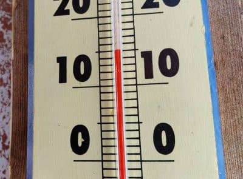

# 昨日は夜寝てしまった…

📅 投稿日時: 2022-04-26 09:24:26

えー．

日曜もスキーから帰宅後遅くまで，

月曜朝締め切りの宿題やって，

なんとか月曜は無事に乗り越えて…

で．

昨日は夜1時頃，倒れたように寝てしまったので，

Blog更新できませんでしたが…

久しぶりに7時間ほどぐっすり寝ました．

やっぱり人間寝ないとダメですね．

そして．

昨日は特派員から，午後2時頃の

温度計の写真が送られてきましたが…

+15℃…！！（涙）

暖かすぎる…

さらに．

今日は昼過ぎから雨になり，明日の朝早くまで

時折強くなりながら降り続けそうなので…

雪が一気に解けそう（泣）

そのあとは29日，1日と雨になりそうなので…

雪が一気に解けそう．

2日だけ，一瞬冷えるかな？

とりあえず．

今はまだたっぷり雪があるけど．

あまりにも気温が高すぎてダメダメな4月（涙）．

GW最後の8日まで雪がもつか？？

もってほしい…

## 💬 コメント一覧

### 💬 コメント by (ikkun)
**タイトル**: Unknown
**投稿日**: 2022-04-26 19:39:02

良かった(笑)人間(笑)   アカカンもなかなか出て来ました❗下まで滑れそうな感じがヤバいGW後半です 345はお天気良ければそちら方面と考えております❗……

### 💬 コメント by (Skier_S)
**タイトル**: >ikkunさま
**投稿日**: 2022-04-27 04:42:36

３，４，５日の天気はまだわかりませんが…

あんまりいい天気が続きそうな感じは無いです(涙)

まぁ，毎日雨ってこともないと思いますが．

