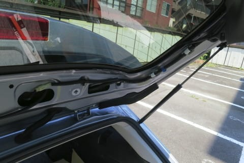

# プロジェクトX2第2章…LEVORG E型にリアカメラをつけてみた・リアゲート内装の取り外し方＆衝撃の事実編

📅 投稿日時: 2018-07-26 02:24:34

🏷️ カテゴリ: [車](cba0e8330b3f2ded7c1addfacc75d4547.md)

知らぬ間に，もう7月も終わりに近づき…

気のせいでなければ，あと1週間で

ダイビング旅行に出発じゃないか！

…まだぜんぜんダイビング器材の準備に

手を付けてないんだけど…

というより，まだ心の準備ができていないんだけど…

納車やらナビ取り付けやらでバタバタ

していたので，スキーシーズン終了から

もう1か月経つというのに．

私にとっては大変珍しいことに．

まだスキーシーズン終了後の禁断症状が

出ていないという…

そして．

まだ去年の一回目のダイビング遠征である，

座間味旅行記が書きあがっていないんですが…？？

このペースでカーナビ取り付けレポートやら，

車ネタを書きまくっていたら．

去年の2回目の遠征の，パラオ旅行記が

この夏のうちに終わらないのではないだろうか…？

…とか言いつつも．

今日もリアカメラの取り付けネタの続き，行くのだ！

---

ってな感じで．

KENWOOD独自コネクタのリアカメラを，

SUBARU純正リアカメラ用先行配線に接続するための

[自作スペシャルハーネスを完成](e0ec12572486bf2ce78094e14c23332d5.md)させたわけで…

ふはははは．

自作オリジナルハーネス．

我ながら素晴らしいじゃないかっ！←これから起きる事態を知らないこの頃は，まだ平和に自画自賛していた…

では，実際に車に取り付けてみましょうか…

…もう，納車時はまだ4kmしか走っていない，

ホントに受け取りたてピカピカの新車．

これを家まで乗って帰って…

トランクにカーペットを敷いて，

ワックスをかけるという営みをしただけの…

まだまだピカピカの新車．

…こいつを，何のためらいもなくバラすのだっ！！

まず，リアカメラを取り付けるために．

リアゲート内側の内装から取り外しに

かかりましょうか…

リアゲートの上側の，この内装．

この，矢印部分の継ぎ目．

ここに，矢印の方向に爪を突っ込んで．

ぐぐぐ，と引っ張れば．

クリップ7個ほどでくっついているこの内装．

比較的簡単に外れます．

…私は内装はがしの工具を持っていないので．

手の爪を突っ込んで強引にはがしました…

専用の内装はがしの工具が無くても，十分ばらせます．

で．

リアゲート内装の一番上が外れたら．

次はウインドウ左右の内装ですが．

こいつも，何も考えずに手前に引っ張れば．

こんな感じで，簡単に外れます．

反対側も同様に外しましょう…

そして，次は．

リアゲートの最後に残る一番大きい内装パーツ．

こいつを剥がしにかかるわけですね．

ここまでは，ネジなど一切なく．

全て引っ張るだけで外れましたけど．

…こいつだけ，ネジを外してやらなくては

なりません．

とはいえ，ネジはこの指さす部分にある

1本のみ．

ゲートを閉めるときに手をかける取っ手．

ここの小窓．小さなマイナスドライバーとかで

くいっと押し開くようにすると，あけられるのですが．

…この中に，ネジが1本鎮座ましましてます…

だもんで．

こいつをドライバーで外しましょう．

ネジが外れると，取っ手自体がポロリと

外れます．

…ネジを落とさないように注意！

落とすとなくしますよ～！

取っ手を外したら…

後は，内装のこの部分．

ここに，一見ネジに見えるファスナーが

ついてます．

ドライバーで左に回すと緩むので．

ちょっと緩んだところで引っ張ると…

ポコンと外れます．

こいつを左右一か所ずつ外したら．

…あとは，ぐいぐい引っ張れば，外れていきます．

かなり多数のクリップで止まっているので．

ゆっくりゆっくり引っ張っていきましょう．

リアゲート下面部分も，強いクリップが

しっかりハマっているので．

下部分は，この写真で言うと手前方向に

引っ張ります．

…ってことで．

無事はずれました…

これで，リアゲート．

フルヌード状態になったわけですが．

さて．

純正リアカメラ用先行配線はどれかな～…

こいつだ！

何も刺さってない空きコネクタは，

リアゲートにこいつしかない！

では，この先行配線コネクタに．

自作ハーネスを繋いでみましょう…

…って…

…え？

ええ？？

刺さらない…！？？

上手くはまらないんですけど！？？

…ってか．

これ，コネクタのデカさ，全然違ってない？

…もしかすると，リアゲートのこのコネクタ．

何か違うコネクタで，どこかほかに本物の

リアカメラ用先行配線があるのでは…？？

と，探したけど．

やっぱり，空きコネクタはこいつしかないよ…

どういうことだ？？？

…と，Webで調べてみると．

なんてことだ…

どうやら，LEVORGのC型までとD型以降で，

純正リアカメラ用リアゲート先行配線のコネクタの形状が

変わってしまったようです！！！

…そして，私が入手したのはC型までのコネクタの品だったという…

オーマイガーーーーーーっ！！！！

なんてこった～っ！！！

このままだと，先行配線が使えないけど…

リアゲートからナビまで自前で配線するにも，

7mケーブルはもうぶった切ってしまってるから，

ケーブルをもう一度作り直すか…？？

あるいは，カメラを買いなおして，

新しいケーブルで自前配線し直すか？？

…一体どうすればいいんだ…！？？（激涙）

（続く）

## 💬 コメント一覧

### 💬 コメント by (ほっぽ)
**タイトル**: まさかの、、、
**投稿日**: 2018-07-26 06:58:29

Ｓさん

これは車体側端子とカメラ側端子、双方をぶった切ってハンダで直付けする

と私は予想しましたが、それだとここまで折角配慮してきた

元に戻せる工夫が活かせませんよね？

どうして解決したのでしょうか？

### 💬 コメント by (Hide)
**タイトル**: 付け替え
**投稿日**: 2018-07-26 07:37:58

これはもうコネクタ（ハーネス）付け替えですな。

配線レイアウトわかっているようなので、Sさんなら”ちょいのちょい”で工事完了♪

あ～楽しそうで羨ましい。

### 💬 コメント by (Skier_S)
**タイトル**: 結末をお楽しみに…！
**投稿日**: 2018-07-27 04:38:56

＞ほっぽさま

本日，解決のレポートを書けずにすみません…

どうやって解決したかは，また明日のおたのしみと

言うことでよろしくお願いします（謝）．

いやーー．

3時間以上あーでもないこーでもないといろいろ

チャレンジしましたから…

＞Hideさま

ふふふふ．

どうやって解決したかは，また明日の記事をお待ち

ください…←っていうより，ちゃんと今日書けよ，というツッコミ多数

というよりも．

マイナーチェンジで車両コネクタの形状を変えるのはやめてほしいと願う今日この頃（涙）

悩まされたのは，この先行配線コネクタだけでは

すみませんでしたから…（泣）．

### 💬 コメント by (ほっぽ)
**タイトル**: スバルは、、、
**投稿日**: 2018-07-27 06:34:05

Ｓさん

間にＣＭを挟んだＴＶドラマのようか展開、

Ｓさんは文才があると思います。

昔からスバルはビッグＭＣで仕様を大幅に変えることがありますが、

今回のは見えない端子だったりするので困りますよね。

ＢＧの頃はＭＣでターボ系を中心に別物のような車になりましたし、

ＢＨの時はＭＣで制御系がユニシアからＤＥＮＳＯになって

これも全く別物のようでした。

ＢＲはＭＣ後にはターボが直噴エンジンになりましたし。

今夜のblogを期待して待っています。

### 💬 コメント by (Skier_S)
**タイトル**: ほっぽさま
**投稿日**: 2018-07-28 01:42:53

すみません…

こんなタイミングでCM(?)を挟むつもりは

無かったのですが…

ちょっと昨日はご無体時間に帰宅だったので．

読者の皆さんのフラストレーション溜まるだろうなぁ…

と思いながら，ダイビング旅行記を挟みました…

確かに，これまでのスバル車を振り返ると．

C→D型のタイミングで，かなりいろいろ

電装品やらエンジンやらが変わってますね…

うーむ．

こんなコネクタが変わるくらいはかわいいもんでしょうか…

### 💬 コメント by (ほっぽ)
**タイトル**: Unknown
**投稿日**: 2018-07-28 10:44:32

Ｓさん

ビッグＭＣで大幅に仕様が変わるスバル車、

確かにコネクター形状くらいは可愛いもの、かもしれません。(^^;

でも、カタログや外観では分からない部分だけに困りますよね。

ディーラーではＤ型以降の変換ハーネスは売っていないのでしょうか。

ディーラーで社外ナビにバックカメラを取り付ける場合も困りますよね。

私はＢＧ、ＢＨ、ＢＰと乗り継いでいますが、

一番ショックだったのはＢＧのマイチェンでした。

ビルシュタイン、１７インチタイヤ標準、

走りのＧＴ－Ｂの出現はかなりショックでした。

そんなＢＧもすっかり街中で見かけなくなり、寂しい限りです。

逆にＢＰの後期型は環境対策がメインで、走りの部分では

大きなアップグレードが無かったので、

それほど物欲が湧くことはありませんでした。(^^;

私がＣ型のtuned　by　STIを買ったということもありますが。

### 💬 コメント by (Skier_S)
**タイトル**: ほっぽさま
**投稿日**: 2018-07-29 14:21:51

いやー．

毎度恒例のD型大幅変更とはいえ．

純正リアカメラコネクタを変えるということは．

C型とD型で純正オプションのリアカメラ仕様を

変えるということで．

なんのためにそこまで変えるんだろう？？？

という感じですよね…

レガシィやらインプレッサやらの他の車に

同じものに変える…というわけでは無く．

LEVORG独自コネクタのようなので．

なんでこんなことになっているのか…

あと．

マイチェンで魅力的なグレードが追加

されるのも，確かに悔しいですよね…

GT-B追加はかなりインパクトありましたよね．

とりあえず，スバル車はD型以降が

安定して良さそうだと思っていますが．

C型までの部品が使えなくなるのは

ちょっと痛いかも…

