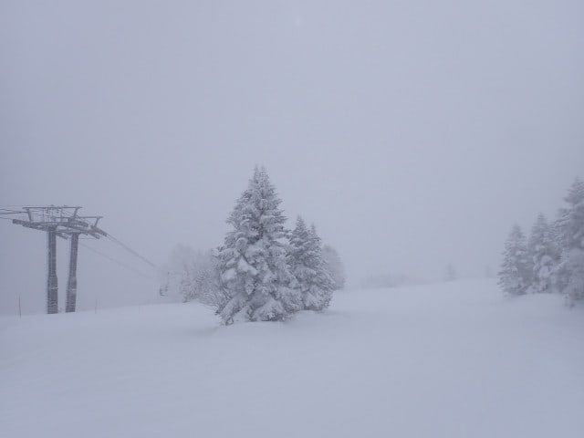
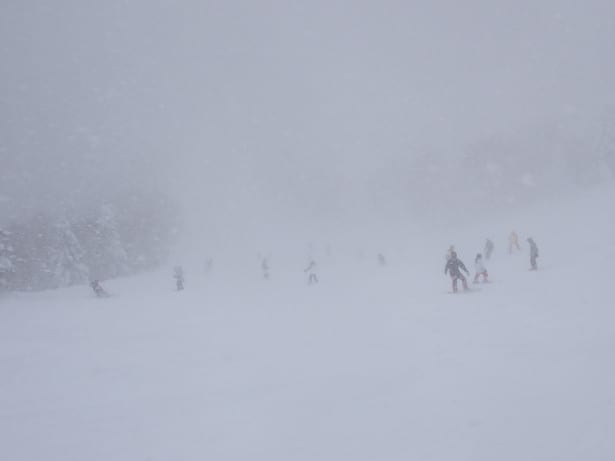
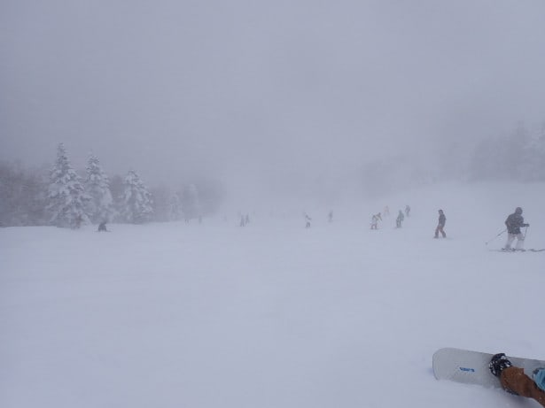
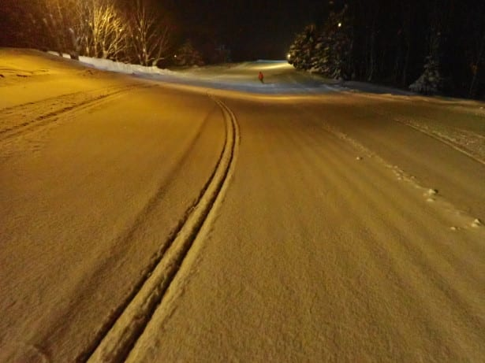
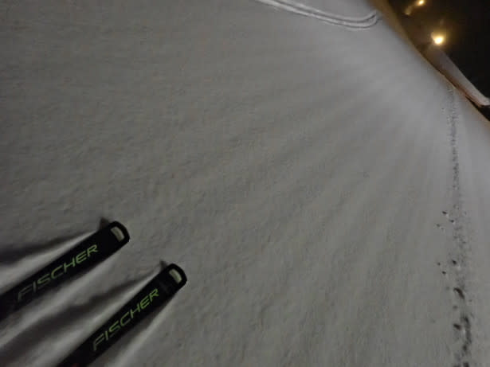

# 2025/2/22(土)の志賀高原焼額山スキー場は…朝から激冷えの雪降りで，昼間だけで40cm以上積もるエンドレスパウダーデー！そして2高故障(泣)

📅 投稿日時: 2025-02-23 00:29:47

🏷️ カテゴリ: [日記](cc4b5682fb7b8b144980957a978653fb0.md)

ということで．

3連休初日の本日も，志賀高原で滑って

ました～！！

まずは朝，志賀高原に登ってくる道ですが．

意外なことに中野の街中はほぼ積雪が

なかったものの，上林チェーンベースから

ちょっと上ると本格雪道ですので，

志賀に来られる方はご注意を…

で，朝の中野市街は晴れてたし．

登ってくる途中も薄曇りながら，

太陽が顔を見せていたのに…

焼額到着直前の8時ごろから，

なんだか本格的な雪になってきました(泣)

朝のうちは晴れで，昼頃から降る予定

だったのに…

ちょうどリフト営業開始のころに降り始める

とは，なんと意地悪な天気なのか…(涙）

ただ，3連休にしては8:30営業開始を待つ

ゴンドラの列はそれほど長くないですね～．

例年の3連休はかなり混んで，第1ゴンドラの

列がすごいことになるので．

今日はそこまで混まないといいな…

と思いながら，朝イチのゴンドラで山頂に

登ると…

雪の降り始めの時間の予想は外したものの．

気温は予想ぴったりの-14℃！！

で．

山頂の天気は…

朝8時前まで晴れてたらしいけど．

雪の降り始めが早すぎるよ…（涙）

今は見事な雪降りで，雪面が見にくいほどです(泣)

バーンコンディションは，圧雪の上に

5－10cmほど軽い新雪が乗っていて．

圧雪バーンでも軽い新雪を蹴散らしながら

滑る，新雪気分を味わえます！！

…けど．

これが朝8時前から降り始めて，

9時前のゲレンデ状況だから…

どのくらい雪が強く降っているか，

わかりますよね…

前が見にくいくらい激しく雪が降りつける，

ちょっと悲しい天気…（泣）

朝だけじゃなく，昨日の夜もちょっと降った

みたいだから．

朝圧雪のGSコースじゃなく，夕方圧雪の

オリンピックコースに行けば，もう少し

深いパウダーを楽しめるかな…？

と行ってみたところ．

オリンピックコースは積雪20cmほどで，

GSコースより10cmほど深いくらいかな．

でも，上に積もってる雪は軽いので…

かなり深い雪みたいなスプレーが上がります！

しっかり硬めの下地の上に，軽めの冷え冷え

雪が20cmほど乗っっていて．

ディープパウダーではないけど，新雪好きには

そこそこ楽しめるバーンでした～！！

…で．

3連休の今日，ゴンドラは激込みになることを

覚悟していたのに．

普段の週末でも混雑してくる10時になっても

あんまりゴンドラが混まないなぁ…

と思っていたら．

なんと．

10時ちょい前に，第2高速リフトが故障で

動かなくなり，復旧の見込み未定とのことで，

終日運休になっちゃいました（泣）

でも，それで一ノ瀬エリアから焼額に人が

流れてこず，ゴンドラが空いてるんだ…！！

まぁ，第2高速が止まったとはいえ，

3連休にしては，ゴンドラがすいてていいなぁ…

と，気楽に思っていたら．

なぜか11時過ぎには，第3高速リフトも

止まっちゃいましたよ？？

どうやら，第2高速リフトは本日の運転が

不可能ということで，リフトに乗っている人を

一人一人吊り下ろして救助しているらしく…

ほかのリフトからヘルプのスタッフを派遣

しているようで…11時過ぎには第4ロマンスも

第3高速も止まっちゃいました…！

こんな天気ですから．

ほかのリフトを止めてでも，第2高速リフトに

乗っている人を急ぎ救出してほしいところ…

リフトが止まるのは納得．

リフトが3本とも止まって，ゴンドラ2本

しか動いてないけど…

一ノ瀬から人が流れてこないから．

ゴンドラはガラガラでしたね…

そして．

12時半ごろには第2高速に乗っていた

お客さんの救出も終了したらしく，

第3高速や第4ロマンスも動き出しました…！

ただ．

第2高速は今日は終日運休のため，

白樺コースと唐松コースは終日クローズ（涙）

そのせいで，ゴンドラは混んでないにも

かかわらず，限られた滑れるコースに

人が集中してしまって．

GSコースや…

パノラマコースの人口密度はちょい

高めでした…（泣）

人口密度が高いのに，終日雪が降り続け，

視界が悪いので…

パノラマやGSコースは，気持ちよく滑る

にはちょっと厳しい感じ（涙）

でも，急斜面で滑る人を選ぶオリンピック

コースやSGSコースは終日空いてましたよ～！

で，今日は気温が最高でも-10℃と

冷え冷えで．

この冷え冷え状態で強い雪が降り続いた

ため…

圧雪コース上も，常に軽いパウダーが

供給され続ける，終日プチパウダー祭り！

コース脇は，午後になってもこんな

パウダーが滑れるし…

オリンピックコースも一日中新雪が

供給され続け．

かつ滑る人も少なかったので…

午後になっても，ガラガラのコースで

ブーツパフの新雪（ちょっと荒れ気味では

あったけど…）を滑り続けられましたよ～！！

ってなことで．

今日は昼間だけで40cmほど積もる，

エンドレスパウダー供給デーだったので．

営業終了時間のラストの圧雪バーンでも

こんな感じで，一日中プチパウダーを

楽しめる，いい日でした～！←新雪が嫌いな人は

楽しめないであろう1日だったことを暗にほのめかしている

という感じで．

今日もいつも通り，16時15分のリフト営業

終了まで滑り続けたのですが．

車に戻ってくると…

…やっぱりこうなってたか…（涙）

と．

泣きながら車を発掘したのでした…

で．

はい．

そうですよ．

このBlog読者はよく訓練されているから

わかりますよね．

これで終わるわけがないですよ～っ！！！

そうです．

当然のごとく，今日も18時からのナイターへ

突撃です！！

今日もナイター一番搬器に乗って．

圧雪したてのナイターバーンへ突入っ！！

…でも．

今日はいつもの悶絶クラスの最高クオリティ

シマシマバーンとは違って…

昼間と同じく，圧雪の上に軽い雪が乗った

プチパウダーバーン！

今日は圧雪後の30分ほどでもこれだけ積もる，

かなりの降りだというのがわかりますよね！

気温が低いので，この雪はかなり軽い…！！

まだ全く跡がついてない，この軽いふわふわ

パウダーを蹴散らしていく，この快感…っ！

シマシマバーンとはまた違った快楽が

ここにある！！！

ナイター中はちょっと雪の降りが弱まって

くれたので，1時間も経つとプチ新雪は

あらかた踏まれて，冷え冷え雪の

いい感じの圧雪バーンになっていき．

今日のナイターも楽しいよ！！

こんな楽しいナイター滑らないなんて，

もったいない…！

と，いつも思うことを今日も噛みしめつつ．

いつも通りナイターラストの8時まで，

しっかり滑り倒したのでした…

ってなことで．

雪の降り始めが朝からだったこともあり，

ディープパウダーは滑れなかったものの．

朝からナイターまでずっと冷え冷えの

プチ新雪を楽しめた一日でしたが．

第2高速の故障で，皆さんが無事に

怪我無く救出されたことを願うばかり…

残念ながら，日曜も第2高速は運休に

なったようなので，明日2月23日の日曜に

志賀高原に来る方は，一ノ瀬から

焼額＆奥志賀方面の移動は，

車かバスでの移動となります…

ということで．

私は明日も焼額を滑ってます…！

## 💬 コメント一覧

### 💬 コメント by (地元民)
**タイトル**: Unknown
**投稿日**: 2025-02-23 00:10:53

志賀高原は規格外なので参考にならんですが、郷に関して、今年の雪、異様に重くないですか？

寒波の雪なのに、軽い雪の日がほとんどなかった印象です。

なぜ？🤔

### 💬 コメント by (地元民)
**タイトル**: Unknown
**投稿日**: 2025-02-23 00:18:00

ちなみに焼額。今回の寒波が始まってから、ト━タルでどのくらい降ったんでしょうか？

250㌢くらい？

### 💬 コメント by (ねも)
**タイトル**: Unknown
**投稿日**: 2025-02-23 07:20:09

まず今日は最高の志賀高原では？👍

昨日・一昨日、志賀高原で滑っていました。21日の焼額山は空いていて晴天、最高でした✌️

昨日は雪がどんどん降ってくるので、おとなしくブナ平でパウダースノーを楽しんでいました。

焼額山でリフト止まって結構なトラブル、は帰宅して初めて知りました(ﾟ-ﾟ)　こちらを拝見するとお客さんもスタッフも大変だったんですね。

Ｓさんの志賀高原満喫を願っています👌

### 💬 コメント by (Skier_S)
**タイトル**: 今日は天気が良かったよ
**投稿日**: 2025-02-24 00:52:19

＞地元民さま

そうなんですよ…志賀の雪もちょいと重め．

やっぱりこれまでより気温がちょい高めなのかも？

昔は-15℃以下ってのも普通にあったので．

ちなみに焼額はこの1週間で50cm級が3回あったので，今回の寒波の

総積雪は200cm越えてると思いますが…250cm行ったかな…？？

＞ねもさま

今日の志賀高原，予想より天気が良く，ゴンドラ待ちも短くて良かったですよ～！

昨日はブナ平だったんですか．

とりあえず，2日間は志賀高原堪能しました～！！

…3連休三日目も滑りたかった…

