# 圧雪車に乗ってみた

📅 投稿日時: 2018-01-24 00:49:36

今朝は家の周りの積雪が15cmほどあり．

…それでも車で通勤してみたら．

通勤途中の公園で，スノボを履いて

遊んでいた子供を見かけて驚いた，

Skier_Sです．

…その公園，坂道なんて全然ないのに…

あの子は何をして遊んでいたのだろう…？？

ってことで，本題へ．

実は．

気づいている人は気づいていると思うのですが．

この正月休み．

焼額スキー場の小学生向けイベント

「圧雪車搭乗体験」

というヤツに申し込んで．

圧雪車に乗ってきました～！

（[12月31日のレポート](ee3dd9c2ba652a015fb8f456f8b0dc7ea.md)に，圧雪車の中からとった写真が…）

いや～．

乗ってみたかったんですよ．

圧雪車．

普通じゃ絶対乗れませんからね…

何とか圧雪車に乗れないものか…

と思っていたら．

わがホームゲレンデの焼額で，

小学生なら圧雪車に乗れる体験が

できるというではありませんか…っ！！

これは．

わが娘をダシに使って．

私が圧雪車に乗りに行くのだ！！

ということで．

圧雪車に乗ってきました～！

今回乗せてもらう圧雪車は．

ピステンブーリーPB400park．

ピステンブーリーはエンジンの違いで，

400馬力の600シリーズと

370馬力の400シリーズの2種類あるうち，

馬力の少ないほうのモデルになりますね…

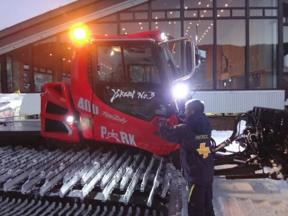

ってことで．

左側が運転席らしく．

右側の助手席に乗せてもらいます…

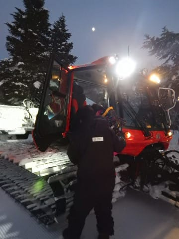

フロントガラスがすごく大きく，

足元近くから頭の上くらいまである

ガラスなので，前の見晴らしは

驚くほどバッチリ！

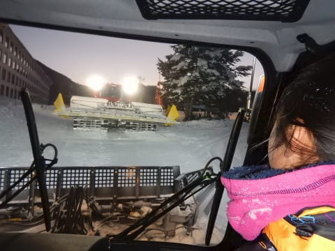

足元はブレードの下までしっかり見えます．

…ここまで見えないと，ブレード操作できないよね…

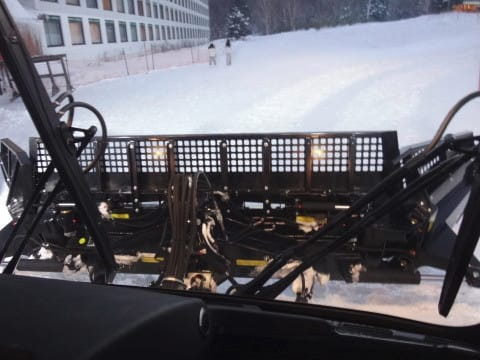

ワイパーは，冷却水であっためられた

温水が流せるホースがついていて．

凍り付かないようになってますね…

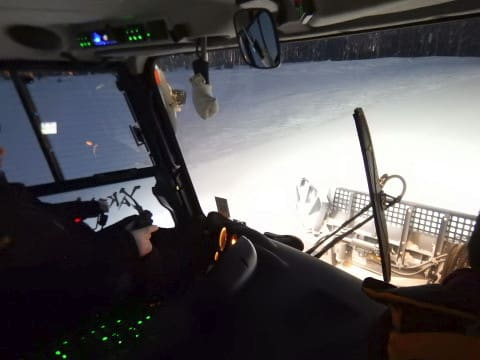

では，出発～！！

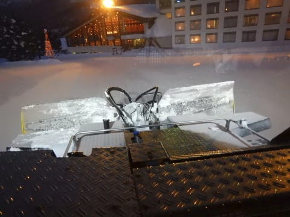

後ろもミルが丸見えの視界の良さ．

この圧雪車搭乗体験．

ほんのちょっと乗れるだけなのかと思ったら．

昼間営業終了後から始める，ナイター用の圧雪作業のすべて，

40分ほどの作業時間ずっと同乗体験できるというもので．

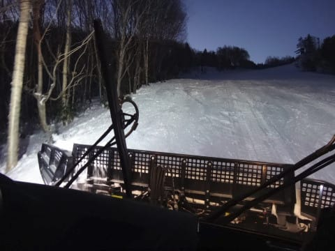

もう，ワクワクモノです．

ガラスはフロントガラスも横のガラスも，

全面ヒータで加熱され，

凍りつかないようになってますし，

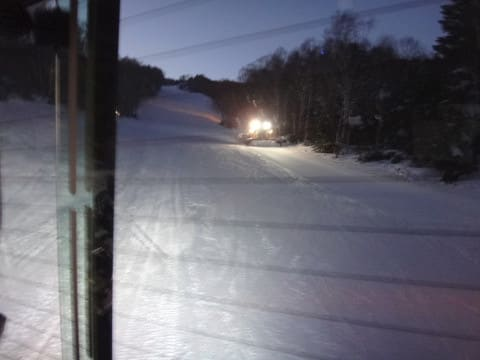

中は暖房がしっかり効いてあったかいし．

シートは意外と高級で，長時間乗っても疲れない，

ヨーロッパ仕様っぽい高級シート．

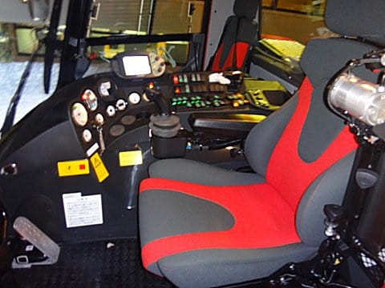

そして，頭上にはオーディオもついてますね…

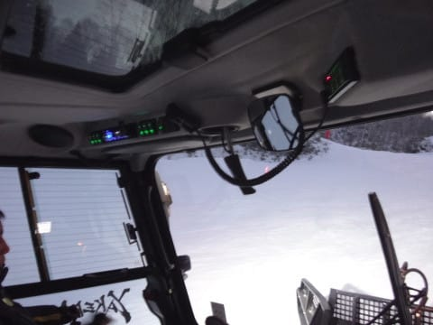

さらに，頭の上にはサンルーフもあり．

空が見えますよ…

ちなみに，

右手はブレード操作のスティック．

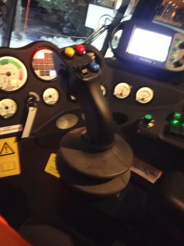

左手は左右の速度調整レバーになっていて．

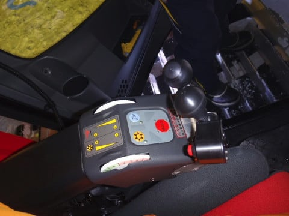

オペレータ席は，かなり近代的な

感じですね…

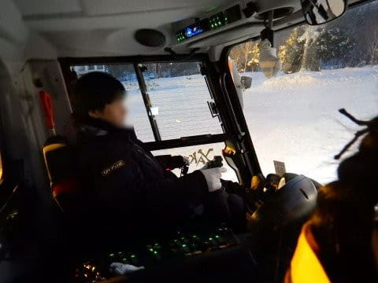

エンジンは，6気筒8900cc，370馬力．

アドブルー（尿素水）による浄化装置を付けた，

最新の排ガス規制対応の最新型．

昨シーズン導入の新車らしく．

燃料は1時間10Lくらい使うそうです…

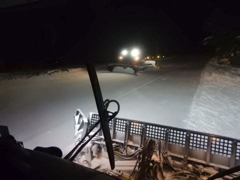

時速10～20km程度なので．

燃費換算するとリッター1～2kmってことに

なっちゃいますか…

で．

微妙なブレード操作で，

「表面をぎりぎり削るように」

操作しながら走るようで．

このブレード操作ができるようになるまで

結構な修行が必要だとか…

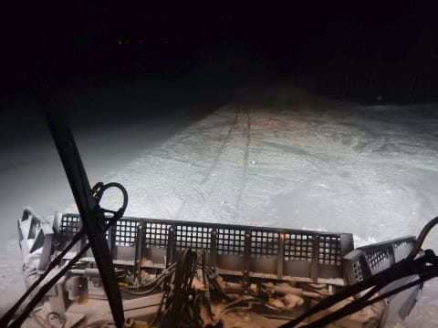

一度圧雪しただけでなく，

圧雪の隙間の段差をつぶすため，

圧雪と圧雪の間をもう一度

きちんと走って段差を消していきます．

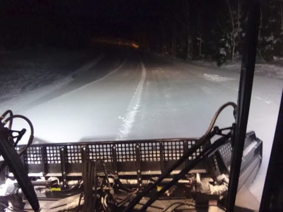

うーむ．

焼額クオリティ！

ナイターの圧雪作業は5時スタートだったけど．

朝の圧雪は3:30集合，30分暖気してる間に打ち合わせ，

4時から圧雪スタートで，オープン前の8時過ぎ完了．

朝早く起きるのは大変だろうなぁ…

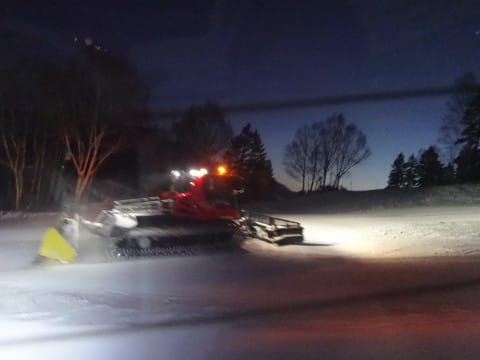

時間との勝負なので，いろいろな苦労談とか．

新雪がガンガン積もると，圧雪車でも滑って走りにくくなるとか．

周りに照明があるわけでもなく，真っ暗な中作業するので．

吹雪いてコースが見にくくなると大変…とか．

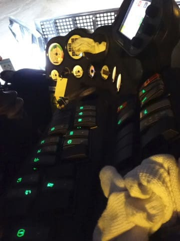

いろいろ大変な中，

焼額クオリティの圧雪の品質を

実現するために，最大限の努力を

払っているのが良く分かりました…

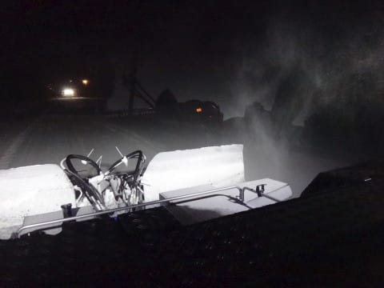

そうそう．

面白かったトリビアとして．

大体，日本の圧雪車は大きく二つの種類があるんですが．

まずは今回乗った，有名なピステンブーリー．

そして，もう一つは新潟の大原鉄工所製の圧雪車．

…たしか，大原は昔はフランスのラ・トラックの

ライセンス生産だったはずだけど…今はオリジナルなのかな？

で．

焼額には，ピステンも大原も両方あるのですが…

どちらの圧雪車で圧雪されたかを見分ける方法があって．

こうやって，シマシマの途中に，何本かに1本ちょっと

高さが違うシマシマがあるのが大原で圧雪した跡．

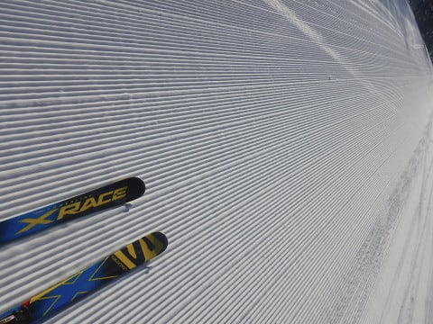

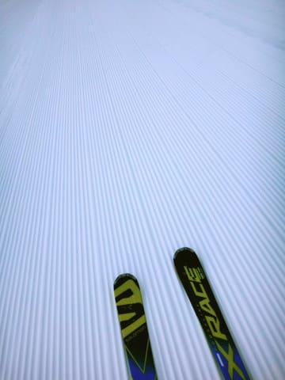

そして，幅いっぱい完全に同じシマシマが並ぶのが

ピステンで圧雪した跡だそうです…

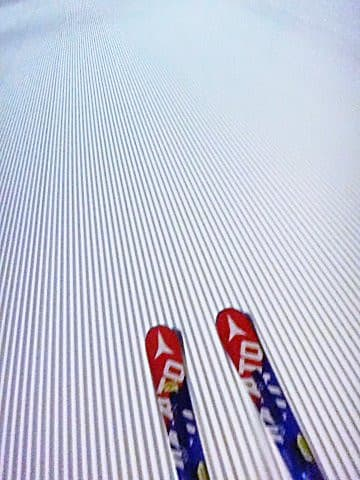

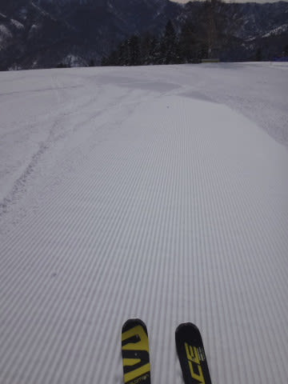

ってことですので．

次にスキー場に行ってシマシマを見た時は．

「ふむ．これは大原の圧雪跡だな…」

などと，いかにも通っぽくつぶやくために，

この知識をお使いください．

ちなみに．

ピステンはオペレータは左側に座るけど，

大原はセンターにオペレータ席があって．

大原の方が操作しやすんですよね～

…って言ってました．

あー．

ちなみに．

どちらも1台で家が一軒買えるくらいのお値段です．

2台買うと，もう億ですね．

自家用に一台買ってみたいところですが，我が家の

家計状況では無理ですか←いや，そもそも自家用で何に使うの？

…ってな感じで．

娘より私の方が興奮した40分．

あっという間でした．

楽しかった～！！！

ほとんどの人は途中で寝ちゃうらしく．

最後まで起きている人は珍しいらしいのですが…

もう面白すぎて，寝てる暇なんかないです（笑）．

いやーーー．

小学生の娘がいて，良かった…←親向けのイベントじゃないから．本来小学生向けのイベントだから

## 💬 コメント一覧

### 💬 コメント by (サトシ父)
**タイトル**: 大原！
**投稿日**: 2018-01-24 06:48:08

私の実家の市内に工場があります。小学生の頃この会社で南極探検隊の雪上車を作ってたと教わりました。奥志賀は今シーズンピステン一台導入、先月のスキー場開きに『入魂式』やってました。今週末はジャイアント泊、早くSさんにお会いしたいなぁ。

### 💬 コメント by (olaf2125)
**タイトル**: なんと！
**投稿日**: 2018-01-24 08:00:17

うぐっ！

これは私が小学生だと言い張って潜り込もうとしていたイベント！

小学生のお嬢さんをダシに使うとはなんたる所業！

(次回ヤケビへはランドセルを持って行かねば…)

### 💬 コメント by (つーちゃん)
**タイトル**: ズルい！
**投稿日**: 2018-01-24 13:05:43

いいなーいいなー

私も圧雪車大好きです。というか特殊車両が好きです

オペレーターには憧れます

今度、１ゴン住人の権力を行使して乗せてくれませんか？笑

P.S.公園でナイターを楽しんだ少女もいたみたいですよ

ttps://youtu.be/bThb5AKx__o

### 💬 コメント by (おぶせ)
**タイトル**: 志賀に来ましたぁ-
**投稿日**: 2018-01-24 17:36:27

圧雪車、人気ですね。玄人好みの仕様満載、高級住宅買える価格も納得ですね。（買えませんけど。）

予定通り、志賀に来ました。5時間30分かかりましたが、至って順調でした。第2ゴンドラと第2リフトだけの利用でしたが、雪小降り、風が強め、雪質まずまず、です。来てよかったです。ご支援ありがとうございました。春節前なのにゲレンデは中国の方が多かったです。ホテルの大浴場も中国語ばかりで驚きました。親日的な方ばかりで、安心していますが。

### 💬 コメント by (yumi)
**タイトル**: 乗ってみたぁ～い✨
**投稿日**: 2018-01-24 20:58:03

いいなぁ～🎉   圧雪車💨💨💨

今日のオリンピックは、殿方なら膝ぱう、おチビには🍑ぱうでした🎵

やや重めでしたけど・・・

おまけに、うちの旦那が埋まってました。

今週末はgood😉👍✨ですよ🎵

### 💬 コメント by (しんちゃん)
**タイトル**: いいなぁ
**投稿日**: 2018-01-24 21:29:37

圧雪車乗ってみたい!!

大原とピステンの違いトリビア、どこかで使わせていただきます(笑)また、シマシマ滑走時、違いを感じながら滑ってみます（シマシマ楽しすぎて、それどころじゃないかも）

### 💬 コメント by (Goku)
**タイトル**: コレは使える
**投稿日**: 2018-01-24 23:20:20

圧雪の跡でメーカーがわかるなんて素晴らしい！

で、その画像を用意してあるのがもっと素晴らしい！

因みに飯山とかの小学校は自前で圧雪車持っています。

今日の長野市は激寒、最高がマイナス２℃ってスキー場ですか？？？

### 💬 コメント by (Skier_S)
**タイトル**: 圧雪車好きが結構いそうですね…
**投稿日**: 2018-01-25 00:59:16

＞サトシ父さま

大原の工場って大きいんでしょうか…

南極観測用車両は今も作っているようですね！

https://www.oharacorp.co.jp/products/snowvehicles/antarctic/

これも乗ってみたいなぁ…

今週末は志賀ですか！

ぜひ焼額まで遠征してきてください～！

＞olaf2125さま

ふふふふ．

イイでしょう…圧雪車．

お先に乗ってきました（笑）

次回はどこかから小学生のお子さんを借りて

イベントに臨んでください！

…ランドセルを持っていくのは，不審者として

警察に通報されそうなので，あまりお勧めしません（笑）

＞つーちゃんさま

あら．

特殊車両好きですか…

私も一度圧雪車にのるだけじゃなく，

ぜひオペレータとして運転してみたいと

思っているのですが（笑）

1ゴン住人の威力では圧雪車に乗せて

もらえないので，オペレータ見習いとして

就職するか，こっそり圧雪車に

近づいて飛び乗るかなどの方法を

お試しください（^^;

…しかし．

江戸川とか公園でスキーするとは…

あの親子，恐るべし…

＞おぶせさま

最新の圧雪車，外見も玄人好みですが，

オペレータ席もマニア心を誘います…

志賀は，今晩から明日にかけてもまた雪が

積もりそうなので，明日の朝も新雪だと

思います…

残念ながら天気はあまり良くなさそうですが，

志賀高原を楽しんでください！

＞yumiさま

今日はひざパフでしたか！

でも，ちょっと重かったんですね…

冷えて雪質良さそうだと思ったんですが．

風が西寄りになったので，今日の昼間は

思ったほど降らなかったみたいですね…

でも，今週末は久しぶりにアイスバーン

じゃない柔らかい雪を滑れそうで，

楽しみです！

＞しんちゃんさま

でしょー，

乗ってみたいですよね…

圧雪車．

なんだか男心をくすぐる要素がありますよね…

ぜひ，次は大原とピステンの違いを見てやってください．

焼額は大体，GSコースは大原，それ以外はピステンで

圧雪されてます…

＞Gokuさま

ええ？

小学校が圧雪車って…

何に使うんですか？？

校庭を圧雪するんですか？？？

…しかし．長野は寒かったんですね．

冷え冷えの雪が続いて，今週末のゲレンデ状況が

楽しみです．

### 💬 コメント by (通りすがり)
**タイトル**: 羨ましい！
**投稿日**: 2018-02-16 21:04:31

毎年試乗記を楽しみに眺めているものですが、こんな記事が！いやぁ、羨ましい！

なんというか、あの大出力内燃機関で斜面を走破なんて、自衛隊で戦車に乗る以外ではこれしかないですよね！楽しそう！

そしてあの、芸術的な圧雪痕！職人芸！素晴らしい！読んでるだけで大興奮です。

試乗記眺めて諦めること10年超。また始めたいと思ってしまいました。

### 💬 コメント by (Skier_S)
**タイトル**: 通りすがりさま
**投稿日**: 2018-02-17 00:01:29

毎度ご愛読ありがとうございます…

いや，圧雪車搭乗体験，面白いですよ！

スピードは戦車ほど速くないですが，

すごい斜面を登ったり降りたり，

かなり傾いて走ったり…

オペレータのブレードさばきも見ものです．

ぜひ知り合いの小学生のお子さんでも連れて

焼額の搭乗体験にチャレンジしてみてください！

### 💬 コメント by (筋 肥大)
**タイトル**: 雪上車オペレーター
**投稿日**: 2018-04-17 15:17:35

お疲れ様です。昨日、志賀高原速報モードの方へお邪魔した筋 肥大です。

私は某スキー場て造雪作業と雪上車のオペレーターを仕事としています。

今シーズン、ピステン４００ を新車導入しまして、ピステンと大原３５０それにＬＭＣを交代で運転しました。ブレード操作はなれているＬＭＣが操作しやすく、ブレード操作をしなければ、ピステンが乗り心地良くて快適です。コース整備は、やはり焼額は最高です。さすがに伝統の志賀高原を代表するスキー場ですね。滑りに行くと色々と気付かせれます。お疲れ様でした。1

### 💬 コメント by (Skier_S)
**タイトル**: 筋 肥大さま
**投稿日**: 2018-04-19 01:01:15

ををを！

圧雪車のオペレータさんでしたか！！

大変なお仕事，お疲れ様です…

志賀高原では，LMCは見たことない気がします…

焼額はピステンと大原，

中央エリアはピステンとプリノートですから．

でも，オペレータさんは結構違う車種に乗って

作業するんですね…

しかし，プロの目から見ても，焼額の

圧雪クオリティは高いのですね．

いや，オペレータさんと聞いてぜひお会いしたく

なりました（笑）．

志賀高原にお越しの際は，ぜひご一報を．

### 💬 コメント by (筋 肥大)
**タイトル**: Unknown
**投稿日**: 2018-04-19 12:54:41

Skier_S様

お返事有り難うございます。

今冬、噴火のあったスキー場にて造雪作業と

コース整備に従事しております。

２７年振りにスキーをしたのは、コース整備するにあたって、実際にスキーをした方がより良い整備ができるからと同僚にすすめられてでした。いざ、スキーをしてみるとカービング板の具合いの良さに驚いて（昔の棒板でスキーを終えていたので）おおはまりとなりました。

明日２０日で志賀草津高原ルートが開通予定ですので、志賀がグット近くなるので行きたいです。行ければ連絡します。ちなみに、ウエアは黒の上下で派手なキャップにネックウォーマーをキャップの上にかけています。宜しくお願いします。

### 💬 コメント by (Skier_S)
**タイトル**: 筋 肥大さま
**投稿日**: 2018-04-20 01:36:26

あ，あのスキー場ですか…

いろいろ大変だったかと．

しかし，コース整備担当されている方も

スキーやらない方がいらっしゃるんですね…

いや，はまります．絶対スキー面白いですから．

もし，志賀にいらっしゃる際はコメントください～！

私を探す目印は，20000mクラブのステッカーを貼った

ATOMICのSXの板です．

朝に焼額第1ゴンドラにいれば，かなりの高い確率で

発見できると思います…

