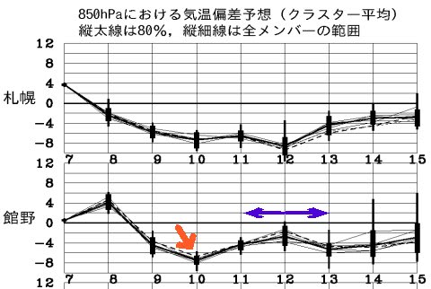
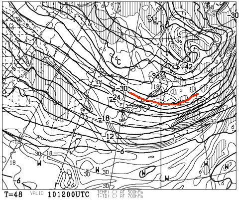
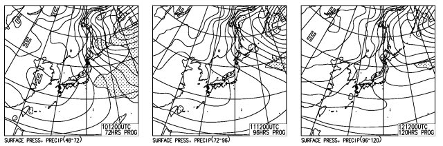

# この3連休の天気は…すっきり晴れてはくれなさそう…

📅 投稿日時: 2014-01-09 02:19:08

えー．

8日間の志賀高原滞在が終わったばかりと言うのに．

この週末，また3連休ですな．

…当然，私は3日間志賀高原で過ごすわけで．

ってことで．

気になる3連休の志賀高原の天気，占ってみましょう～．

…

うむ．

なんだか，10日はすごい冷えそうな予感…

こんな感じで，平年より8度低い気温まで下がりそうですね～．

で．青矢印で示した3連休の11日～13日も，

平年より低めの気温になりそうなので．

しっかり冷えひえの3日間で，雪質の心配は要らないかなっ！

そして，10日夜9時の500hpa気温ですが…

いわゆる「上空5000m」の-30度の寒気が，しっかり中部～関東まで

降りてきてますな～．

これは，そこそこの雪が降る目安．

なので，

10日夜はぼちぼち雪が降って，11日朝はそこそこの新雪が

積もってくれるかな～．

で．11日も終日降りそうなので．

12日朝も，冷えていい雪が積もってくれそう！

＃そんなに深いパウダーにはならなさそうだけど

で．

10日～12日の地上天気図を見ると．

おおむね，縦じまの等圧線が続くので．

3連休，スカッと晴れてくれることはなさそうですね…

3日とも，終日雪がちらつく天気が続きそう．

って感じなので．

今のところ…

11日　朝はそこそこのパウダー．

　　　終日雪が降ったり止んだり．時々強く降る．冷えひえだよっ！

　　　午後は雪がもさもさになるパターン．

12日　この日も，朝は新雪がぼちぼち積もってそう．

　　　終日雪がちらつくかな～．太陽は拝めなさそう．

　　　この日も，午後はぼこぼこバーンだろうな～．

13日　12日とほぼ同じ…朝は新雪がぼちぼち積もるかな．

　　　終日雪がちらつき，太陽は拝めないかな～．

　　　当然，午後はぼこぼこ荒れあれバーン．

って感じです．

うーむ．3日とも，朝は雪が積もりそうで．

白馬や新潟方面では結構な積雪になりそうな感じだけど．

まぁ，今のところ，志賀高原では一晩で20cm程度，多くて30cmかな～．

3連休初日の，11日の朝が一番積もってるかな？

また，直前に詳細予想します…
