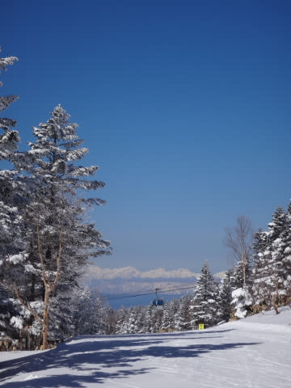
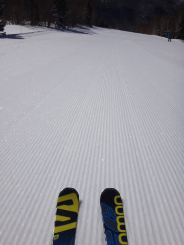
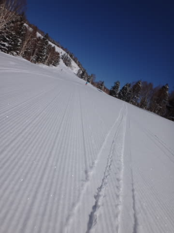
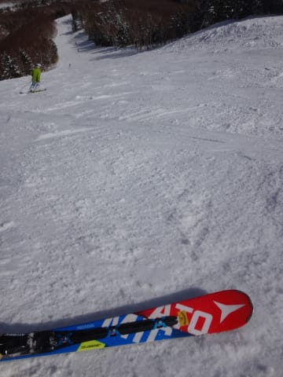
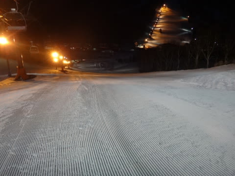

# 3月26日の志賀高原，速報モード…天気最高．朝イチ最高！ごごはちょっと緩んだけど…3月としては恵まれた日

📅 投稿日時: 2016-03-27 04:04:36

えー．

朝，家を出てからの活動時間が24時間を突破してしまった，

Skier_Sです．

私の体験からわかったことを．

今回，みなさんにお教えしましょう．

　前日，夜11時に帰宅して．

　睡眠時間4時間弱で，往復10時間運転しなくては

　いけないスキー場に日帰りで行って．

　朝イチゴンドラからナイター終了までまで滑って

　帰ってくると．

　死ぬほど疲れる，

ということを…←教わらなくてもわかるから，普通

ということで．

本日は，死ぬほど眠いので←それでもこんな時間に更新しているところは，褒めるところなのか，それとも「馬鹿か？」と突っ込むところなのか…

超速報モードで…

本日は．

ふはははっはは．

予想通りの，冷え冷え晴天の一日でした！

朝イチは，トップシーズン並みの柔らかい雪が圧雪された，

最高フカフカ圧雪バーン！

…今シーズン，柔らかい圧雪って…

2-3回しか滑ってないんじゃなかろうか？？

もう，最高！

朝イチシマシマ，最高っ！！

気温が低めだったので，日が射しても

昼前くらいまでは結構いい雪！！

で．

昼ごろから，第1ゴンドラのGSコース側は荒れたけど…

第2ゴンドラ側，パノラマ-サウスコースは午後になっても

ザブザブ春雪にはならず，

フラットなまま！！

夕方ゴンドラストップ直前でも，こんな感じでした…

いやーー．

今シーズンのなかでも，結構いいコンディションの

一日だったけど．

普段の年でも，3月下旬と考えればかなり恵まれた

一日だったな！！！

…ってことで．

日帰りなのに，ナイターまで参戦です…

だって．

ダイヤモンドナイター，今日で今シーズン最後ですから…

やっぱり，滑っておかないと！！←あとの帰路の運転が大変だとか，全く考えてない

ちょっと固めの部分もあったけど，

ナイターもおなか一杯楽しめました～！

…詳細レポートは，また明日…

一緒に滑った[Gokuraku Skierさんのレポート](http://red.ap.teacup.com/applet/gokurakuskier/20160326/archive)が参考になるかも…

だ，だめだ．眠すぎる…

おやすみなさい…

## 💬 コメント一覧

### 💬 コメント by (べべ)
**タイトル**: 昨日は
**投稿日**: 2016-03-27 06:26:53

ナイターまで行かれるとは…お疲れ様です。

昨日はリフトストップ前の貴重な時間、ありがとうございました！

一緒に滑られてた方がGokuraku Skierさんなんですね。

お二人とも速すぎです…

### 💬 コメント by (aqura)
**タイトル**: お疲れ様です
**投稿日**: 2016-03-27 06:28:48

いやぁ～、日帰りなのに、ナイタ―まで滑るとはU+2757  楽しまれたようですね、こちらまで嬉しくなります。  私はこれから休日出勤(涙)

### 💬 コメント by (Goku)
**タイトル**: 私も睡魔に・・・
**投稿日**: 2016-03-27 08:01:03

昨日はお疲れさまでした～♪

素晴らしい３月２６日でしたね！

＞…詳細レポートは，また明日…

＞一緒に滑ったGokuraku Skierさんのレポートが参考になるかも…

スミマセン・・・

私もあれから帰って０時近くまで飲んだくれてたもんで、途中までしか書いてないんですよ～

かかと痛はブーツを脱ぐと何ともなかったです。

インソールは次回試してみます。

ありがとうございました。

でも、ポチりませんよ（笑）

２Ｗほどお会いできませんが、また一緒に滑りましょう！

### 💬 コメント by (Skier_S)
**タイトル**: 今日はスキーせず…（涙）
**投稿日**: 2016-03-28 00:51:39

＞べべさま

最後に1本，3高に行きたいタイミングだったので，

あまりゆっくりお話しできずにすいません…

あの時はGokuraku Skierさんはいなかったんですが，

その前に一緒に滑っているのをご覧になってたんですね（＾＾；

そんなに速かったでしょうか…？？

あれでも，20000mな方々にはおいて行かれるのですが（笑）

＞aquraさま

日帰りナイターは，帰路の運転で死ねますので

あんまりお勧めしません…（笑）

休日出勤お疲れ様でした．

＞Gokuさま

痛さに負けて，ポチってしまいましょう…（笑）

また4月中旬以降にご一緒しましょう！

