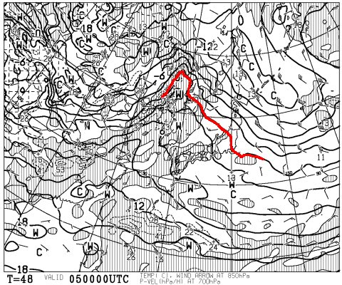
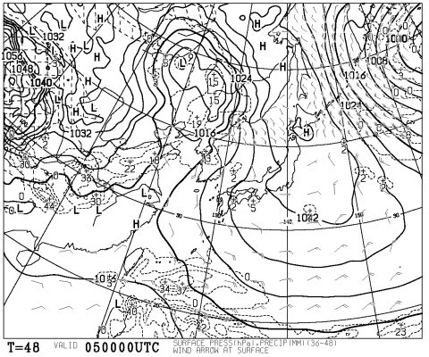
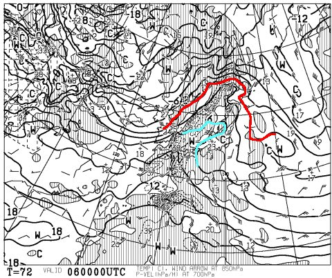
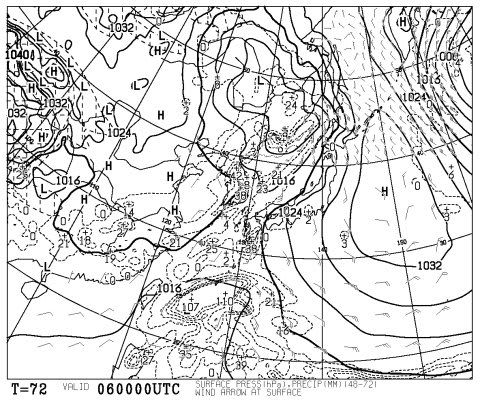
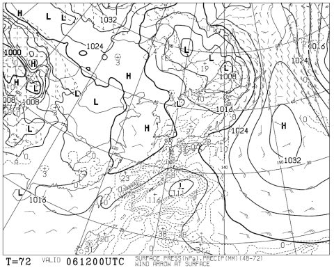
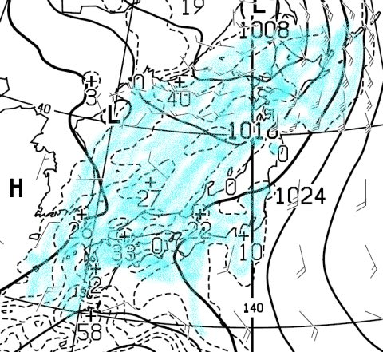

# 今週末の志賀高原の天気は…土曜は晴れ！日曜も朝のうちは晴れるか…？雪は春雪（涙）．

📅 投稿日時: 2016-03-04 02:08:38

えー．

すでに何度か宣言していますが．

天気図を読むのはあくまで趣味であって，

気象関係の仕事は全くしていない，Skier_Sです．

…ということで．

今週末の志賀高原の，詳細天気予想をば…

ふむ．

5日土曜日，朝9時の850hpa気温図ですが…

やっぱり，0℃線は志賀高原より北ですね（涙）．

そして，土曜の地上天気図は…

見事にすっぽりと高気圧に覆われて．

うむ．

土曜は昨日までの予想通り．

すっきり晴れそうです…

ただ．

やっぱり，昼間の気温はプラス5度近くまで上がり．

…強烈な日差しと相まって，雪質は春の雪になりそう…

で．

6日日曜の朝9時の850hpa気温ですが．

…うーーむ．

0℃線は北海道の上まで上がり．

…志賀高原には，水色で示した+6℃線が…

これは，4月～5月並み（泣）．

悲しいほど，気温が上がっちゃいそうな予感…

日曜の朝6時の地上天気図はこんな感じなので．

うむ．

朝のうちは高気圧の勢力がまだ残ってそうなので…

晴れるかな？

ただ．

午後に向かって雲が増えていき．

日曜の夜9時の地上天気図は…

ヤバい！低気圧がやってきているっ！！

この気温だと，降れば確実に雨になってしまう！！

…雨は，降るのか？？？

この図を拡大してみると…

ををををを～っ！！

ぎりぎりセーフっ！！

降水が予想される，水色で塗ったエリア．

見事に志賀高原を避けています…

とりあえず，南風が強いこの日．

雨雲が志賀高原付近を避けたように，すっぽり降水域から外れてます…

南風だと雨が降りにくい志賀高原近辺，

少なくとも，夕方までは降らなさそう！！

昨日から引き続き．今の時点の天気図でも．

土日の雨は避けられそうです！！

＃気温は上がるけど（涙）．

ってことで．

まとめると．

土曜：朝からすっきり晴れ！朝は放射冷却でそこそこ冷え込み，

　朝イチは結構締まったいい雪が滑れそう…

　だけど，強い日差しで午前中から雪は緩みだし，

　昼にはしっとりとした春の雪になっちゃいそう…

　午後は荒れ荒れ春雪状態かな…

日曜：朝のうちは晴れそう．もし，晴れれば放射冷却で，

　朝は固めの圧雪かな…．朝が曇ってれば，気温が下がらず

　緩んだままの圧雪でスタート．

　…南風が強いので，ゴンドラが減速運転になりそう．

　奥志賀ゴンドラとか，運休にならないことを祈るばかり…

　午前中から雲が増えていき，午後は曇り．

　南風で気温が+5度以上に上がり，雪は完全ザブザブ春雪．

　4月並みの重い雪になっていくでしょう…

　日ごろの行いが良ければ，雨は降らないで夕方まで

　もってくれる（はず）．

という感じで．

スキーヤーの皆さんは．

日ごろの行いが良い人ばかりのはずなので．

この土日は雨は降らなさそうなものの…

気温は上がり．

日曜は完全ザブザブ雪になりそうです…（涙）．

とりあえず．

あまり気温が上がりすぎないように．

引き続き寒気の歌を歌っておきましょう…
