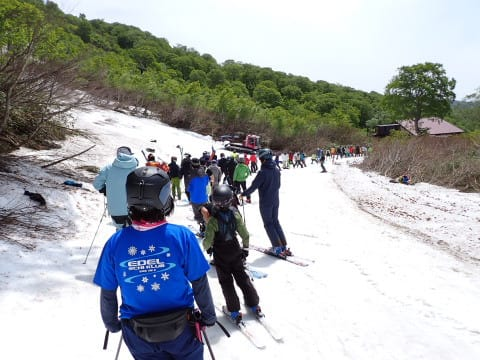

# 2024/5/26(日)の月山スキー場，速報レポート！…終日晴れ，今日も板を履いてリフト乗車可能！リフト待ち最大5分が数回，午後はほぼ待ち無し．午前大斜面は混雑

📅 投稿日時: 2024-05-27 01:59:08

🏷️ カテゴリ: [2024スキー滑走日記](c453f687e8a0f05679e95831d0a02cd0c.md)

ってなことで．

今日も月山で滑ってきたわけですが．

やっぱり月山は遠い…←当たり前でしょ

帰宅して片付けその他やっていたら

もうこんな時間なんですが（泣）

おととい睡眠2時間以下で出発し．

昨日も睡眠時間は6時間ちょいで．

今日は何とか夜2時半には寝るとして．

睡眠5時間ちょいか…（泣）

平日も睡眠不足だった今週．

休日もこんな日々を過ごして，

明日ちゃんと朝起きて仕事に

行けるのかな…？←もっと早くに滑るのを

切り上げればよかっただけでは？

ってなことで．

あまり記事を書く時間が取れないので．

本日の月山，速報モードでレポートです！

本日は，晴天でスタート！

気温は昨日よりは高いけど，

風が吹くと肌寒く，Tシャツだけで

滑れるほど暑くはない感じ．

朝のリフト券売り場は混んでたけど．

8時営業開始のリフトはそこまで

混んでおらず…

今日もリフト乗り場は板を履いて

リフトに乗り込めます！

リフト降り場もちゃんと雪がついて

いて．

板を履いたまま滑れる月山は，

かなり快適…！

沢コースも，あさイチはフラットで

雪もそこそこ締まって板が走って…

かぐらのあさイチより快適かも！！

沢コース，この写真の上の方はまだ

幅がありますが．

下の方はピステン1台分ギリギリの幅に

なっているので…

もうそろそろやばいかも．

リフトは午前中は時々この程度まで

列が伸びたけど．

板を履いてリフト乗車なので，

歩いてリフト乗車の時よりリフトの

運転速度が速いこともあり，これで

5分待たないくらい．

昼前くらいになると，もうリフトは

ガラガラで．

午後は数人待ち程度で乗れました～！

ちなみにTバーには乗ってませんが．

下から見るとこんな感じの混雑でした…

で．

大斜面はまだまだ雪があるように

見えますが…

そろそろリフト降り場からまっすぐ突っ切れる

トラバースコースの入り口に

藪が立ってきて途切れそう．

…ここが途切れたら，リフト降りてから

結構上に登らないと，大斜面に出られなく

なりますね…

大斜面自体は，雪はまだまだあります！

午前中はかなりの数のレッスンが入って

いたりして，結構人が多かったですね…

大斜面はいつもの全面コブ斜面ですが．

土日の人出のおかげで，日曜の今日は

土曜より全てのラインでコブが

深くなった感じ．

沢コースは，昼頃から結構荒れて，

板の滑りが悪くなってきましたが．

最後の緩斜面を除いて，まだ

大回りできる幅もあるし．

大斜面も藪が目立ってきたとはいえ，

まだ長いラインがとれるし…

板を履いてリフトに乗り降りできる

こともあり，リフトグルグルで

効率よく楽しめて，この時期としては

結構たっぷり滑れた感がある月山

でした～！

…また明日，余力があれば詳細レポート書きます！

## 💬 コメント一覧

### 💬 コメント by (ねも)
**タイトル**: Unknown
**投稿日**: 2024-05-30 06:06:29

Ｓさん　お久しぶり！

ややイマイチなコンディションにみえますが、結構な人出ですね(@_@)　月山は山登りでしか。

20日に退院しました。リハビリ中です。今のところ歩行可能距離は500ｍかな(-_-;)　１㎞を目指しています。

### 💬 コメント by (Skier_S)
**タイトル**: ＞ねもさま
**投稿日**: 2024-05-31 00:42:16

月山としては，板を履いてリフト乗り降りできたし，かなり恵まれたコンディションでしたよ～！

結構楽しめましたよ！！

そして，退院おめでとうございます！！

また来シーズンまでにはゲレンデ復活できるように，無理せず焦らずリハビリしてください…

