# この年末年始の志賀高原スキー場の天気は？…なんと！ひたすら冷え冷え，雪降りの年末年始っ！積もるといいんだけど…

📅 投稿日時: 2018-12-27 02:58:41

🏷️ カテゴリ: [スキー天気予想](c6554f5c3c106093b511a8daae23757e8.md)

どうやら，本日から．

一の瀬ファミリーの正面バーンが

オープンしたようですね…！

…ただ．

パーフェクターとパノラマはまだ

あいていないようなので．

人工雪で強引に正面バーンをオープンさせた

感じでしょうか…

で．

残念ながら．

まだ，寺子屋・西館・東館・ジャイアントは

オープンしていないようです…

あぁ…もう一降りほしい．

いや，あと二降り欲しい…っ！

ってなわけで．

今週末から，年末年始休に突入する人は

多いと思いますが．

ニュースなんかでさんざん

「凄い寒波がやってくる！」

と言われている，この年末年始休．

志賀高原はどんな感じになりそうか．

天気図を読み解いてみるのだ…！

えー．

まずは年末年始休の前．

27日の木曜の850hpa図から見てみますか…

ふむ．この日は－0℃線は日本の南．

志賀高原には，水色の－6℃線が掛かる程度

なので．

志賀高原は，朝は－8～9℃程度．

昼間も-5℃をちょっと上回る程度の，

結構冷える一日！

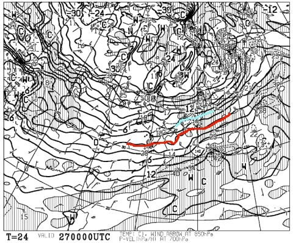

そして，地上天気図を見ると…

水色の降水域が志賀高原にかかっていますが．

日本海側の雲がきれいに流れておらず，

それほど大量に降らなさそうな

感じですね…（ちょっと残念）

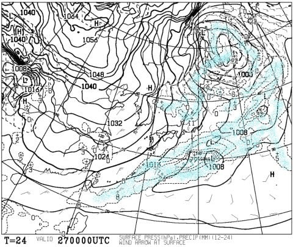

そして，年末年始休の直前，28日金曜の

850hpa気温図ですが．

この日も赤い0℃線は日本の南．

志賀には，水色の－9℃線がかかってます．

この日も，朝は－12℃程度の冷え冷えの一日！

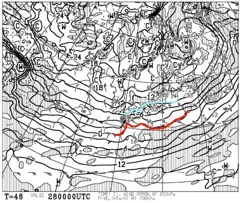

で，地上天気図を見ると…

日本海の吹き出しの雲．

かなり離岸距離が短い感じなので．

結構いい感じの雪雲なんですが…

新潟付近に「+18」という数字が見えるように．

新潟近辺の+18cmが最大の積雪量という予想．

長野はそれより少ない積雪量になるので．

うーん．

28日朝までに，積もっても10cm程度かな…

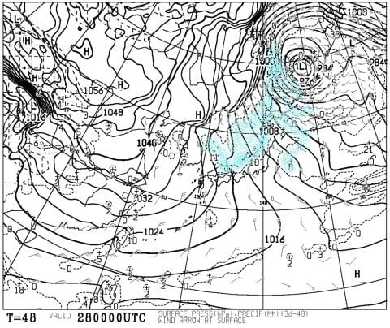

続いて，年末年始休の初日．

29日の850hpa気温図ですが．

なんだかすごいよ！これ．

赤い0℃線が，沖縄近くまで下がってるし．

志賀は，水色の－12℃線が近づいてきてます．

…この日は朝は－15度クラス．寒いよ！

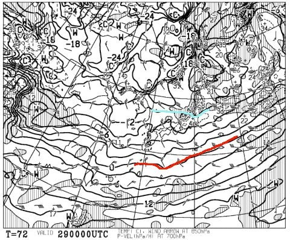

この日の地上天気図を見ると．

見事な冬型ですな…

この日の朝は，日本海側はハンパなく

降ってそうですね．

志賀高原でも，朝までの積雪は10cmを

超えてくれるかな…

運が良ければ20cmは積もってくれそう．

それほど深くはないけど，冷え冷えパウダーデー！

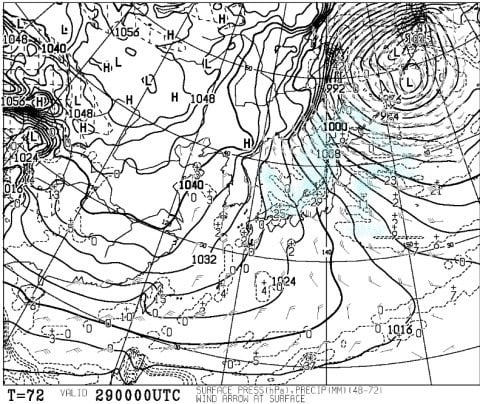

29日は，一日降り続けそう！

…なんだけど．

地上天気図の拡大を見てみると…

この赤く囲った部分．風速50ノット越え？？

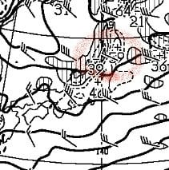

これは…風速25mを超えそうってことなので．

奥志賀＆焼額とも．

29日の朝は，ゴンドラが動かないかも…

で．

続く30日以降，1月2日まで．

850hpa図を見ても，

0度線ははるか南で，志賀高原には

－9℃線がかかっている感じなので．

年末年始は，朝は毎日-10℃以下で

スタートしそうな感じ…

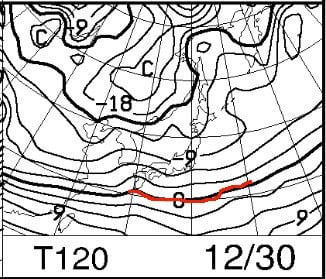

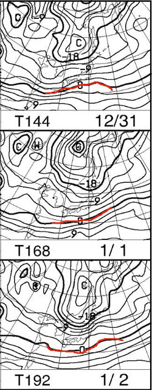

地上天気図見ても．

30日から1月2日まで，ひたすら

冬型が続きますね…

ドサドサ降る感じではなさそうだけど．

志賀高原では曇り～雪が舞う日が続いて．

晴れ間が全く望めなさそうな気配…

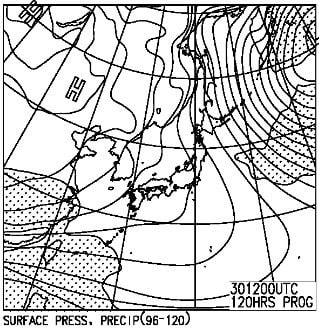

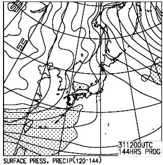

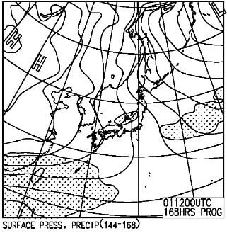

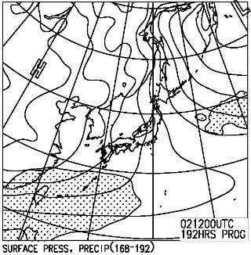

ってことなので．

まとめると．

27，28日：どちらも朝は-10℃程度で，結構冷える．

　曇り～雪の一日で，積雪はそれぞれ10cmずつくらいか．

29日：28日の夜から吹雪になり，朝の積雪は

　最大で20cmほどになるかな？

　この日の朝にスキー場に移動する人は，

　吹雪＆積雪路に注意！

　朝の気温は-15度と冷え冷えで，昼間も気温が

　あがらず，風も強いので凍死するほど寒そうな感じ…

　ゴンドラは，朝は風の影響で動かなさそう．

　ただ，午後に向かって風は少し弱まりそうなので．

　午後は焼額第1ゴンドラは動くかな…

　一日雪が降り続け，昼間も10cmほど積もるので．

　この日は冷え冷え新雪が蹴散らされた荒れ荒れ

　ゲレンデの一日．

30日：この日も冷え冷え，朝は山頂で-12℃程度．

　ただ，積雪はほとんどなし．数cm程度．

　朝イチはやわらか最高圧雪が楽しめそう．

　曇り空，時折雪がぱらつく，午後は晴れ間も

　みえるかも？寒い一日．

31日：この日は，朝の山頂で-10℃くらいかな．

　積雪は無し．

　基本的に曇りの一日．時折日が射すことも

　あるかも…

1，2日：朝は-10℃程度，昼間もそんなに気温が上がらない．

　両日とも，積雪は10cmあるかないかくらい．

　雪がぱらつく一日．

ってな感じで．

この年末年始は，冷え込みがずっと続きそうです．

もう，こんな感じで，平年より気温が低い日が

ずっと続きますから…

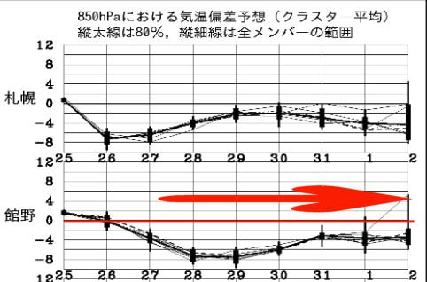

特に，28，29日は平年比-8℃の

冷え込みですね…！

そして，ずっと曇り～雪の日が続き，ほとんど

太陽は拝めなさそうな感じです．

…ただ．

志賀高原では，雪がドサドサ積もりそうな

気配はありません（涙）

太ももパフ，腰パフと言ったディープパウダーは

望み薄な感じです（泣）．

うーむ．

この冷えている期間に，どっさり積もって

欲しいものだけど…

まぁ．

27～29日までの間，毎日10cmずつくらいでも

積もってくれれば，ゲレンデはかなり改善すると

思うので．

29日には，志賀高原はほぼ全面滑走可能に

なるんじゃないかな～．

とりあえず．

これまでが悪すぎたので．

年末年始休は，全面オープンしたゲレンデで

滑りたいところ…

これから29日までの積雪に期待！

## 💬 コメント一覧

### 💬 コメント by (やっさん)
**タイトル**: いつも楽しく拝見させていただいております。
**投稿日**: 2018-12-27 06:11:34

年内年始は家族4人で志賀高原で過ごしているものです。今年は私だけ先行して26日から志賀高原でスキーしてます！一旦28日に京都に戻りそのままとんぼ返りして29日の朝に戻ってくる予定ですが、吹雪きそうなのですね‼ちょっと移動が心配です。いつもは中央がメインなのですが今年はヤケビをメインにして、なんとか勇姿を拝見させて頂きたいと考えております‼

### 💬 コメント by (はなげ親分)
**タイトル**: 全面オープン
**投稿日**: 2018-12-27 18:25:47

期待大です！

しかし、ポチった板のデビュー時が読めません～

### 💬 コメント by (MZMM)
**タイトル**: 年末年始大雪の模様
**投稿日**: 2018-12-27 21:17:04

今晩は、年末年始大雪の模様👌👍👏👏☺️🙌🙌

⛷の '宣伝動画' を作って見ました (2:45) :

compaign.tudou.com/v/XMzk3NTAwMDA2OA== 

(または d.hatena.ne.jp/zuotengiphone/20181220 から→間も無く閉鎖されます)

一年一度の2018年2月の熊の湯♨️スキー⛷メインゲレンデ →ヤケビはいつもエッジを盗られ苦手なので

   '' 山は白銀(しろがね)朝日を浴びて 滑るスキーの楽しさ.....''

     唄は itun.es/jp/m-MKbb?i=1100115911 (第23曲)などから

子供たちの滑り様、結構快調、楽しめると思います、→ (薄小字で)YouTubeに、凄い動画がいくつもあるけど

身贔屓(^^;;かも、

### 💬 コメント by (Skier_S)
**タイトル**: コメント遅れてごめんなさい
**投稿日**: 2018-12-29 00:33:04

＞やっさんさま

コメントありがとうございます～！

私も29日から焼額で滑ってます！

私はウェアはBlogに晒してませんが，

どうやら意外と簡単に発見できるらしいので，

ぜひ見かけたらお声がけください．

希望があればステッカーもお渡しします～！

＞はなげ親分さま

積もりましたね～．

ヤケビもようやくオリンピックコースオープンです！

だもんで，ポチった板デビューさせられますよ！

＞MZMMさま

ようやく積もりましたね～．

動画は去年の熊の湯ですか！

また今年も志賀に来られるのでしょうか…？

