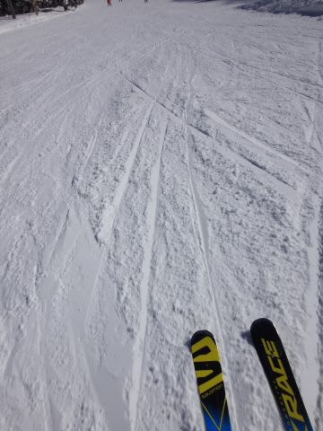
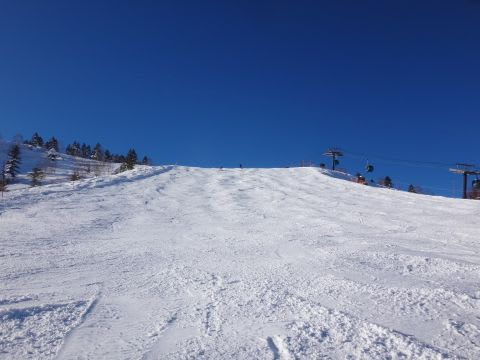

# 2月4日（土）の志賀高原は…晴天！雪は最高っ！！シーズンそうそうない好コンディション

📅 投稿日時: 2017-02-05 00:55:49

いやーーー．

今日は．

基本的に晴れの天気予想で．

さらに，朝イチは最高だろうなぁ…

と，書いてましたが．

…実際．

最高でした．

さらに最高だったのは．

2月なので，混むだろうし，

そのため，午後は荒れ荒れ凸凹…

と，予想したけど．

…確かに，ちょっと人は多めだったけど．

夕方は凸凹斜面になったけど．

でも．思ったほどでは無く．

夕方まで，かなり気持ちよく滑れたので．

いやーーー．

もしかすると，今シーズンの最高の週末では？？？

という，今日一日だったのでした！←それは，予想を外したということでもあるわけだな

まず．

朝は，昨日の日差しでところどころアイスバーン化した，

登り坂を登って志賀高原にやってきたわけですが…

山頂の朝イチの気温は-9度と，トップシーズンらしい

冷え冷え気温でスタート！

山頂は，すっきり晴天で…

通常営業開始の8時半のゴンドラだと．

別料金のファーストトラックにちょっと

荒らされちゃっているけれど．

でも，まだかなりシマシマが残っていて…

超冷え冷えの，よく冷えた締まり気味の

シマシマバーンがお出迎えっ！！

これは…

晴天ぴかぴか，冷え冷えシマシマっ！

最高のバーン状況じゃありませんかっ！！！

…たしか．

先週も似たような表現を使った気がするのですが．

これは．

最高プレミアムエクストラハイグレードシマシマ

圧雪では！！？？

最高っ！

最高なんですけど…

もう，天気はぴかぴか晴天．

だのに…

GSコースはちょいと人が多めでしたが．

オリンピックコースは，貸し切り状態なんですけど！？？

人がいないので，結構締まった圧雪の，

かなりフラット気味なバーンを…

気持ちよく飛ばし放題なんですが！？？

＃この写真，誰も写ってないんですが…

さすが2月の週末．

時々，ゴンドラ待ちが駅舎の外ぎりぎりまで

延びるかな，というタイミングが合ったものの…

でも，すごい長い列がつくことなく．

ゲレンデは，こんな感じでぴかぴか晴天なのに，

なぜか人も少なめで…

…ええんか？

午後2時になっても．

急斜面のオリンピックコースが，こんなフラットで，

ええんか？？？？

だもんで．

今日は，午後になってもずっと大回り板を

履いたまんま．

午後3時になっても…

全然フラットなまんまなんですが？？

…確か，誰かが

　午後は凸凹になっていく

と，予想していた気がするのですが…

でも．

夕方まで

人が少なめの，超フラットバーンっ！！！

いや．

いいの？

ホントに2月にこんなに人が少なくていいの？

ただ．

さすがに午後3時半を過ぎると．

ちょっと凸凹してきましたが…

でも，せいぜいこのくらい．

午後まで，全然大回り板でOKなんですけど！？？

ええのんか？？

こんな人が少なくて，いいのか？？

という，ガラガラバーンを．

日が暮れる営業終了まで，滑り続けたのでした…

で．

当然．

ええ．当然です．

…ナイターまで，行ったわけですが．

今日のナイター．

気温⁻10℃近く，雪はかなり冷え冷えのいい感じのシマシマっ！！

朝に続いて，おいしそうなシマシマを，いただきます～！

って感じで．

この日も，18:30～21:00までの2時間半．

ガラガラのダイヤモンドナイター，

おなか一杯いただきました～！！！

…って感じで．

人も比較的少なめ．

だのに，ゴンドラは減速運転しないくらいの，

絶妙な混み具合で．

で．コースも荒れずにフラットと．

超恵まれたコンディションでした～！！

いや…今も穏やかな天気なので．

明日，天気が崩れるとは，ちょっと信じがたいけど…

明日は．

えええええ！！？？？

低気圧が，志賀より北に行ってるのですが…

南岸低気圧じゃなかったの？？

だもんで．この低気圧に南風が吹き込み…

0度線は志賀より北に上がっちゃいそう…

…

これだと，雨になる可能性もたかいのですが（涙）．

でも．

明日はそれほどひどい雨にならないはず．

昼過ぎ，夕方近くまでは，降らずにもってくれるはず…

と．

このBlog読者はみんな祈ってくれるはず．

そうです．

祈るのです！！！

明日，雨になったら…

それは，皆さんの祈りが足りなかった，ということで．←結局，人のせいにするのか？？

## 💬 コメント一覧

### 💬 コメント by (Goku)
**タイトル**: 羨ましい
**投稿日**: 2017-02-05 05:39:55

うぎゃ～

羨ましい～！

で、この感じだとナイタープラスで軽く20000m超えですね!

### 💬 コメント by (michi)
**タイトル**: 昨日は…
**投稿日**: 2017-02-05 20:01:27

天気が良くて最高でしたね。

栂池は昼から南側斜面で春のような雪質の場所がありました。

思っていたより混んでいてゴンドラ乗るのに30分くらい待ちました。

スキー場、雪質共にヤケビの方が好きなmichiでした(^^;)

### 💬 コメント by (Skier_S)
**タイトル**: また雪が積もりそう
**投稿日**: 2017-02-06 00:46:57

＞Gokuさま

今日はまた午前中一緒に滑っていただき，

ありがとうございました～！

午後のゴンドラ減速はやられましたね…（涙）．

また来週，よろしくお願いします～！

＞michiさま

土曜は良かったですね～！

でも，栂池ってそんなに混むんですね…

雪質は，標高が高い志賀がやっぱり

文句なくいいですよ～！

次はぜひ焼額へ！

では，またの機会にお会いしましょう…

