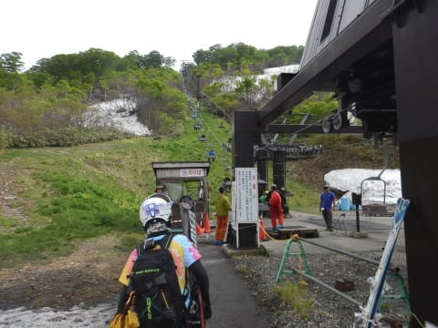

# 6月18日（日）月山詳細モード！…リフトと大斜面の状況を写真たっぷりで…雪が多いよ！

📅 投稿日時: 2017-06-20 02:54:46

🏷️ カテゴリ: [2017スキー滑走日記](c7d777cecfc91bdf0fa464ad62c6d49ab.md)

えー．

冷静に考えると，家から月山まで往復13時間．

つまり，朝9時に出かけたとしても，

行って帰ってくるだけで

帰宅は夜10時になるというのに．

なぜ，月山日帰りでスキーができるんだろう…

と，一瞬不思議に思ってしまった，Skier_Sです．

ということで．

この日曜に行ってきた月山の詳細レポートを

お送りするわけですが．

…写真がむちゃくちゃ多いので，

まずは前半戦．

本日は，リフトと大斜面の状況をば…

まず．

行きの車の中から大斜面が見えるわけですが…

うはーー！

車から見るだけで．

すでに，6月下旬と思えぬほど，

雪たっぷりなのが分かります…！

そして．

現地に着くと．

リフト乗り場前の川が，まだ完全に

埋まってるんですけど…！

そして，乗り場までの道の両側もたっぷりの雪！

…多いよ．

今年は，雪が多いよっ！

朝8時からリフト営業開始なのですが．

朝8時にリフト券乗り場に着くと．

そこにはもう結構な列が…（涙）

ちと残念なことに，ここで10分近く

待たされてしまったものの．

朝イチのリフト自体はガラガラ！

この時期ですから，リフトは当然

板を脱いで乗るようになってます…

ちなみに，リフトは先週保守工事が行われ．

こういう低い位置に架けかわっていて…

場所によっては，足がつきそうな低さ（笑）．

そして．

リフトで山頂へ出ると…

山頂は，まだまだ雪が全面に残ってますよ！

そして．

リフトを降りたすぐから雪があって…

なんと．

まだゲレンデに滑って出られますね…！

ゲレンデに滑って出る道は，

残念ながら，こんな感じで

もう細くなっていて…

うーむ．

この状況だと，滑ってゲレンデに行けるのは，

あと2-3日かな…

今週末は，ダメそうですね（涙）．

このルートが切れると．

この矢印ラインを通って，はるかな登り道を

行かないと，ゲレンデに出られないんですが．

今週末は，はるかなる道パターンに

なってそうな予感…

ってことで．

さっそく滑るわけですが．

山頂のTバーのコースも，

雪が結構あって楽しそうではあるものの…

リフトが動いている今日は．

Tバーには見向きもせずに，リフトを滑り続けるのだ！

…ということで．

月山と言えば，大斜面ですから．

この矢印のトラバースラインに沿って，

大斜面へ向かい…

（トラバースラインはこんな感じ）

トラバースラインを終えると，

出ました，大斜面！

朝イチは，コブは浅めではあったものの…

この時期にしては，まだ幅もかなりあって，

コースが途切れそうになってたりせず．

ラインも3～4本ほど，上から下まで通しで行ける感じ．

この時期としては，かなり良いですね～！

大斜面，見ての通り，かなりの本数の

ラインが刻まれていますよ～！

そして．

大斜面の下の部分はこんな感じで…

まだ，リフト乗り場まで続く部分も雪が残っていて．

リフト乗り場直前まで滑りこめます．

いや…

これは，6月下旬の月山としては．

かなり楽しいんですけど！！？？

…ってことで．

今日のレポートは長くなっちゃったので

続きはまた明日．

…沢コースの詳細や，

午後の状態，

リフト待ちの状況などは，

また明日までお待ちください～！

## 💬 コメント一覧

### 💬 コメント by (Ｓｏｒａ)
**タイトル**: まだ未練がありまして
**投稿日**: 2017-06-20 22:20:47

今月下旬から、東北・北海道へのクルマ旅に出る予定です。月山の夏スキーには昔から関心がありまして、検討中でしたが月山スキーレポブログが見当たりませんでした。

しかし、さすがskierSさん、詳しいレポをありがとうございます。これは非常に貴重な情報だと思います。

しかし、せっかくの月山をケチをつけるようで真に申し訳ありませんが、雪面がかなり汚れてますよね。Ｔバーのところはきれいなようですが。

とすると、ソールが汚れるのは致し方ありませんが、傷がメチャメチャ付くことはありませんか。それも致し方のないことですが（笑）、なんせ私はファットスキー１本しかないので、この虎の子をギザギザにするわけにはいかなくて。。（涙）

板に与えるダメージは、どんな感じですか？

### 💬 コメント by (Skier_S)
**タイトル**: Soraさま
**投稿日**: 2017-06-21 00:36:47

お久しぶりのコメントですね…！

毎回Blog楽しみに読ませてもらっています．

さて．

今の月山の様子ですが…

やはり，雪はかなり汚れています．

今のところ，石ころを踏むほどではないですが，

ところどころ汚れたところを通る覚悟は

必要です．

板のチューンナップを出す前に行くか，

古い板を使うことをおススメします…

そして，この週末はまだリフトまで滑っていけて，

リフトを降りたところからすぐ滑っていけましたが．

あと数日でリフトからゲレンデまでは

かなり歩くようになります．

かなり大変です．

その時は，ドロドロになった土の上を

歩くので，スキーブーツもかなり汚れます．

ちなみに，下りをリフトで降りることにして，

リフトの上にあるTバーだけを滑るならば，

そんなに雪も汚れてませんし，毎回

泥の上を歩かずに済みます…

とりあえず．

月山．滑ることはできますが，

楽しいかどうかは微妙です…（笑）

この時期に滑れる，ということに

ヨロコビを感じられる人でないと，

駐車場からリフト乗り場までも

かなり歩きますし，なかなかの

修行です…（＾＾；

でも，話のネタにはなりますよ～！

### 💬 コメント by (Skier_S)
**タイトル**: Soraさまへ…追記
**投稿日**: 2017-06-21 00:48:10

私が昔書いた，こんな説明があります

http://blog.goo.ne.jp/skier_nobu/e/386ed10257f375b054924cf85cc86423

…今は，Tバーが3本から2本に減りましたが，

あとは大体ここに書いた通りです．

ちなみに，駐車場からリフト乗り場までは，

登り坂を10分以上歩きます．

バックパックにスキーブーツを入れて，

駐車場からリフト乗り場までは，

普段の靴で移動することをおススメ…

歩くコースに雪は無いので，

普通のスニーカーとかでOKです！

### 💬 コメント by (Ｓｏｒａ)
**タイトル**: お返事ありがとうございます
**投稿日**: 2017-06-21 10:09:29

詳細なお返事ありがとうございます。

2007年の記事も読ませていただきました。サンタバーバラに留学されていたのですね。西海岸にもいいスキー場があるでしょう。私の赴任中、マンモスバレーというばかでかいスキー場に東海岸から出向いたことを想い出しました。あ、お勉強に行かれたわけですから、さすがにスキーはやりませんでしたよね（笑）。

さて、本題ですが、

＞楽しいかどうかは微妙です…（笑）この時期に滑れる，ということにヨロコビを感じられる人でないと，・・・なかなかの修行です…（＾＾；

今日の記事も読ませていただきました。おっしゃるとおりだと思います。Ｓさんのように、筋金入りの人でないとチト。。

昨年の秋にこのリフトに乗って、月山登山をしていますので、詳細な写真を見せていただき現況はよく分かったつもりです。で結論的には、私はやはり「逝く」のはやめようと（笑）。

でも、青空が覗いた夏スキーの月山はやはりいいですねー。ありがとうございました。

### 💬 コメント by (Skier_S)
**タイトル**: Soraさま
**投稿日**: 2017-06-22 03:16:27

あ，UCSBに行ったのは私ではありません…（＾＾；

私はあの時，人のBlogを乗っ取っていたので（笑）．

で，月山スキーは諦められたのですね…

リフトからすぐ滑り出せて，かつリフト乗り場に

滑りこめない時期の月山は，普通の神経を

お持ちの方にははっきり言ってお勧めできません（＾＾；

終わった人が逝く世界です…

でも，リフト滑る1本くらいなら，話のネタには

なって面白いかもしれませんが…（笑）

