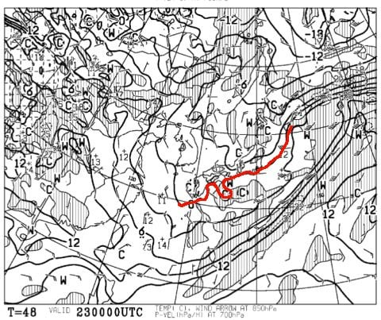
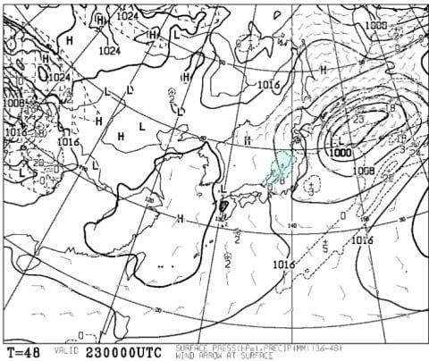
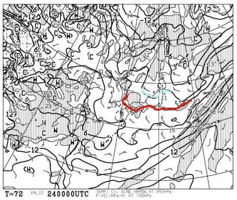
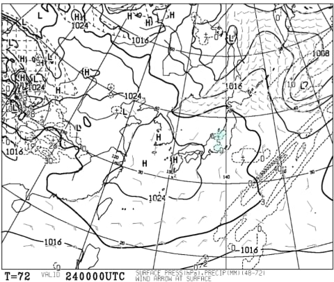
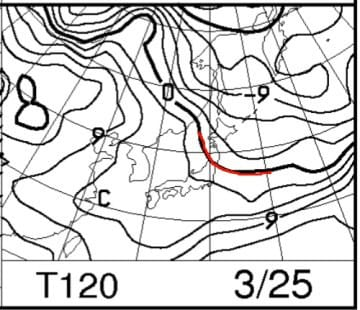
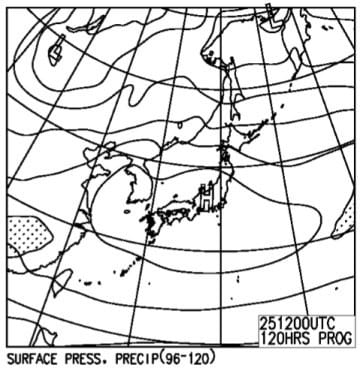

# 今日はスキーに行かず…そして今週末，3月24，25日の志賀高原の天気は？？

📅 投稿日時: 2018-03-22 00:43:37

えー．

本日ですが．

スキーに行きませんでした

ええ．

やっぱり，ここしばらくのご無体でかなり疲れていたのか．

朝起きられませんでした…（涙）．

ってか．

厳密には朝一回起きたけど．

天気があまりにも悪くなりそう…って

感じだったので．

起きるのをあきらめて布団に戻って．

…で．

次に起きたら午後2時でした（爆）．

いやーーー．

疲れてたんだな…

しかし．

今日の志賀高原．

早朝はゴンドラが動いたものの．

午前8時には強風でゴンドラが止まってしまったようで．

その後，午後10時ごろには強風で3高も

営業中止，

さらに一の瀬方面含め，次々リフトが止まっていく

という状況で．

昼ごろにはほとんどのリフトが止まったようですね…

…スキーに行かなくて，良かった…

いや，昨日．

かなり志賀高原近辺の気温傾斜が強い天気図だったので．

　昼前から雪が降り出し．

　時折強く降り，風も出てくる感じですね…

と書きましたが．

まさか，リフトが止まるほどの強風になるとは…

うむ．

きっと．

休みの日なのに私がスキーに行かなかったから，

空がびっくりして大荒れの天気になっちゃった

に違いない…←違うから

しかし．

こんな天気だったから，スキーに行かなくても

平穏な心でいられますが．

今日，もしピカピカ晴天の最高雪質の一日だったら．

今ごろ悶絶してただろうなぁ…

そんな天気の予想だったら滑りに行ってただろうけど

って感じの本日だったのですが．

今日は水曜なので．

定例の週末の天気予想をば…！

とりあえず．

明日．

木曜の朝は残念ながら雨で始まりそうですが．

昼ごろから雪になるかな～．

そして，週末の直前，金曜の850hpa気温を見ると．

-3℃線が志賀に掛かっているので．

この時期としてはまぁまぁの冷え具合ですかね…

昼間もマイナス気温をキープしそうで．

金曜の地上天気図は．

降水域が志賀に掛かってますね…

金曜は一日，雪がぱらつく感じで．

うっすらと積雪があるかも…

で．土曜の850hpa気温図ですが．

この日も水色の-3℃線が志賀に近づいているので．

朝は-5℃程度の冷えですかね～．

昼間もマイナス気温をキープしそうな

感じです．

土曜の地上天気図をみてみると．

うーむ．

わずかに降水域が志賀近辺にあるけど…

これは金曜夜までの降水かな？

おそらく，朝には晴れてそうな天気図ですね．

で，翌日曜の850hpa気温を見てみると．

うーむ．

この日は0℃線はちょいと志賀より北まで

行っちゃいますね．

朝は放射冷却で冷えそうですが．

昼間の気温は0℃を超えてくるかな？

そして，地上天気図は．

すっぽり高気圧に覆われているので，

日曜は晴れそうですね！

…でも，雪が解けちゃいそう…

ってな感じで．

まとめると．

土曜24日：朝は多少雲が多いかもしれないけど，晴れ！

　朝の気温は-5℃．ここしばらく朝イチは固めだったけど，

　金曜日に雪が積もるので，この日の朝イチの圧雪は，

　うっすら柔らかい雪の層が圧雪された感じで，

　久々の柔らかめ圧雪かな？

　ただ，急斜面はすぐに下地の固いのが出てきそう．

　気温はマイナスをキープするので，天気はいいけど

　雪は緩まなさそう．

　逆に言うと，ところどころ固い下地が出てくる

　バーンになるか…

　でも，天気が良いのに雪が緩まない，

　いい感じの一日かな！

日曜25日：朝からすっきり晴れ！

　朝のうちは放射冷却で-3℃程度の冷え込みかな…

　強い日差しで東斜面は午前中に雪が緩み始め，

　春の雪になっていく．北～西斜面はしばらく

　固い斜面でキープしそう．

　ただ，昼間の気温は+3℃くらいまで上がりそうなので，

　午後には緩み始めるか…

　ただ，雪が板に張り付くほどの高温にはならなさそうで，

　日差しが暖かい，いい感じの春スキーの一日になりそう．

ってな感じでしょうか．

この週末も，いい天気になりそうですね～！

## 💬 コメント一覧

### 💬 コメント by (yumi)
**タイトル**: 行かなくて正解⭕️でしたね🍀
**投稿日**: 2018-03-22 08:15:21

Ｓさぁ～ん🎉

最近はリアルＳさんとお話しさせて頂いているので、久々のコメント💬です🎵

（Wさんの伝言意外で・・・）

昨日は酷かったみたいですね💧

留守をすると、どうも気になる・・・

Ｓさんがお休みするのかどうかも、スッゴい気になっていました‼️

お休みにして🌃✨💤正解でしたね。

ブログの更新時間を見て、「いったい、いつ寝ているんだろう？」って、いつも思ってましたので。

今週末はいいお天気みたいですね✨

お体大切に、楽しんで下さいませ🎵

### 💬 コメント by (Skier_S)
**タイトル**: yumiさま
**投稿日**: 2018-03-23 02:20:57

コメントありがとうございます～！

水曜は滑らなかったのですね？？

私もさすがに，水曜は死んだように寝てました…

14時間ほど寝ました（笑）．

でも，まだ睡眠不足は解消していません…

眠いです．

では，今週末もお会いしましょう～！

### 💬 コメント by (yumi)
**タイトル**: 今週末は⛷️💨💨💨
**投稿日**: 2018-03-23 08:16:03

今週は、北海道遠征中です🛫🛫🛫

相変わらず、毎日滑ってますよぉ～⛷️💨💨💨

### 💬 コメント by (Skier_S)
**タイトル**: yumiさま
**投稿日**: 2018-03-23 23:48:33

北海道ですか！！

いいなぁ～．

この春は，北海道は結構冷え冷えなので

雪がいいんじゃないでしょうか…？

楽しんできてください！

